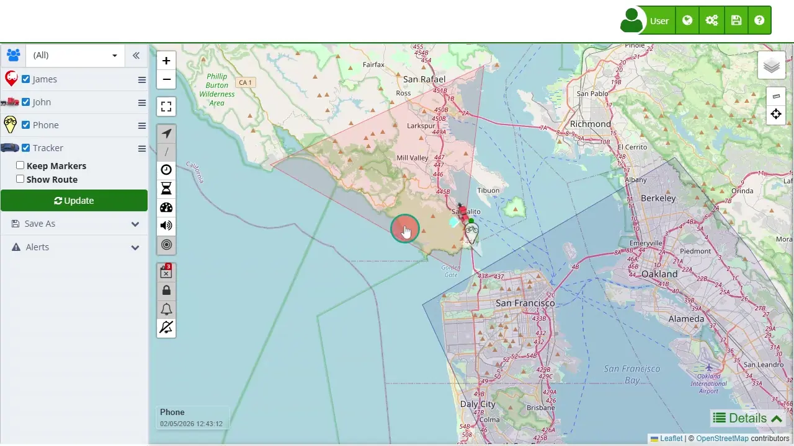

# Device Control Panel
The Device Control Panel on the left side of the [map](https://app.plaspy.com/Map) interface is a crucial tool for managing and visualizing tracked devices. This panel provides users with various options to search, filter, and select devices, as well as configure different settings related to their monitoring needs. The panel's design allows for easy navigation and efficient management of multiple devices, ensuring that users can quickly access the information they need. Below is a detailed description of the functionalities available in this section.

## General Description

The Device Control Panel is organized into several key sections that facilitate device management and monitoring. At the top, users can find options to filter and search for devices, ensuring they can quickly locate specific units even in a large fleet. The main body of the panel lists all devices with checkboxes to select or deselect them for viewing on the map. This section also includes buttons for batch selection and deselection of devices, streamlining the process of managing multiple units simultaneously.

### Edit Groups and Filtering

At the top of the panel, there is an option to edit device groups, allowing better organization of the visualization according to specific categories or teams. The dropdown selector facilitates the selection of pre-configured groups, providing a quick way to filter devices based on the required organization. This functionality is useful for administrators who need to manage several units in a structured manner.

### Search and Selection

The search bar allows users to enter keywords to quickly locate specific devices. This is vital for times when it is necessary to find a particular device within an extensive list. Next to the search bar, the batch selection buttons \(select all, deselect all, invert selection\) expedite the management of multiple devices, allowing rapid changes in the visualization of the fleet on the map.

### Device List

Each device in the list is represented with an icon and a name, accompanied by a checkbox that allows for individual selection. Selecting a device will display it on the map, providing an immediate visual reference of its location. This setup is essential for closely monitoring the status and position of each tracked unit.

### Additional Features

Below the device list, users will find additional options such as "Keep Positions" and "Show Route." These options allow customizing the map view by maintaining current points visible during new queries and displaying the historical route of devices over a specific date range. Additionally, the "*fa-refresh* Update" button allows refreshing the displayed data to ensure that the information is up-to-date.

### Save and Alerts

At the bottom of the panel, there are options to save configurations and manage alerts. Users can save data in formats like Excel or KML for Google Earth, facilitating the analysis and external presentation of the information. The alerts section allows configuring and editing specific alerts, as well as managing geofences, providing advanced tools for fleet monitoring and security.

## Step-by-Step Instructions

### How to Search and Select Devices

1. **Search Device:** Enter the name or keyword of the device in the search bar. The list will automatically filter to show only the devices that match the search terms.
2. **Select Device:** Check the checkbox next to the device you want to view on the map. Repeat this process to select multiple devices if necessary.

### How to Edit Groups and Filter

1. **Edit Groups:** Click on the group icon at the top of the panel to access group editing options. Here you can organize devices into different categories for better management.
2. **Filter by Group:** Use the dropdown selector to choose a specific group of devices. This will update the list to show only the devices belonging to the selected group.

### How to Save Configurations and Manage Alerts

1. **Save Configuration:** Click "*fa-floppy-o* Save As" and select the desired format \(Excel or KML\) to export the data. Follow the instructions to complete the export.
2. **Manage Alerts:** Click "*fa-exclamation-triangle* Alerts" to configure or edit alerts. Here you can set parameters to receive notifications about specific events and manage geofences to enhance security and monitoring.

## Validations and Restrictions

- **Data Update:** Ensure to use the "*fa-refresh* Update" button to get the most recent information from the devices.
- **Group Configuration:** Groups must be pre-configured to be selectable from the panel. Ensure a clear organizational structure for easier management.
- **Batch Selection:** Use the batch selection options to efficiently manage large numbers of devices, avoiding individual selection when not necessary.

## Frequently Asked Questions

- **How can I quickly find a specific device?**
 - Use the search bar at the top of the panel to enter the name or keyword of the device. The list will automatically filter to show only the matching devices.
- **What should I do if I need to update device information?**
 - Click the "*fa-refresh* Update" button at the bottom of the panel to refresh the displayed data and ensure that the information is up-to-date.
- **Can I export the device list and its data?**
 - Yes, you can export the information in formats such as Excel or KML for Google Earth. Use the "*fa-floppy-o* Save As" menu at the bottom of the panel to select the desired format and follow the export instructions.

The Device Control Panel is a powerful tool for efficient management and detailed monitoring of devices, providing users with an intuitive and feature-rich interface to maintain smooth and secure operations.
