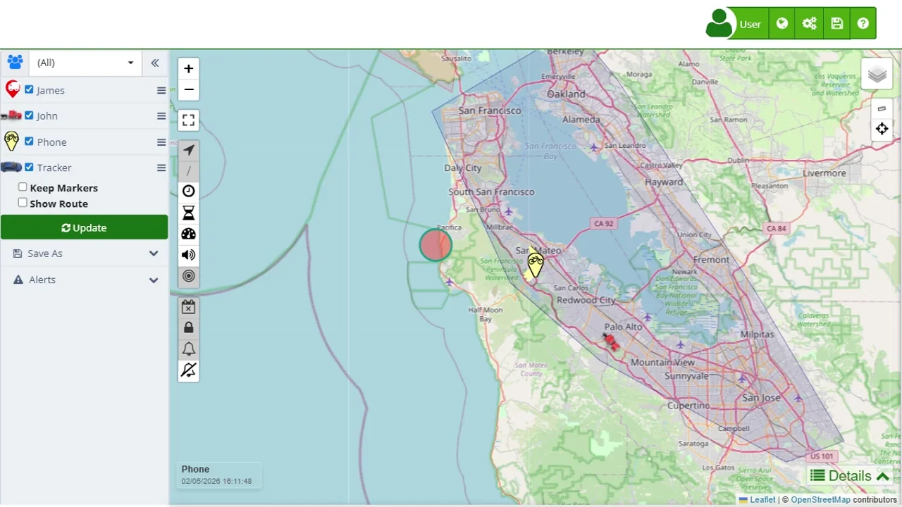

# Device Menu
Each device listed in the Device Control Panel on the left side of the [map](https://app.plaspy.com/Map) interface has a menu that provides access to various options. These options allow users to perform a range of actions and configurations on each device. Below is a detailed description of all the menu options, their purposes, and specific use cases for clarity.

 

### Route

- **Last hour:** Allows users to view the route the device has taken in the last hour. It is useful for monitoring recent movements of a vehicle or person, ensuring they are following the expected route.
- **Last 3 hours:** Allows users to view the route the device has taken in the last three hours. Ideal for reviewing the journey of a recent work shift.
- **Last 6 hours:** Allows users to view the route the device has taken in the last six hours. Useful for analyzing a half-day work shift or activities over a morning or afternoon.
- **Today:** Allows users to view the route the device has taken today. Ideal for reviewing all activities of the day, useful for daily activity reports.
- **Yesterday:** Allows users to view the route the device took yesterday. Useful for generating activity reports from the previous day and analyzing recent behaviors.
- **Day before yesterday:** Allows users to view the route the device took the day before yesterday. Useful for viewing and analyzing activities from two days ago, ideal for short-term comparisons and analysis.

### Last location

- **This device only:** Shows the last location of only this device. Useful for quickly locating a specific device in case of emergency or when specific information is needed.
- **All devices:** Shows the last location of all devices. Provides a general view of the location of all devices, ideal for monitoring multiple assets simultaneously.

### Share Location

- **Current Location:**
    - This allows you to send the device's most recent position using apps like Google Maps, Waze, WhatsApp, or other available options. This way, any authorized person can see exactly where the device is at that specific moment.
- **Live Location:** 
    - This option lets you share the device's location in real-time for a specific period: **** 1 hour, 4 hours, 8 hours, 1 day, or a custom time. Once you choose the duration, you can send the access via email, WhatsApp, or through a direct link. The person who receives the link will be able to follow the device's movement until the set time expires.

### Send command

- Allows users to send a command to the device, although this option may be hidden depending on the device's capabilities and user permissions. It is used for performing remote actions such as turning off a vehicle's engine, restarting a device, or sending custom alerts, which is crucial for proactive management and rapid response to critical situations.

### Settings

- **Name:** Allows users to change the name of the device. Useful for renaming devices based on their function, location, or specific assignment, facilitating identification and management.
- **Icon:** Allows users to change the icon representing the device on the map. This customizes the visualization and uses different icons for various types of devices or statuses, improving clarity and visual organization.

- **Alerts:**
    - **Reminders:** Configures reminders for important events related to the device. Useful for scheduling maintenance, inspections, or specific events.
    - **Edit:** Allows users to edit existing alerts to adapt to new conditions or requirements. Ensures that notifications are relevant and precise.
    - **Copy to...:** Copies the alert configuration to another device. Facilitates setting up multiple devices with similar alerts, ensuring consistency in configurations.
- **Geofences**
    - **Edit:** Allows users to edit geofences associated with the device to reflect changes in operational areas or adjust boundaries as needed.
    - **New allowed zone:** Creates a new allowed zone. Defines areas where the device can operate freely, useful for managing routes and authorized work areas.
    - **New forbidden zone:** Creates a new forbidden zone. Establishes areas where the device should not enter, crucial for security and preventing unauthorized access.
    - **New control zone:** Creates a new control zone. Defines special surveillance areas where additional attention should be paid to the device's activities.
    - **New control point:** Creates a new control point. Sets specific points that the device must visit or pass through, useful for verifying routes and ensuring adherence to itineraries.
- **More settings:** Provides access to advanced settings and detailed customizations. Allows users to tailor the device configuration to specific needs and optimize its performance.

These menu options provide a comprehensive set of tools for managing and configuring each device, ensuring that users can personalize their tracking experience to meet their specific needs.
