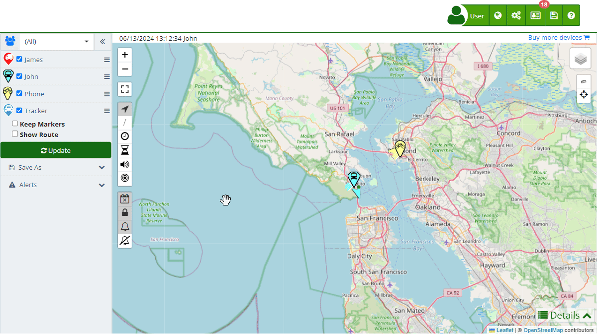

# GeoFences
Geofences are essential tools for monitoring and controlling specific locations within the Plaspy satellite tracking system. They allow you to set up virtual zones on the [map](https://app.plaspy.com/Map) that can generate alerts when a device enters or leaves these areas. Geofences can be configured in various ways, including allowed zones, prohibited zones, control zones, checkpoints, and routes, adapting to different monitoring needs.

To create and manage geofences, users can utilize the tools available in the [map](https://app.plaspy.com/Map) control panel. From here, geofences can be drawn directly on the map using the options for cursor, allowed zone, prohibited zone, control zone, checkpoint, and route. Additionally, existing geofences can be edited and renamed, as well as deleted when no longer needed. These functions are crucial for effective fleet and asset management, enabling automated alerts that enhance operational efficiency and security.

### Types of Geofences and Use Cases

- **Cursor**: This option allows you to select and manipulate existing elements on the map, facilitating the editing of previously created geofences.
- **Allowed Zone**: Useful for defining areas where devices are allowed to operate freely. For example, a logistics company might establish an allowed zone at its distribution center, allowing vehicles to move without triggering alerts.
- **Prohibited Zone**: Ideal for setting up areas where access is restricted. An example would be creating a geofence around a sensitive area where fleet vehicles are not allowed to enter.
- **Control Zone**: Used to monitor entries and exits in specific areas, such as city borders or high-value facilities. A use case could be controlling access to an industrial area, ensuring that only authorized vehicles enter or exit.
- **Checkpoint**: Allows you to set specific points that devices must reach. This is useful in delivery routes where each point represents a mandatory stop for the vehicle.
- **Route**: Defines specific paths that devices must follow. A typical use case would be a public transport route where vehicles need to follow a fixed itinerary.

These functionalities ensure that users can customize monitoring according to their specific needs, providing a powerful tool for asset and fleet management.

### Accessing and Using Geofences

To access geofence options in Plaspy, follow these steps:

1. **Access**: Log in to your Plaspy account and navigate to the main [map](https://app.plaspy.com/Map).
2. **Geofence Options**: In the left sidebar, you will find the options under the " GeoFences" section.
3. **Drawing Geofences**: Select the type of geofence you want to create \(Cursor, Allowed Zone, Prohibited Zone, etc.\) and draw directly on the map.
4. **Managing Geofences**: Once created, you can edit, rename, or delete geofences as needed.

With these tools, you can effectively manage the operational areas of your devices, optimizing the security and efficiency of your daily operations.
