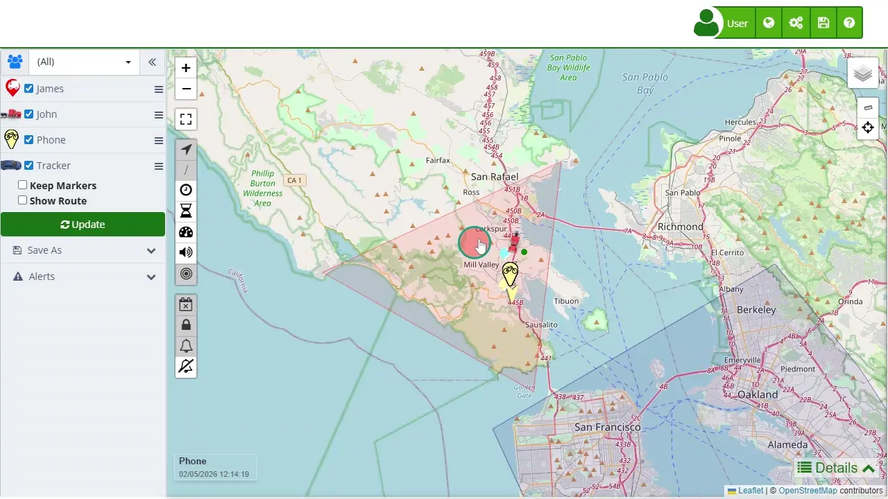

# Map
the [map](https://app.plaspy.com/Map) is an advanced monitoring tool designed to provide an interactive and real-time visualization of the location of various tracking devices. This map is organized into several key sections, each with specific functionalities that allow users to efficiently manage and analyze tracking information. Below are the different parts of the map and their capabilities, offering a comprehensive guide to understanding and utilizing all available functions.

To access the map, navigate through the main menu of the web application and select "*fa-globe*" then click on "[*fa-globe* Map](https://app.plaspy.com/Map)" option. Once there, you will be presented with an overview of all tracked devices, along with various options to customize the display and obtain precise information about each of them.

### Main Map

The main map is the most crucial component of the monitoring tool. This is where all tracked devices and their routes are visualized on a central and accessible interface. The real-time updating of device locations provides accurate and current data, essential for continuous monitoring. Additionally, the interactive interface allows users to interact directly with markers and controls, enhancing the user experience and enabling more efficient tracking. The different map layers, such as satellite and street views, offer visualization options tailored to various needs, facilitating detailed analysis and informed decision-making.

This central area of the map also allows the visualization of historical routes and journeys of devices within a selected date range. This functionality is especially useful for analyzing movement patterns and planning future routes. The ability to switch between different map views and use zoom tools for more detailed or broader views of the area significantly enhances the effectiveness of device monitoring and management.

### Map Icons

The [icons on the map](buttons_on_the_map) represent device markers and are an essential part of the visual interface. Each marker on the map indicates the current location of a device and can have different colors and shapes depending on its status, facilitating quick and visual identification. These icons not only show the location but also allow direct interaction. Clicking on a marker brings up a pop-up window with detailed information about the device, such as its last update and other relevant data.

These icons improve the user experience by enabling actions such as centering the map on a specific device and switching between different map views. This interactive capability not only facilitates real-time monitoring but also allows users to customize their map view according to their specific needs, thereby improving tracking and analysis capabilities.

### Left Device Panel

The [left side of the map](device_control_panel) is dedicated to the management and visualization of tracked devices. Here, users will find a complete list of all devices associated with their account. This list allows selecting and deselecting devices, making it easy to display or hide their location on the map. Devices can be quickly searched using the search field, which is especially useful when managing large numbers of devices. Additionally, devices can be grouped into customizable categories, simplifying management and organization.

This section also includes advanced display options. The "Keep Markers" option allows maintaining the current points of devices on the map when making new queries, ensuring that information is not lost. The "Show Route" option allows visualizing the historical route of a device within a specific date range, providing a detailed view of its movements. The "*fa-refresh* Update" button allows manually updating the map information, ensuring that the data displayed is always up-to-date and reflects the real-time situation.

### Bottom Details Panel

At the [bottom of the map](details) are the specific details of the selected device. This section provides a detailed view of the device's information, including its last known location, current speed, and battery status. These data are essential for accurate and real-time monitoring of each device, allowing users to make informed decisions based on updated data.

Additionally, this area includes an activity log that records the device's latest movements and events. This log is invaluable for analyzing behavior patterns and detecting any unusual activity. Alerts and notifications are also managed from this section, allowing users to configure and view alerts based on geofence entry and exit, as well as other critical events. This functionality is fundamental for the security and efficient tracking of devices.

the map is designed to offer a complete and efficient user experience, facilitating the monitoring and management of multiple devices. Each map component has a specific function that contributes to providing a detailed and customizable view of satellite tracking information. By familiarizing themselves with these components, users can maximize the use of the tool and improve their ability to make informed decisions based on real-time data.

### Frequently Asked Questions

- **[How can I see the complete route of a device?](viewing_a_devices_route_history)**
 - Activate the "Show Route" option in the side panel and select the desired date range to visualize the complete route on the map.
- **Can I set up alerts for specific areas?**
 - Yes, use the alerts panel to create [geofences](geofences) and set up alerts based on entry or exit from these areas.
- **How do I export map data to Excel?**
 - In the save menu, select the "*fa-file-excel-o* MS Excel" option to export the current map data in Excel format.

This manual covers the basic functionalities of the map, providing a clear and detailed guide to maximizing the use of this satellite tracking tool.
