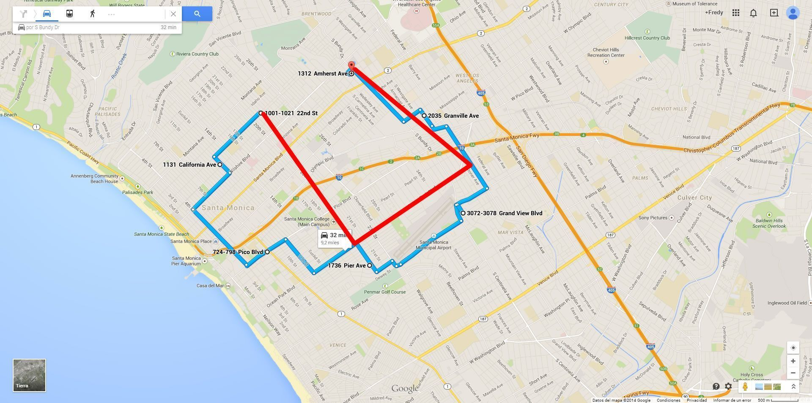

# Mileage Calculation
In Plaspy, the calculation of a vehicle's mileage is based on the positions sent by the tracker to determine the location. It is crucial to understand that this calculation is approximate and may not always accurately reflect the actual distance traveled due to data transmission limitations and terrain characteristics.

Plaspy's system calculates the distance by using the positions reported by the tracking device, connecting these points with straight lines. This means that curves and other details of the actual route may not be considered in the calculation, which can result in differences between the real distance and the reported distance.

## How Mileage is Calculated

- **Calculation Method:** The mileage is calculated based on the positions transmitted by the tracking device. The system connects these points with straight lines, which may omit curves and other details of the actual route.
- **Calculation Limitations:** If a vehicle travels in a closed circle and returns to the original position, the system will consider it as a distance of 0 km. This is because the calculation is made solely between transmission points and does not consider the actual path taken by the vehicle.
- **Route Visualization:** In Plaspy's graphs, the actual route of the vehicle is shown in blue, while the calculated route based on transmission points is shown in red. This allows users to compare the real distance with the calculated distance.

## Optimizing the Calculation

To improve the accuracy of the mileage calculation, it is recommended to reduce the data transmission interval of the tracking device. However, it is necessary to balance the transmission frequency with data consumption, battery life, and the processing capacity of the device.

- **Transmission Frequency:** Transmitting data more frequently will improve the accuracy of the mileage calculation but will also increase data and battery consumption and require more processing power from the device.
- **Recommendations:** It is suggested to adjust the transmission interval to the shortest possible time that maintains an acceptable balance between accuracy, data consumption, and battery life.

## Examples

To illustrate how mileage is calculated and the possible differences from the actual distance traveled, the following graphic examples can be consulted:

Blue the actual path of the vehicle  
Red travel reported to **Plaspy**

Example 1

Example 2

##   
Final Considerations

It is important to note that the mileage calculation in Plaspy is an estimation and may not accurately reflect the actual distance traveled due to the limitations of the calculation method and terrain characteristics. Users should be aware of these limitations and adjust their expectations accordingly.

By understanding the process and limitations of mileage calculation in Plaspy, users can optimize the use of their tracking devices and obtain a better approximation of the distances traveled by their vehicles.
