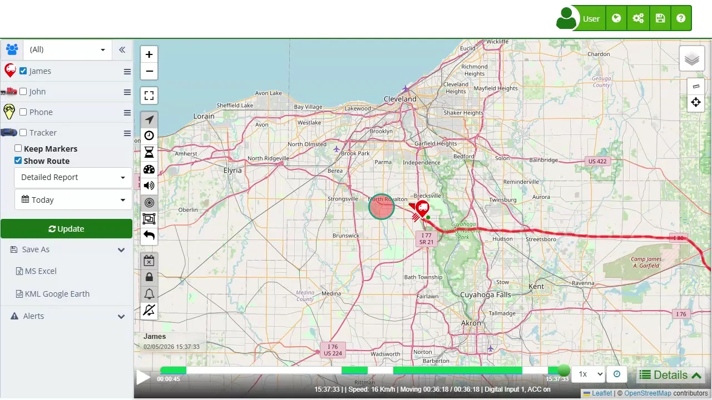

# Timeline
The [timeline](https://app.plaspy.com/Map) in Plaspy provides a detailed summary of the device's performance during a specific trip. Below are the fields and metrics presented in this section:

### Filtering Buttons

- **Driving \(\):** Filters the timeline to show only when the device was moving. Useful for checking speeds, routes, and active times.
- **Stopped \(\):** Shows events where the device was stopped and parked. Ideal for checking how long it stayed still and in which locations.
- **Idle \(\):** Shows periods when the engine was on, but the vehicle was not moving. Helps identify unproductive time and potential fuel waste.
- **Alerts \(\):** Shows details of alerts sent by the device, such as speeding, disconnections, or entering/leaving geofences. Used to detect situations that need attention.
- **Critical Alerts \(\):** Shows the most important or high-risk alerts. These require immediate attention to avoid problems or incidents.

### Summary Fields

- **Max Speed:** Identifies the highest speed peaks and detects speeding during the trip.
- **Average Speed:** Provides a general reference of the trip's pace and allows for easy comparison between similar routes.
- **Mileage \(Distance Traveled\):** Helps track vehicle use, plan maintenance based on mileage, and verify distances.
- **Number of Stops:** Shows how many times the vehicle stopped to identify excessive or unplanned breaks.
- **Driving Time:** Indicates the actual time spent driving; helps estimate the duration of trips or deliveries.
- **Stopped Time:** Reflects waiting or parking periods, useful for detecting long or unproductive times.
- **Active Sensors \(Optional\):** Records when installed sensors \(like ignition, doors, or cargo\) were activated and for how long.
- **Fuel Percentage \(%\) \(Optional\):** Shows the fuel level at the end of the trip to help control consumption and refills.
- **Km per Tank \(Optional\):** Estimates how far the vehicle can go with a full tank to help plan routes.

### How to Check Trip Timeline

1. **Open the Trips section:** In the left side panel, select the device you want to check.
2. **Show trip:** Check the "Show trip" option, choose the time period you want to see and then click the **" Update"** button to see the route on the map.
3. **Open Timeline section \(\):** At the bottom right of the map, click on \(\).

### Validations and Restrictions

- **Date Range:** Make sure the selected dates are within the data range available for your device.
- **Sensor Accuracy:** Some sensors may not be available for all devices, depending on their model and features.

### Frequently Asked Questions \(FAQ\)

- **Why can't I see data from all sensors?**
    - Make sure the device has those sensors installed and that they are enabled and working correctly during the trip.
- **What do the different fuel metrics mean?**
    - "Fuel \(%\)" indicates the remaining fuel percentage. "Distance per tank" and "Distance per fuel unit" show how efficient the fuel use is.
