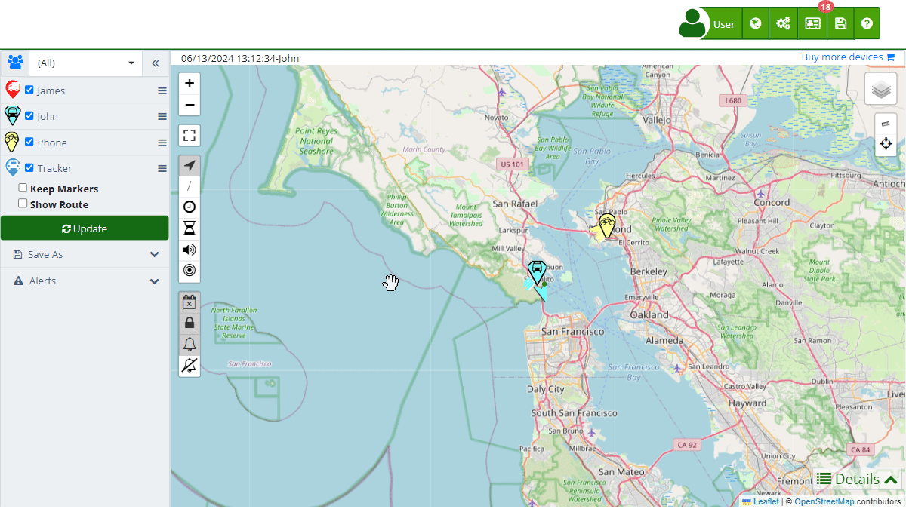

# Trip Statistics
The [statistics panel](https://app.plaspy.com/Map) in Plaspy provides a detailed summary of the device's performance during a specific trip. Below are the fields and metrics presented in this section:

### Fields and Descriptions

- **From**: The start date and time of the trip.
- **To**: The end date and time of the trip.
- **Max Speed**: The maximum speed reached during the trip, measured in the configured units \(Km/h or Mi/h\).
- **Average Speed**: The average speed during the trip, measured in the configured units \(Km/h or Mi/h\).
- **Distance Traveled**: The total distance traveled, measured in the configured units \(Km or Mi\).
- **Stops**: The total number of stops made during the trip.
- **Moving Time**: The total amount of time the device was in motion.
- **Static Time**: The total amount of time the device was stationary.
- **Idle Time**: \(Optional\) The total amount of time the device was idling.
- **Sensor 1**: \(Optional\) Time that Sensor 1 was active.
- **Sensor 2**: \(Optional\) Time that Sensor 2 was active.
- **Fuel \(%\)**: The percentage of fuel remaining in the tank at the end of the trip.
- **Distance per Tank**: The distance traveled per tank of fuel, measured in the configured units \(Km or Mi\).
- **Fuel Consumption**: The amount of fuel used, measured in liters or gallons.
- **Distance per Unit of Fuel**: The distance traveled per liter or gallon of fuel.
- **Fuel 2 \(%\)**: \(Optional\) The percentage of fuel remaining in a second tank at the end of the trip.
- **Distance per Tank 2**: \(Optional\) The distance traveled per second tank of fuel, measured in the configured units \(Km or Mi\).
- **Fuel 2 Consumption**: \(Optional\) The amount of fuel used in the second tank, measured in liters or gallons.
- **Distance per Unit of Fuel 2**: \(Optional\) The distance traveled per liter or gallon of fuel from the second tank.
- **Min Temperature**: The minimum temperature recorded during the trip, measured in the configured units \(Celsius or Fahrenheit\).
- **Max Temperature**: The maximum temperature recorded during the trip, measured in the configured units \(Celsius or Fahrenheit\).

### Instructions to View Trip Statistics

1. **Open the Trips Section**: In the left panel, select the device whose trip you want to view.
2. **Select a Trip**: Use the date picker to define the period of the trip you wish to view.
3. **Show Trip**: Check the "Show Route" option and click the "Update" button to display the route on the map.
4. **Open Statistics Details**: At the bottom of the map, click on the "Statistics" tab within the details panel.

### Validations and Restrictions

- **Date Range**: Ensure the selected dates for the trip are within the available data range for the device.
- **Sensor Accuracy**: Some sensors may not be available for all devices, depending on their capabilities.

### Frequently Asked Questions

**Why don't I see data for all sensors?**

- Ensure the device has the corresponding sensors and that they are enabled and functioning correctly during the trip.

**What do the different fuel metrics mean?**

- "Fuel \(%\)" indicates the percentage of fuel remaining. "Distance per Tank" and "Distance per Unit of Fuel" show fuel efficiency.
