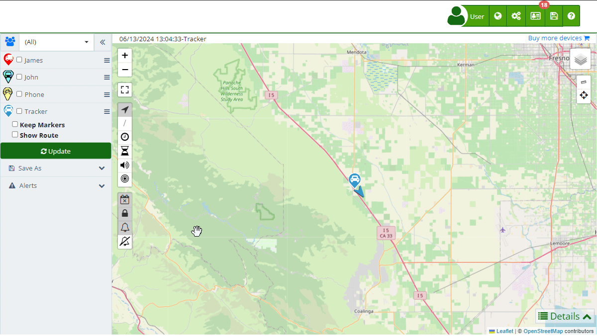
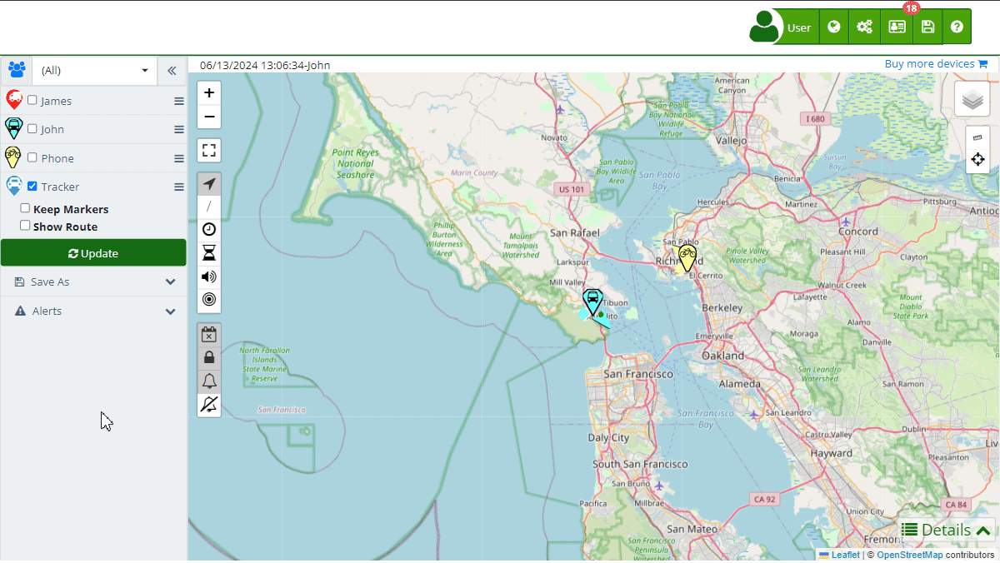
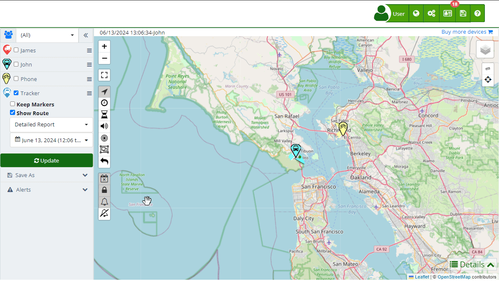
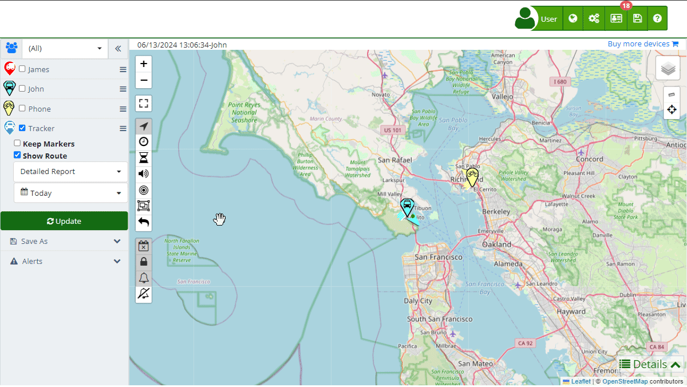
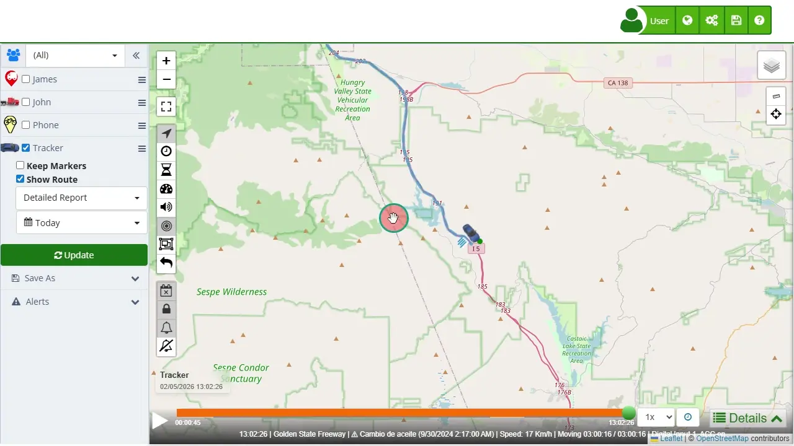
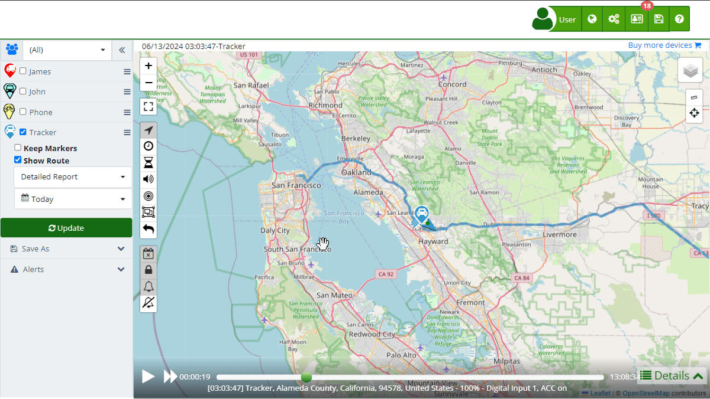

# Viewing a Device's Route History
Plaspy allows users to view the complete route history of their devices on the [map](https://app.plaspy.com/Map). This feature is useful for tracking the movement and activities of your devices over a selected period. Follow these steps to view a device's route history and understand the playback controls available:

### Steps to View a Route:

- **Select Devices**: In the left panel, select the device\(s\) whose route you want to view. You can choose a specific device or multiple devices simultaneously. Use the checkboxes next to each device to make your selection.  

    - **Enable Show Route**: Check the option "Show Route". This will enable the route display feature and bring up additional settings for customizing the route view.

- **Choose Date Range**: Select the date range for the route you wish to view. You can choose from predefined options like "Hoy" \(Today\) or set a custom range. This flexibility allows you to view routes from the past hour, specific dates, or any desired period.

- **Update Map**: Click the " Update" button to load the selected route\(s\) on the map. The system will display the route, showing all the locations the device has reported during the selected period.

### Playback Controls:

Once the route is displayed on the map, several playback controls become available to enhance the viewing experience:

- **Play/Pause Button**: Press the "Play" button to start the route playback or "Pause" to halt the animation. Pressing "Play" will animate the movement of the device along the displayed route, while "Pause" will stop the animation at the current point.
- **Time Slider**: Use the time slider at the bottom of the screen to manually navigate through the route. Dragging the slider left or right will move the playback to different times within the selected date range, allowing you to see where the device was at specific moments.
- **Speed Control button \(1X, 2X, 4X or 16X\)**: Adjust the playback speed to fast forward or slow down the animation. This control helps in quickly reviewing long routes or closely analyzing specific segments of the journey.
- **Route Information Panel \(\)**: Observe the information panel that appears during playback. This panel provides details about the device's location, speed, and other relevant data at the current point in the playback. It updates dynamically as the playback progresses, offering real-time insights into the device's activities.

### Additional icons on the map:

- */***Trail:**Allows displaying or hiding the historical trail of a device, showing its past route. This is useful for analyzing historical movements, detecting movement patterns, and reviewing completed routes to optimize future route planning.
- **Cluster Nearby Points:** Visually clusters devices that are very close to each other to improve visibility and facilitate counting. This is especially useful in areas with high device density, such as large parking lots or mass events.
- **Show All Markers:**Displays all markers of a device's complete route. Usually, only the last route marker is shown, but this option allows viewing all route points, useful for detailed analysis and route audits.

By following these steps and utilizing the playback controls, you can effectively monitor and analyze the movement history of your devices within the Plaspy platform. This feature is particularly beneficial for fleet management, logistics tracking, and ensuring the safety and efficiency of your operations.
