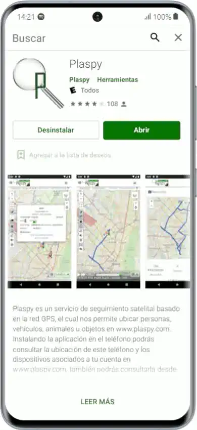

# Mobile Application
Plaspy offers a mobile application for Android and iPhone devices, providing all the features and tools you need as a Plaspy user. This guide will explain how to install the application and how to start using it on your mobile device.

## Installing the Application

### Android

1. **Access Google Play Store:** On your Android device, open the Google Play Store app.
2. **Search for Plaspy:** In the search bar, type "Plaspy" and press search.
3. **Install the Application:** Find the Plaspy application in the search results and select "Install."
4. **Open the Application:** Once installed, open the Plaspy application. Ensure that your phone's GPS is active.
5. **Download Link:** You can download the application directly from [Google Play Store](https://play.google.com/store/apps/details?id=com.plaspy.mobileapp).

### iPhone

1. **Access App Store:** On your iPhone, open the App Store.
2. **Search for Plaspy:** In the search bar, type "Plaspy" and press search.
3. **Install the Application:** Find the Plaspy application in the search results and select "Get."
4. **Open the Application:** Once installed, open the Plaspy application.
5. **Download Link:** You can download the application directly from [App Store](https://itunes.apple.com/us/app/plaspy/id893288026).

## Using the Application

### Registration and Login

1. **Open the Application:** When you open the application for the first time, you will see the welcome screen where you can register or log in.
2. **Registration:** If you don't have an account, select "Register" and complete the sign-up form.
3. **Login:** If you already have an account, enter your username and password to log in.

### Device Configuration

1. **Tracking Options:**To have the tracking option available, you must have licenses available in your Plaspy account. Otherwise, you will directly enter your account with the current user privileges.
    - **Do not track this device:** Use your mobile phone only to access the Plaspy platform without tracking the device.
    - **Track this device:** Allow your phone to be tracked as a new device.
2. **Tracking Configuration:**If you decide to track your device:
    - **Device Name:** Enter the name of your device.
    - **Update Intervals:** Select the time interval for tracking updates.
    - **Privileges:** Assign the appropriate privileges \(All, Administrator, etc.\).
3. **Accept Permissions:** Accept the security permissions requested by the application.

## Conclusion

Once the application is configured, you will have access to all Plaspy functions directly from your mobile device. You can efficiently manage and track your devices, ensuring total control over your operations.

## Frequently Asked Questions

- **Is the application compatible with all devices?**
    - Plaspy is compatible with Android devices \(version 6.0 and later\) and iOS devices \(version 9.0 and later\). Ensure you have a device with GPS and 3G connectivity or higher.
- **What should I do if I don't receive notifications?**
    - Check that your device's GPS is active and that the Plaspy application is open and not removed from the multitasking bar. Also, ensure you have a good internet connection.

By following this guide, you can install and use the Plaspy mobile application to take full advantage of its features and effectively manage your devices.
