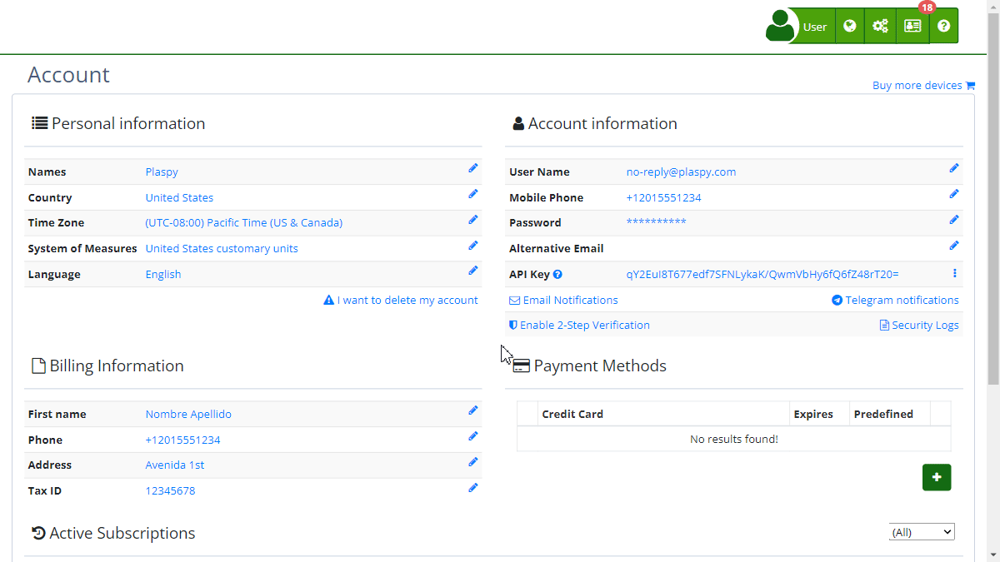

# Activate Two-Factor Authentication (2FA)
[Two-Factor Authentication \(2FA\)](https://app.plaspy.com/UserSecurity/EnableOTP) is an additional security measure that helps protect your account from unauthorized access. By enabling 2FA, you will need a security code generated by an authentication app, in addition to your password, to access your account.

#### Field Descriptions

- **Email:** Shows the email associated with the account for which 2FA is being activated.
- **Authentication Apps:** Links to recommended applications such as Google Authenticator, Authy, and Microsoft Authenticator.
- **Activate 2FA Button:** Initiates the process to activate Two-Factor Authentication.
- **Cancel Button:** Cancels the process and returns to the previous screen.

#### Step-by-Step Instructions

1. **Access 2FA Settings:**

 - Log in to your account.
 - Navigate to the "[Account](https://app.plaspy.com/Account)" section from the main menu.
 - Click on "[Activate Two-Factor Authentication](https://app.plaspy.com/UserSecurity/EnableOTP)."
2. **Start the Activation Process:**

 - On the "Activate Two-Factor Authentication" screen, you will see your associated email and a brief description of 2FA.
 - Click the "Activate 2FA" button.
3. **Set Up the Authentication App:**

 - Select and download an authentication app of your choice \(e.g., [Google Authenticator](https://support.google.com/accounts/answer/1066447?hl=en), [Authy](https://authy.com/), or [Microsoft Authenticator](https://www.microsoft.com/en/security/mobile-authenticator-app)\).
 - Open the app and follow the instructions to add a new account.
4. **Scan the QR Code:**

 - will display a QR code that you need to scan with the authentication app.
 - If your app does not support QR code scanning, you can manually enter the code provided by.
5. **Enter the Security Code:**

 - Once the QR code is scanned or entered manually, the app will generate a security code.
 - Enter this code in the corresponding field to complete the activation process.
6. **Password Confirmation:**

 - For security reasons, you will be asked to confirm your current password.
 - Enter your password and click "Accept."
7. **Finish:**

 - Once the process is completed, 2FA will be enabled for your account. Every time you log in, you will need to provide the code generated by the authentication app, in addition to your password.

#### Validations and Restrictions

- **Security Code:** The security code generated by the authentication app is valid only for a short period. Make sure to enter it quickly.
- **Password Confirmation:** You must correctly enter your current password to finalize the 2FA setup.
- **Compatible Apps:** Use only compatible and recommended authentication apps to ensure the correct generation of codes.

#### Frequently Asked Questions

- **What is Two-Factor Authentication \(2FA\)?** 2FA is a security measure that requires two forms of verification to access your account: your password and a security code generated by an authentication app.
- **What happens if I lose access to my authentication app?** If you lose access to your authentication app, contact support for assistance in recovering your account.
- **Can I disable 2FA once it is activated?** Yes, you can disable 2FA from the same settings section in your account. However, it is not recommended to disable this additional layer of security.

This guide will help you activate and set up Two-Factor Authentication on your account, enhancing the security and protection of your information.
