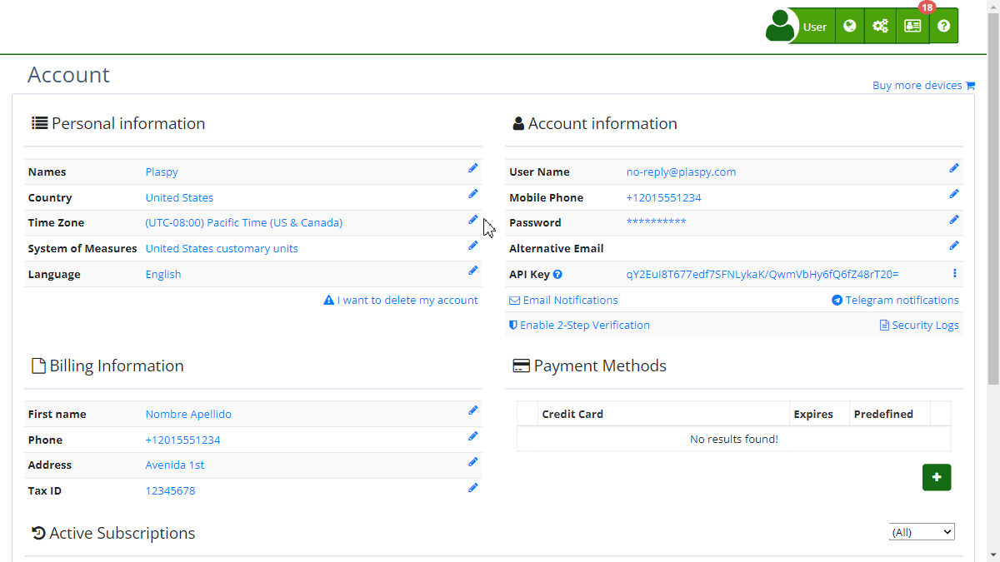

# Alternative Email
Using an [alternative email](https://app.plaspy.com/UserSecurity/Email2?from=/Account) is an additional security measure that allows you to recover your account if you cannot access your primary email. Below are the steps to configure and use this functionality.

### Field Descriptions

- **Alternative Email:** Field where you enter an additional email address that will be used to secure your account.
- **Confirm Button:** Saves the entered alternative email address.
- **Skip Now Link:** Option to skip the alternative email setup at this time.

### Step-by-Step Instructions

1. **Access Alternative Email Settings:**

 - Log in to your account.
 - If this is your first time logging in, you may be prompted to set up an alternative email.
2. **Enter the Alternative Email Address:**

 - On the "[*fa-envelope-o* Protect Your Account](https://app.plaspy.com/UserSecurity/Email2?from=/Account)" screen, you will see your primary email.
 - Below, in the "Alternative Email" field, enter an additional email address.
3. **Confirm the Alternative Email:**

 - Once the address is entered, click the "Confirm" button.
 - You may be asked to confirm your password for added security. Enter your current password and press "Accept."
4. **Skip Setup:**

 - If you do not want to set up the alternative email at this time, you can click the "Not Now" link to proceed without saving changes.

### Validations and Restrictions

- **Valid Email Address:** Ensure you enter a valid email address. The system will validate the email format before allowing you to save.
- **Password Confirmation:** For security reasons, you may be asked to confirm your current password when saving the alternative email.

### Frequently Asked Questions

- **Why do I need an alternative email?**
 - An alternative email helps you regain access to your account if you lose access to your primary email. This adds an extra layer of security to your account.
- **Can I change my alternative email later?**
 - Yes, you can change your alternative email at any time by accessing your account settings.
- **What happens if I do not set up an alternative email?**
 - Although it is not mandatory, it is recommended to set up an alternative email to ensure continuous access to your account and improve security.

This guide will help you set up and manage your alternative email, providing an additional security measure to protect your account.
