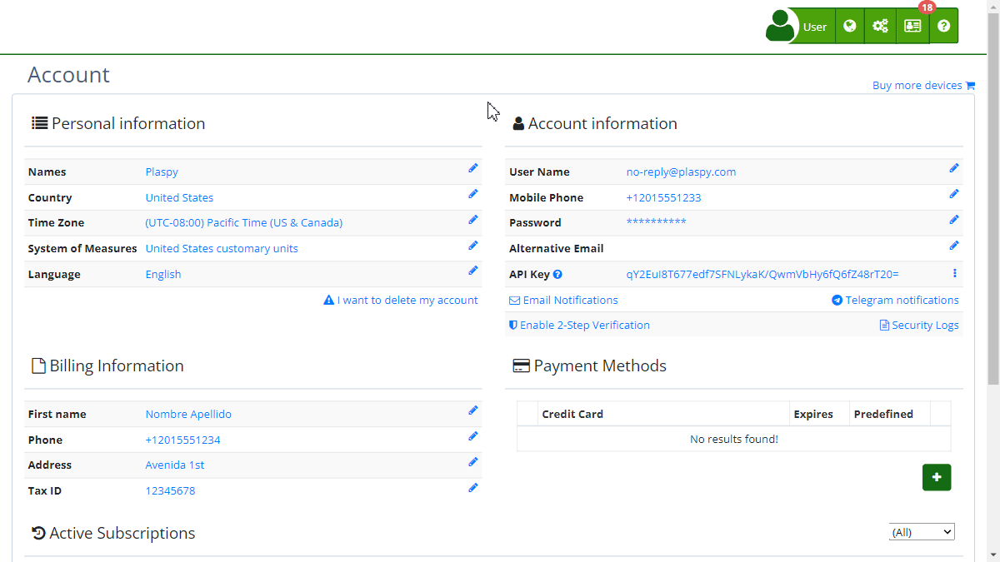

# Billing Information
The "[*fa-file-o* Billing Information](https://app.plaspy.com/Checkout/?from=/Account)" section allows users to manage and update the necessary details for billing contracted services. Here, you can register and keep the required information up to date to issue invoices correctly, which is essential to ensure the continuity of services without interruptions.

### Field Descriptions

- **Country:** Select the country corresponding to the billing address from a dropdown list. This field is mandatory and ensures that the billing information complies with local regulations.
- **First Name:** Enter your first name in the corresponding field. This is a mandatory field and must contain the legal name of the person responsible for billing.
- **Last Name:** Complete this field with your last name. Like the first name field, it is mandatory and must match legal records.
- **Phone:** Provide a contact phone number. This field is mandatory and must be a valid number that allows contact if necessary.
- **Address:** Specify the physical address where billing correspondence will be received. This field is essential for delivering any physical documents related to billing.
- **Organization:** If applicable, include the name of the organization or company for which billing is being done.
- **Document Number:** Select the type of document \(e.g., NIF, TIN, NIT, CC, etc.\) and provide the corresponding number. This field is crucial for validating tax information and ensuring invoices are issued correctly.

### Step-by-Step Instructions

1. **Access the Section:**
    - Log in to your account.
    - In the top right corner, click on your username and select **'*fa-user* My Account'**.
    - Click on "[*fa-file-o* Billing Information](https://app.plaspy.com/Checkout/?from=/Account)."
2. **Update Information:**
    - In the "[*fa-file-o* Billing Information](https://app.plaspy.com/Checkout/?from=/Account)" form, select your country from the dropdown list.
    - Enter your first and last name in the corresponding fields.
    - Provide a valid contact phone number.
    - Complete the physical billing address.
    - If applicable, add your organization's name.
    - Select the type of document and provide the corresponding tax document number.
    - Review that all information is correct and click "Save" to update the data.

### Validations and Restrictions

- **Mandatory Fields:** All fields marked with an asterisk \(\*\) are mandatory. Ensure you complete them to save the information.
- **Phone Format:** The phone number must be valid and comply with the international format, including the country code.
- **Document Number:** Depending on the selected document type, the number must comply with the format required by tax authorities.

### Frequently Asked Questions

- **What happens if I do not update my billing information?**
    - It is crucial to keep billing information updated to avoid service interruptions and issues with invoice issuance.
- **How can I correct an error in my billing information?**
    - Simply access the "*fa-file-o* Billing Information" section, make the necessary changes, and save the updated information.
- **Is it necessary to provide a physical address?**
    - Yes, a physical address is necessary for any correspondence related to billing and tax compliance.

This guide ensures that you can keep your billing information accurate and updated, facilitating efficient and trouble-free management of your services.
