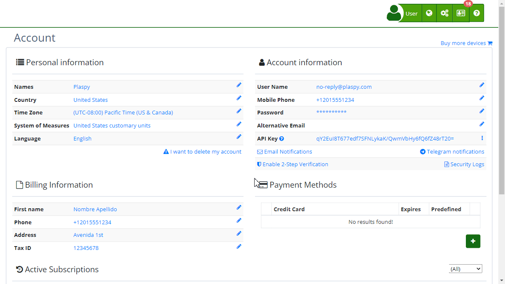

# Delete Your Account
Deleting your account on Plaspy is an important and final decision. Before proceeding, ensure that you have canceled any active subscriptions to avoid unwanted charges. This option is irreversible, and once the account is deleted, you will not be able to recover any associated data.

### Step-by-Step Instructions

1. **Access the Account Deletion Feature:**

    - Log in to [your Plaspy](https://app.plaspy.com/Account) account.
    - In the top right corner, click on your username and select **' My Account'**.
    - Go to the " Personal Information" section.
    - Select the "[I want to delete my account](https://app.plaspy.com/UserSecurity/Delete?from=/Account)" option.
2. **Deletion Confirmation:**

    - A screen will appear with a warning message about deleting the account.
    - If you are sure you want to proceed, click the red "Remove my account" button.
3. **Password Verification:**

    - For security reasons, you will be asked to enter your current password to confirm the deletion.
    - Enter your password and click "Accept."
4. **Final Confirmation:**

    - After verifying your password, the account will be permanently deleted.
    - You will receive a notification confirming the deletion of your account.

### Validations and Restrictions

- **Active Subscriptions:** Before deleting your account, make sure to cancel any active subscriptions to avoid additional charges.
- **Data Recovery:** Once the account is deleted, no data can be recovered, nor can the account be reactivated.

### Frequently Asked Questions

- **What happens to my data once my account is deleted?**
    - All data associated with your account will be permanently deleted and cannot be recovered.
- **Can I cancel the deletion of my account?**
    - No, once you confirm the deletion of your account and it is processed, there is no way to reverse this action.
- **What should I do if I have an active subscription?**
    - You must cancel any active subscriptions before proceeding with the deletion of your account to avoid unwanted charges.

### Conclusion

Deleting your account on Plaspy is a simple but irreversible process. Make sure you are completely certain before proceeding and follow the steps carefully to ensure that the deletion is done correctly and securely.
