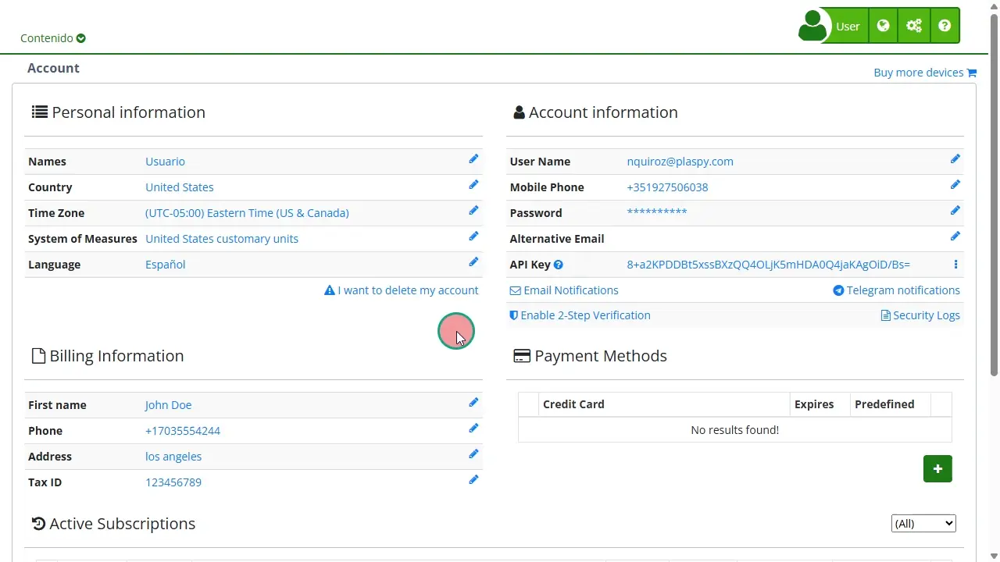

# Email Notifications
[Email notifications](https://app.plaspy.com/UserSecurity/MailNotifications) in Plaspy allow users to stay informed about the latest updates, news, and relevant events. Through this feature, users can customize and select the categories of notifications they wish to receive directly in their email.

### Field Descriptions

- **Email Address:** User's email address where notifications will be received.
- **Notification Categories:**
    - **Product Updates:** Receive updates on system changes, improvements, and new features.
    - **Company News:** Stay informed with the latest news, instructional videos, and useful demonstrations.
    - **Device Limit Alerts:** Notifies you when a device exceeds the number of available daily alerts.
- **I do not wish to receive any notifications:** Option to disable all email notifications.
- **Confirm Button:** Saves the selected preferences.
- **Cancel Button:** Cancels the process and returns to the previous page.

### Step-by-Step Instructions

1. **Access Notification Settings:**

    - Log in to your Plaspy account.
    - In the top right corner, click on your username and select **'** My Account**'**.
    - Click on "[Email Notifications](https://app.plaspy.com/UserSecurity/MailNotifications)."
2. **Select Categories:**

    - On the configuration screen, you will see your email address and a description of the available notifications.
    - Check the boxes for the notification categories you want to receive: Changes, News and/or Device Limit Alerts.
3. **Disable Notifications:**

    - If you do not wish to receive any notifications, check the box "I do not wish to receive any notifications." This action will automatically uncheck all categories.
4. **Confirm Preferences:**

    - Once you have selected your preferences, click the "Confirm" button to save the changes.
5. **Cancel Configuration:**

    - If you decide not to make any changes, click the "Cancel" button to return to the previous page without saving changes.

### Validations and Restrictions

- **Selected Categories:** You must select at least one notification category if you have not checked the option to disable all notifications.
- **Email Address:** Ensure that the email address shown is correct to receive notifications. If you need to update it, you can do so from the account information section.

### Frequently Asked Questions

- **Can I change my notification preferences later?**
    - Yes, you can change your notification preferences at any time by accessing the " Email Notifications" section in your account.
- **What happens if I do not select any category and do not check the option to disable notifications?**
    - If you do not select any category and do not check the option to disable notifications, no changes will be saved, and you will continue to receive notifications according to your previous configuration.
- **How can I ensure that Plaspy emails do not end up in my spam folder?**
    - Add Plaspy's email address to your contact list or safe senders list in your email service to ensure that messages reach your inbox.

This guide ensures that you can configure and customize your email notifications efficiently, keeping you always informed about what matters most in Plaspy.
