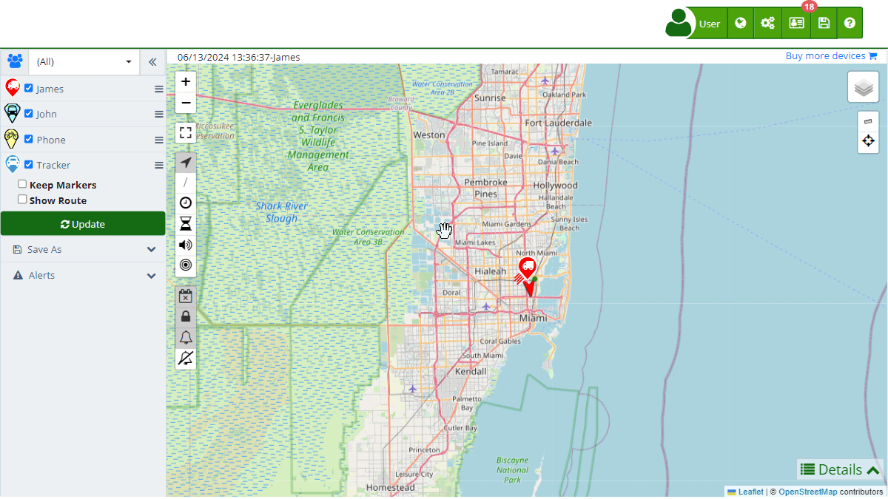

# My Account
In the "[My Account](https://app.plaspy.com/Account)" section, you can manage all relevant information about your profile and personal settings. This section is designed to offer you easy and quick access to your data, allowing you to update and manage your account efficiently.

### *fa-list* Personal Information

- **Names:** Displays the registered user name\(s\). You can edit this information by clicking the pencil icon and then saving the changes.
- **Country:** Shows the country registered to your account. To change it, select the pencil icon, update the information, and save the changes.
- **Time Zone:** Displays the time zone selected at registration. If you want to modify it, click the pencil icon, select the new time zone, and save the changes.
- **Measurement System:** Allows you to choose between different measurement systems to customize how data is displayed on the platform. The available measurement systems are:

 1. **International System of Units \(SI\):** Uses meters, liters, and kilograms as basic units for measuring distance, volume, and weight, respectively. Kilometers for distance, liters for fuel volume, and kilograms for weight. For example, a 100-kilometer trip, a 50-liter fuel tank.
 2. **US Customary Units:** Uses feet, gallons, and pounds as basic units for measuring distance, volume, and weight, respectively. Miles for distance, gallons for fuel volume, and pounds for weight. For example, a 62-mile trip, a 13.2-gallon fuel tank.
 3. **Metric System with Gallons:** Combines the use of the metric system for distance and weight with the US gallon for measuring fuel volume. Kilometers for distance, gallons for fuel volume, and kilograms for weight. For example, a 100-kilometer trip, a 13.2-gallon fuel tank.

- **Language:** Indicates the language of the platform. You can change the language by clicking the pencil icon, selecting the new language, and saving the changes.
- ***fa-exclamation-triangle* I want to delete my account:** This option allows you to **permanently delete** your account. Before doing so, please make sure to cancel any active subscriptions to avoid future charges.

### *fa-user* Account Information

- **[Username](primary_email):** This is the email address you registered with on and where you receive all notifications. You can change it from this section.
- **[Mobile Phone](update_mobile_phone_number):** Displays the phone number associated with your account. To update it, click the pencil icon and follow the instructions to save the changes.
- **[Password](password_change):** Here you can change your current password. You only need to select the pencil icon and follow the instructions to set a new secure password.
- **[Alternative Email](alternative_email):** Indicates an alternative email for account recovery. You can update it from this section.
- **[API Key](../developers/enable_the_api):** Shows your API key, which you can use for integrations and developments. You can copy, generate a new one, or delete the API key from this section.

#### Notifications and Security

- **[*fa-envelope-o* Email Notifications](email_notifications):** Configure the notifications you want to receive by email. You can add multiple email addresses separated by commas or semicolons. You can also select the categories of notifications you want to receive, such as platform changes or important news.
- **[*fa-telegram* Telegram Notifications](telegram_accounts):** Allows you to receive notifications via Telegram by configuring this option from your account.
- **[*fa-shield* Two-Factor Authentication](enable_twofactor_authentication_2fa):** Activate or deactivate two-factor authentication to increase your account security.
- **[*fa-file-text-o* Access Logs](security_log):** Check your account access logs to monitor any suspicious activity.

### *fa-file-o* Billing Information

- **Names:** Displays the name registered for billing purposes. You can edit it from this section.
- **Organization:** Indicates the name of the organization associated with the account. You can update this information as needed.
- **Phone:** Displays the phone number registered for billing. Update this information if necessary.
- **Address:** Displays the registered billing address. You can change it as needed.
- **Tax ID:** Shows the registered tax ID. You can update this information from this section.

### *fa-credit-card* Payment Methods

- **Credit Cards:** Displays the credit cards associated with your account. You can add new cards, delete existing ones, and set the default card for payments.

### *fa-history* Active Subscriptions

- **Quantity, Value, and Product:** Displays a summary of all your active subscriptions, including the quantity, value, and associated product.

### *fa-file-text-o* Receipts and Invoices

- **Date, Quantity, Due Date, Value, and Product:** Displays a history of your receipts and invoices, including details such as the issuance date, quantity, due date, value, and associated product.
