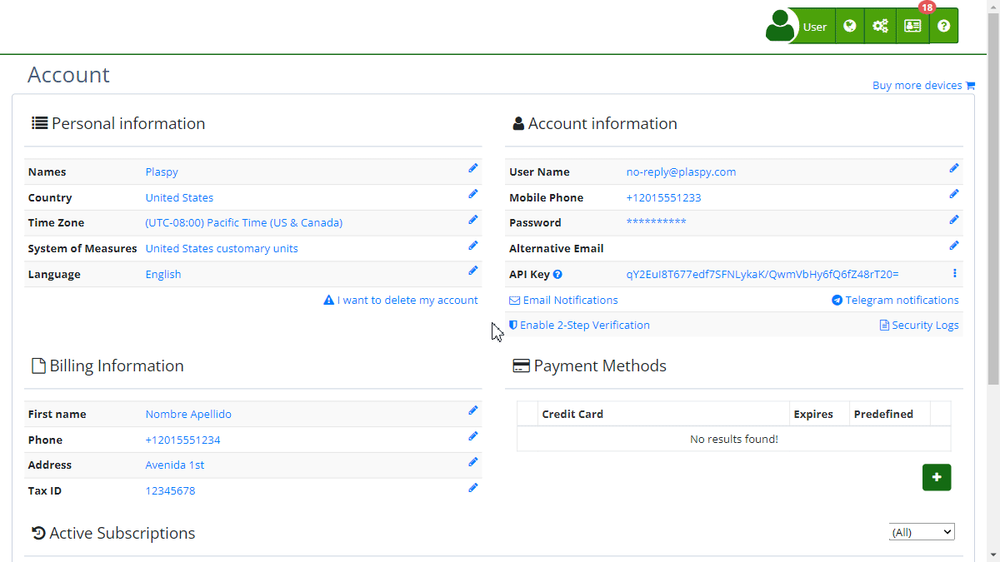

# Password Change
To maintain the security of your Plaspy account, it is important to regularly change your password. Plaspy allows you to update your password directly from your user profile. Make sure to follow security policies when creating a new password.

You can access the password change option from the "[Account](https://app.plaspy.com/Account)" section in the user menu. Once there, under '*fa-user* Account information', click on "*fa-pencil*" next to **Password**.

### New Password Requirements

- **1 lowercase letter:** Must include at least one lowercase letter \(a-z\).
- **1 uppercase letter:** Must include at least one uppercase letter \(A-Z\).
- **1 number:** Must contain at least one number \(0-9\).
- **8 characters:** The minimum length of the password must be 8 characters.

### Fields

- **New password:** Enter your new password ensuring it meets the mentioned requirements.
- **Confirm new password:** Re-enter the new password to confirm it.

### Step-by-Step Instructions

1. **Access the "Account" section:** In the top right corner, click on your username and select **'*fa-user* My Account'**.
2. **Update your password:** Under '*fa-user* Account information', click on "*fa-pencil*" next to **Password**.
3. **Enter the new password:** Ensure the new password meets all security requirements.
4. **Confirm the new password:** Re-enter the new password in the confirmation field.
5. **Save changes:** Click the "Change" button to save your new password.

### Validations and Restrictions

- The new password must meet all mentioned security requirements.
- Both passwords \(the new one and its confirmation\) must match.
- If any validation fails, an error message will be displayed indicating which requirements were not met.

### Frequently Asked Questions

- **Why is it important to change my password regularly?**
    - Changing your password regularly helps protect your account from unauthorized access and potential security breaches.
- **What do I do if I forget my new password?**
    - If you forget your new password, you can reset it using the password recovery option on the Plaspy login page.
- **Can I use a password that I have used before?**
    - It is recommended not to reuse old passwords to ensure better security.

This guide ensures that you can change your password efficiently, maintaining the security of your Plaspy account.
