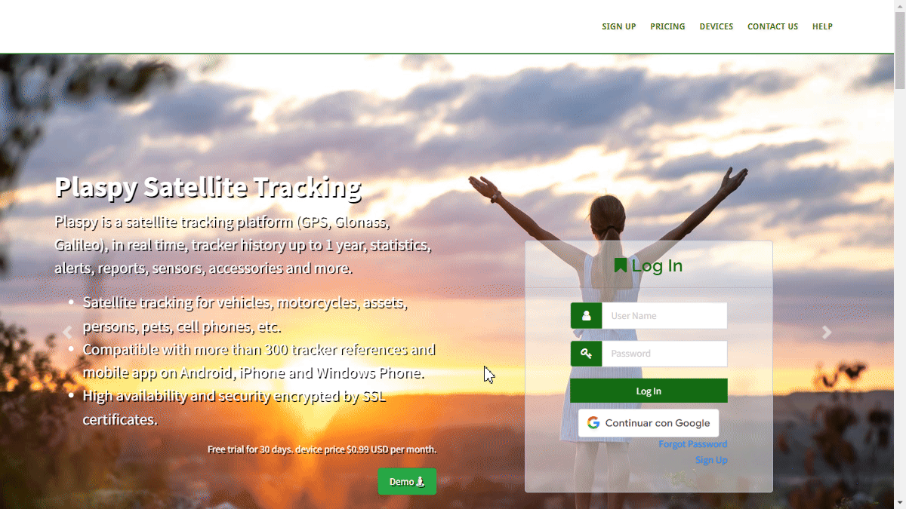

# Password Recovery
, the "[Password Recovery](https://app.plaspy.com/Forgot/Password)" functionality allows users to reset their password in case it is forgotten. This guide will walk you through the steps necessary to regain access to your account securely and efficiently.

### Introduction

To access the password recovery option, follow these steps:

1. Open your web browser and go to the ma page.
2. Click on the "[Forgot your password?](https://app.plaspy.com/Forgot/Password)" link located below the login field.
3. You will be redirected to the password recovery page.

### Field Descriptions

- **Email for login**: Enter the email address associated with your account.
- **I'm not a robot**: Check the box to complete the reCAPTCHA, confirming you are not a robot.

### Step-by-Step Instructions

1. **Enter Email**: In the "Email for login" field, enter the email address you used to register your account.
2. **Complete reCAPTCHA**: Check the "I'm not a robot" box. This may require you to complete a short visual challenge to verify your identity.
3. **Click on Recover**: Once you have entered your email address and completed the reCAPTCHA, click the "Recover" button.
4. **Email Verification**: will send an email to the provided address. Check your inbox \(and spam folder, if necessary\) for the password recovery email. This email will contain a 6-digit verification code.
5. **Enter Verification Code**: Once you receive the email, open the message and locate the 6-digit verification code. Enter this code on the page where requested to continue the password reset process.
6. **Reset Password**: After entering the verification code, you will be redirected to a page where you can enter a new password.
7. **Enter New Password**: Enter a new password in the provided fields and confirm the password by entering it again. Make sure your new password is secure and easy to remember.
8. **Confirm Changes**: Click the button to confirm the changes. You can now log in to your account using your new password.

### Validations and Restrictions

- **Registered Email**: Ensure you enter the email address registered with your account. Otherwise, you will not receive the recovery email.
- **Verification Code**: The 6-digit code is valid for a limited time only. Make sure to enter it as soon as possible to continue with the reset process.
- **Password Security**: The new password must meet 's security requirements, such as minimum length and a combination of letters, numbers, and special characters.
- **Response Time**: The password reset link in the email may have a limited validity period. Make sure to use it as soon as possible.

### Frequently Asked Questions

- **What should I do if I do not receive the password recovery email?**
    - Check your spam or junk mail folder.
    - Ensure the email address entered is correctly registered with your account.
    - If you still do not receive the email, try repeating the process or contact support.
- **How can I ensure my new password is secure?**
    - Use a combination of uppercase and lowercase letters, numbers, and special characters.
    - Avoid using common passwords or easily guessable personal information.
    - Consider using a long and unique passphrase that only you know.

By following these steps, you can reset your password securely and quickly, ensuring your account remains accessible and protected.
