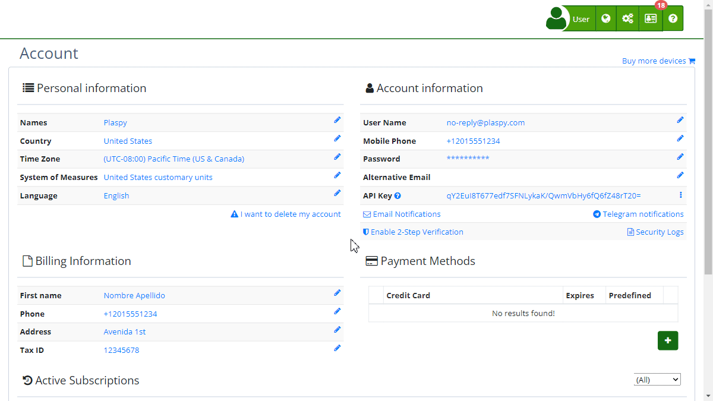

# Primary Email
In Plaspy, the [primary email](https://app.plaspy.com/UserSecurity/Email?from=/Account) is essential for account security and management. This email is used for all important notifications and user identity verification. Below are the steps to configure and change the primary email of your [account](https://app.plaspy.com/Account).

### Field Descriptions

- **Primary Email:** Email address used to log in and receive important notifications.

### Step-by-Step Instructions

1. **Access Account Settings:**

    - Log in to your Plaspy account.
    - In the top right corner, click on your username and select **'*fa-user* My Account'**.
2. **Modify the Primary Email:**

    - In the "Account Information" section, click on the edit icon next to the current email address.
    - A pop-up window titled "[*fa-envelope-o* Protect Your Account](https://app.plaspy.com/UserSecurity/Email?from=/Account)" will open.
3. **Enter New Email Address:**

    - In the "Login Email" field, enter the new email address.
    - Read the message indicating that changing the email will automatically log you out and require verification.
4. **Confirm the Change:**

    - Click "Confirm."
    - You will receive an email at the new address to verify the change.
5. **Verify New Email Address:**

    - Open the verification email sent to your new address.
    - Follow the instructions in the email to complete the verification.

### Validations and Restrictions

- **Valid Email Address:** Ensure you enter a valid and accessible email address.
- **Verification Required:** You cannot use the new email address until you complete the verification.
- **Additional Security:** For security reasons, you will be asked to enter your current password to confirm the change.

### Frequently Asked Questions

- **What happens if I do not verify my new email address?**
    - If you do not verify the new email address, you will not be able to use it to log in, and notifications will continue to be sent to the old email.
- **Can I use the same email address for multiple accounts?**
    - No, each email address must be unique and cannot be associated with more than one Plaspy account.
- **How do I regain access if I cannot verify the new email?**
    - If you have trouble verifying your new email address, contact Plaspy support for further assistance.

This guide will help you effectively manage your primary email in Plaspy, ensuring the security and accessibility of your account.
