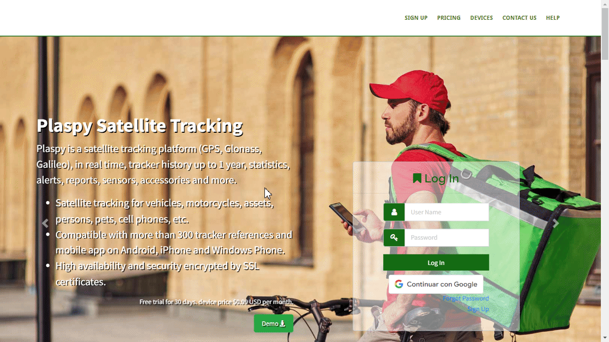

# Recover Username
In Plaspy, the "[Recover Username](https://app.plaspy.com/Forgot/User)" functionality allows users to retrieve their username if they have forgotten it. This guide will walk you through the steps necessary to recover your username securely and efficiently.

### Introduction

To access the username recovery option, follow these steps:

1. Open your web browser and go to the main Plaspy page.
2. Click on the "[Forgot your username?](https://app.plaspy.com/Forgot/User)" link located below the login field.
3. You will be redirected to the username recovery page.

### Field Descriptions

- **Device Identifier or IMEI**: Enter the identifier, IMEI, or serial number of any device registered to your Plaspy account.
- **Mobile Phone Number**: Enter the mobile phone number registered to your Plaspy account.
- **I'm not a robot**: Check the box to complete the reCAPTCHA, confirming you are not a robot.

### Step-by-Step Instructions

1. **Select Recovery Method**: On the username recovery page, choose the method you prefer to recover your username: "Device Identifier or IMEI" or "Mobile Phone Number".
2. **Enter Information**:

    - If you selected "Device Identifier or IMEI", enter the identifier, IMEI, or serial number of any device registered to your account in the corresponding field.
    - If you selected "Mobile Phone Number", enter your registered mobile phone number in the corresponding field.
3. **Complete reCAPTCHA**: Check the "I'm not a robot" box. This may require you to complete a short visual challenge to verify your identity.
4. **Click on Recover**: Once you have entered the required information and completed the reCAPTCHA, click the "Recover" button.
5. **Display Username on Screen**: Your registered email address and username will be displayed on the screen once the information is completed.
6. **Email Verification**: Additionally, Plaspy will send an email to the registered address with your username and the registered email address. Check your inbox \(and spam folder, if necessary\) to find the email with your username and registered email address.
7. **Retrieve Username**: You will now be able to see your username on the screen and also in the email sent to you. Use this username to log in to your Plaspy account.

### Validations and Restrictions

- **Registered Information**: Ensure you correctly enter the device identifier, IMEI, serial number, or registered mobile phone number in your Plaspy account. Otherwise, the information will not be displayed and you will not receive the recovery email.
- **Security of the Process**: The reCAPTCHA ensures the process is completed by a human and not a bot.
- **Email Verification**: The recovery email may have a limited validity period. Make sure to use the information provided as soon as possible.

### Frequently Asked Questions

- **What should I do if my username does not appear on the screen or I do not receive the recovery email?**
    - Check your spam or junk mail folder.
    - Ensure the information entered is correctly registered with your Plaspy account.
    - If you still do not receive the email, try repeating the process or contact Plaspy support.
- **How can I ensure my contact information is up-to-date in Plaspy?**
    - Log in to your Plaspy account and verify that your contact information \(email and mobile phone number\) is correct and up-to-date.
    - If necessary, update your information to avoid future issues when recovering your username or resetting your password.

By following these steps, you can recover your username securely and quickly, ensuring your Plaspy account remains accessible.
