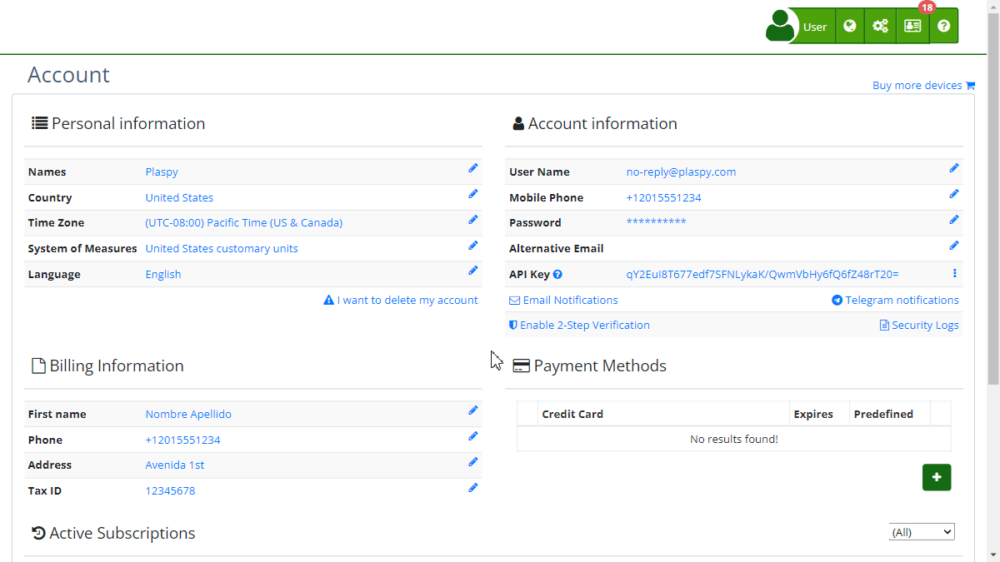

# Security Log
The Security Log in Plaspy allows users to monitor and review all login activities performed on their account. This tool is essential for maintaining account security as it provides a detailed record of every time someone accesses the account, including information about the date, event, browser used, and the country from which the access was made.

To access the Security Log, follow these steps:

1. Log in to your Plaspy account.
2. In the top right corner, click on your username and select ' My Account'.
3. At the bottom of the screen, you will find the " Security Log" panel.

### Security Log Fields

- **Date:** Shows the exact date and time of access.
- **Event:** Describes the type of event recorded.
- **Browser:** Details the browser and operating system from which the access was made.
- **Country:** Indicates the country from which the access was made, based on the IP address.

### Step-by-Step Instructions

1. **View the Log:** Once in the " My Account" section, click on " Security log" to be automatically displayed. You can review the recent and detailed access events.
2. **Load More Records:** If you want to see more access records, click the "Load more" button at the bottom of the table. This will allow you to load additional events and review more entries.

### Validations and Restrictions

- **Recent Accesses:** The logs show the most recent accesses at the top of the list.
- **Browser Details:** It is important to note that the browser details include the operating system, which can be useful for identifying suspicious accesses.
- **Country and IP Address:** The country flag and IP address help identify unusual access locations that could indicate a possible security breach.

### Frequently Asked Questions

- **How can I know if someone accessed my account without my permission?**
    - Review the Security logs to identify any events you do not recognize, especially those from unknown locations or devices.
- **What should I do if I detect suspicious access?**
    - If you find any suspicious access, we recommend changing your password immediately and enabling two-factor authentication to improve your account's security.
- **Does the Security log show failed login attempts?**
    - Currently, the Security log in Plaspy only shows successful login events. For more details about failed attempts, contact Plaspy's technical support.
- **Can I export my Security log?**
    - For now, Plaspy does not offer an option to export the Security log. However, you can take screenshots if you need to save this information.

Using the Security Log will help you maintain the security of your account, allowing you to stay aware of all login activities and quickly detect any suspicious behavior.
