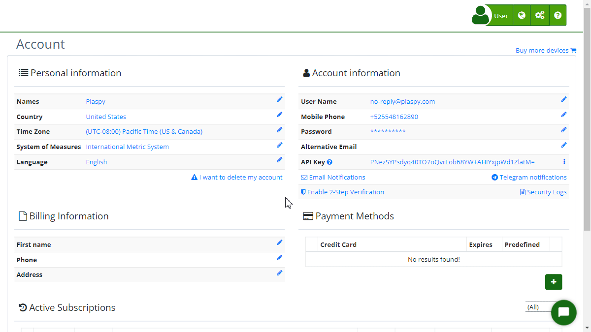
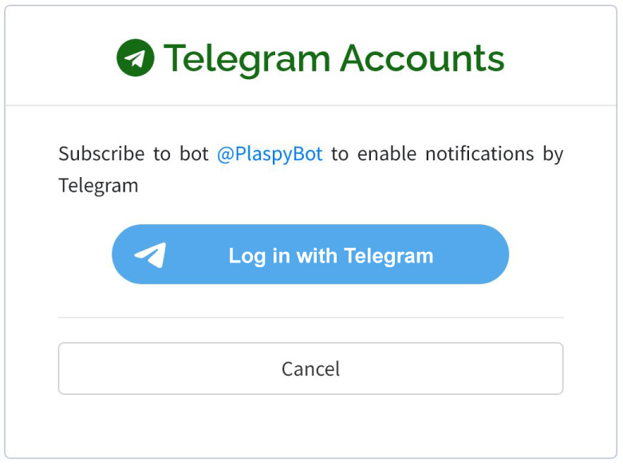
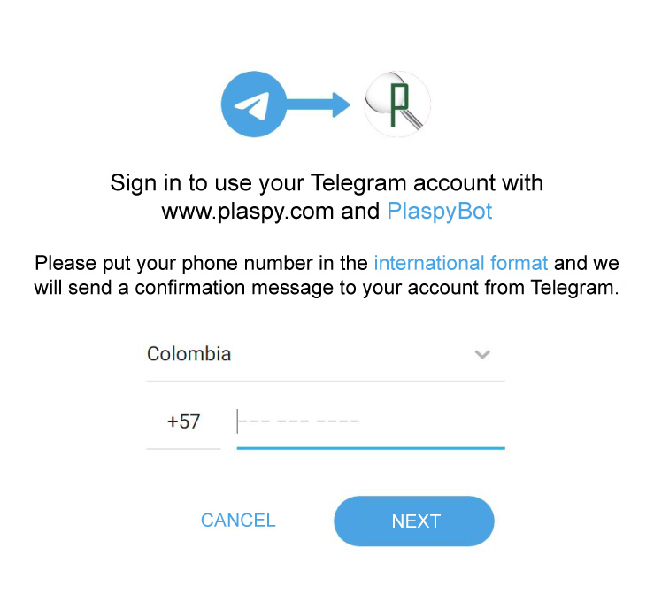
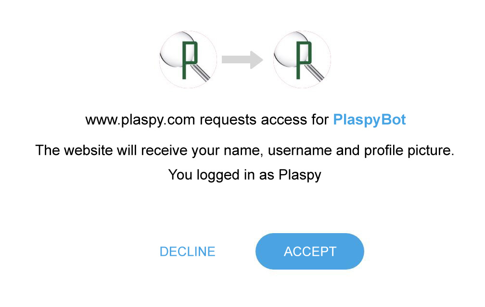

# Telegram Accounts
Plaspy allows users to receive notifications via [Telegram](https://app.plaspy.com/Telegram?from=/Account), making it easy to stay updated with important events in real-time. Below are the steps to configure this option:

### Field Descriptions

- **Telegram Bot:** @PlaspyBot is the bot that will allow you to receive notifications on your Telegram account.
- **Log in with Telegram:** Button that redirects to Telegram authentication to link your Plaspy account.
- **Cancel:** Button that cancels the Telegram notification setup process and returns you to the previous page.

### Step-by-Step Instructions

1. **Access Telegram Notification Settings:**

    - Log in to your Plaspy account.
    - In the top right corner, click on your username and select **'*fa-user* My Account'**.
    - Click on the "[*fa-telegram* Telegram Notifications](https://app.plaspy.com/Telegram?from=/Account)" option.  

2. **Subscribe to the Telegram Bot:**

    - On the "Telegram Accounts" screen, click the Telegram bot link @PlaspyBot or the "Log in with Telegram" button.
    - You will be redirected to the Telegram authentication page. Enter your Telegram credentials if necessary.  

3. **Authentication and Permissions:**

    - Complete the authentication process in Telegram to allow Plaspy to send notifications to your account.
    - Once authenticated, you will automatically return to Plaspy and see a confirmation that your account is linked with Telegram.  

4. **Additional Settings:**

    - If at any time you wish to cancel the subscription, you can do so from the same "[*fa-telegram* Telegram Notifications](https://app.plaspy.com/Telegram?from=/Account)" section in Plaspy.

### Validations and Restrictions

- **Authentication:** You must have an active Telegram account to link it with Plaspy and receive notifications.
- **Permissions:** Ensure you grant the necessary permissions during authentication for the notifications to be sent correctly.

### Frequently Asked Questions

- **What type of notifications will I receive via Telegram?**
    - You will receive notifications related to important events, device alerts, changes to your account, and other relevant updates.
- **Can I disable Telegram notifications at any time?**
    - Yes, you can disable notifications at any time by going back to the "Telegram Notifications" section in Plaspy and selecting the unsubscribe option.
- **Is it safe to link my Telegram account with Plaspy?**
    - Yes, the linking process uses Telegram's secure authentication methods to protect your information and ensure that only you can receive the notifications.

This guide will help you set up and manage Telegram notifications efficiently, ensuring you are always informed about important events and updates from Plaspy.
