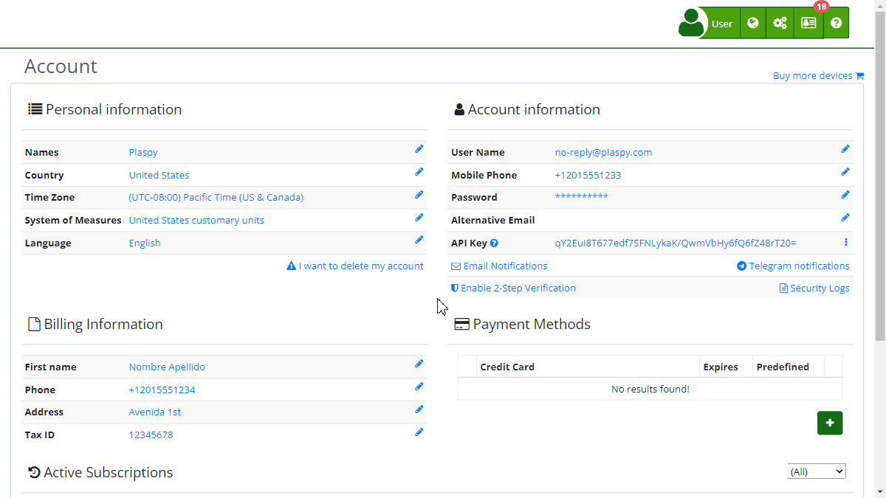

# Update Mobile Phone Number
The "[Update Mobile Phone Number](https://app.plaspy.com/UserSecurity/Phone?from=/Account)" feature in Plaspy allows users to update their recovery phone number. This feature is crucial for account security as the phone number can be used in case the account is locked or if suspicious activity is detected. Below are the steps and considerations for updating the mobile phone number on the platform.

### Access

To access the option to update your mobile phone number:

1. Log in to your Plaspy account.
2. In the top right corner, click on your username and select **' My Account'**.
3. Select "[Update Mobile Phone Number](https://app.plaspy.com/UserSecurity/Phone?from=/Account)."

### Field Description

- **Recovery Phone Number:** This field must contain the phone number in international format \(e.g., +155512345678\). This number will be used to recover the account in case of forgotten password or detection of suspicious activity.

### Step-by-Step Instructions

1. **Access the Page:** In the top right corner, click on your username and select **' My Account'**.
2. **Enter Number:** Enter the recovery phone number in international format.
3. **Confirm Changes:** Click the "Confirm" button to save the new number. If you decide not to make changes, select "Not Now" to cancel the operation.

### Validations and Restrictions

- **International Format:** The phone number must be in international format. It should include the country code followed by the phone number.
- **Valid Number:** The system validates that the entered number is a valid phone number. If the number does not meet the format requirements, the system will display an error message requesting a valid number.
- **Mandatory Field:** Entering a phone number is mandatory to save the changes.

### Frequently Asked Questions

- **Why do I need a recovery phone number?**
    - The recovery phone number is necessary to secure your account and allow recovery in case you forget your password or if Plaspy detects suspicious activity.
- **Can I use any phone number?**
    - You can use any phone number that meets the international format and is accessible to you in case of emergencies related to your account.
- **What if I do not have a phone number in international format?**
    - It is necessary for the number to be in international format. If you do not have one, consider acquiring a number that can be used for this purpose.
- **How do I know if my number was updated correctly?**
    - After entering and confirming the number, you will receive a notification on the platform indicating that the changes have been successfully saved.

This functionality ensures that your account is protected and that you can always recover access in case of security issues. Make sure to keep your recovery number updated and correctly entered in the required format.
