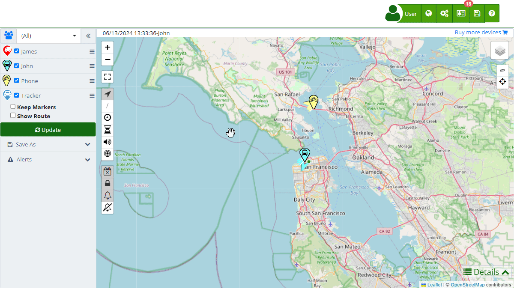

# Reports
The [reports](https://app.plaspy.com/Reports) section in Plaspy provides users with the ability to generate detailed reports based on the data collected by their satellite tracking devices. This functionality is essential for monitoring the activity, location, and performance of vehicles and other assets. Reports can be customized to meet the specific needs of users, enabling efficient management and informed decision-making.

To access the reports section, log into Plaspy, navigate to the main menu, and select the "[Reports](https://app.plaspy.com/Reports)" option. Once there, you can configure your query parameters and apply various filters to obtain the specific information you need.

### Field Descriptions

- **Query**: Allows you to select the type of report you want to generate, such as "Map Detail," "Activity Report," "Detailed Report," "Activity Summary," and others. Users can create, edit, duplicate, and delete reports as needed.
- **Date**: Specifies the date range for the query. It can be selected using an interactive calendar or predefined options like "Today," "Last week," "Last month," and others.
- **Group**: Allows you to select a specific group of devices if they have been organized into groups. This makes it easier to query data for a particular subset of devices.
- **Devices**: This field allows you to select one or more specific devices for the query. A dropdown list with a search function can be used for quick selection.
- **Filters**: The filters section allows you to refine your query by adding additional criteria, such as minimum and maximum speed, battery level, geographical zones, among others. Users can add, edit, or remove filters as needed.

### Step-by-Step Instructions

1. **Access the Reports section**: Log into Plaspy and select " Reports" from the main menu.
2. **Select the type of report**: In the "Query" field, choose the type of report you want to generate, such as "Map Detail", "Detailed Report", etc.
3. **Define the date range**: Use the "Date" field to select the date range of interest. You can do this directly from the date picker or choose a predefined range.
4. **Choose the device group**: If you have devices organized into groups, select the appropriate group in the "Group" field. Otherwise, leave the option at "\(All\)."
5. **Select devices**: In the "Devices" field, choose one or more devices from the dropdown list. Use the search function if you have many devices.
6. **Apply additional filters**: If necessary, add specific filters to further refine the report results.
7. **Generate the report**: Click " Refresh" to generate the report with the selected parameters. You can download the report in Excel format if needed, using the "Download" button.

### Validations and Restrictions

- **Mandatory fields**: The "Query," "Date," and "Devices" fields are mandatory for generating a report. If they are not completed, the system will not allow the report to be generated.
- **Device selection**: Ensure you select at least one device for the report. The system will not generate a report if no devices are selected.

### Filters in Reports

The filters section is crucial for obtaining specific and relevant data in reports. Filters allow you to include or exclude data based on criteria defined by the user. For example, you can filter reports by battery level, speed, mileage, idle time, among others. To apply a filter:

1. **Add a filter**: Click on the filter icon and select the attribute you want to filter, such as "Battery \(%\)" or "Speed \(Km/h\)."
2. **Select the condition**: Choose the filter condition, such as "Equal \(=\)," "Greater than \(&gt;\)," or "Less than \(&lt;\)."
3. **Enter the value**: Input the specific value for the filter, such as "50" to filter devices with a 50% battery.
4. **Apply the filter**: Click "Update" to apply the filter and generate the report.

### Frequently Asked Questions

- **What types of reports can I generate in Plaspy?**
    - In Plaspy, you can generate various types of reports, including "Map Detail," "Activity Report," "Detailed Report," and "Activity Summary." Each type of report provides different perspectives and details based on the user's needs.
- **How can I filter data in the reports?**
    - You can add additional filters in the filters section when generating a report. These filters allow you to specify criteria such as speed ranges, battery levels, geographical zones, and more to refine the report results.
- **Can I download reports in Excel format?**
    - Yes, after generating a report, you can download it in Microsoft Excel format using the "Download" button available in the reports section. This makes it easier to manipulate and further analyze the data in spreadsheet programs.
