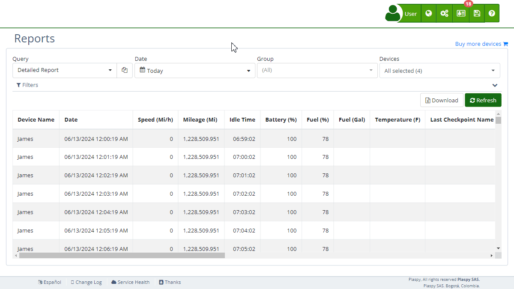

# New Report
Creating a new [report](https://app.plaspy.com/Reports) in Plaspy allows users to customize how they visualize and analyze the tracking data from their devices. This functionality is essential for tailoring reports to specific needs, providing considerable flexibility in data management. Users can create a new report from scratch, duplicate an existing one to use as a base, or edit a current report.

### Types of Reports

When creating a new report, there are two main types of reports you can generate:

- **Standard**: This type of report is commonly used on the [map](../map) for [map details](../map/details) or to apply filters when querying a route. It provides a detailed and precise view of the behavior and location of the fleet in real-time. Each record represents a specific location of an asset, providing data such as instantaneous speed, geographical coordinates, and the exact time of the record. It is ideal for users who need exhaustive tracking and meticulous recording of the activities of each vehicle or asset in their daily operations.
- **Activity Summary**: This type of report is used for downloading [activity summaries](../activity_summary). It consolidates the information of the assets, providing a simplified report that facilitates an overall view of daily performance. Instead of specific locations, this report focuses on aggregated statistics, such as the maximum or average speed achieved per day and other summary indicators that allow for quick assessment of the performance and efficiency of the entire fleet. It is ideal for a strategic view and decision-making at the managerial level.

### Creating a New Report

To create a new report, follow these steps:

1. **Access the Reports Section**: Log into Plaspy and navigate to the "[*fa-tasks* Reports](https://app.plaspy.com/Reports)" section in "*fa-globe*."
2. **Select 'New Report'**: In the query field, select "\(New query\)" to start from scratch. If you prefer to duplicate an existing report, select the report and click the copy button.
3. **Name the Report**: Enter a descriptive name for the new report in the "Report name" field.
4. **Select Report Type**: Choose between "Standard" and "Activity Summary" based on the type of analysis you need.
5. **Configure Parameters**: Set the date, group, and device parameters you want to include in the report.
6. **Add Columns and Filters**: Use the variables section to add the columns you want to include and configure the necessary filters.
7. **Save the Report**: Click "*fa-floppy-o* Save" to store the new report in the system.

### Editing an Existing Report

To edit an existing report:

1. **Select the Report**: Choose the [report](https://app.plaspy.com/Reports) you want to edit from the query dropdown menu and click on "*fa-pencil-square-o*."
2. **Modify Parameters**: Change the date, group, and device parameters as needed.
3. **Reorder or Remove Columns**: Report columns can be reordered, removed, or renamed directly in the editor.
4. **Update the Report**: Click "*fa-floppy-o* Save" to apply the changes.

### Duplicating a Report

To duplicate a report and use it as a base for a new one:

1. **Select the Report**: Choose the [report](https://app.plaspy.com/Reports) you want to duplicate from the dropdown menu and then click on "*fa-files-o*."
2. **Make a Copy**: Click the copy icon to duplicate the selected report.
3. **Modify the Copy**: Rename and adjust the parameters of the copy according to your needs.
4. **Save the New Report**: Click "*fa-floppy-o* Save" to store the copy as a new report.

### History Section

The "History" tab allows users to view all modifications made to a report. Each change is recorded with a timestamp and a brief description, making it easy to track alterations. Users can revert to a previous version of the report with all the changes made up to that point, providing an efficient way to undo unwanted changes. Additionally, users can use the OpenAI integration to request modifications to the report using natural language, significantly simplifying report customization.

### Variables Section

In the "Variables" tab, users can manually add columns to their reports. This section includes a list of all available variables that can be included, such as:

- **Device Name**: The name or unique identifier of the tracking device.
- **Date**: The date and time the last location data of the tracking device was collected.
- **Speed \(Km/h\)**: The current speed at which the tracking device is moving.
- **Battery \(%\)**: The percentage of battery charge remaining in the tracking device.

To add a variable:

1. **Search for the Variable**: Use the search bar to find the desired variable.
2. **Add the Variable**: Click the "+" icon next to the variable to add it to the report.

### Report Properties

The "Properties" tab allows users to modify the report's properties. By default, only the current user can view the report, but this setting can be changed to allow all sub-users of the account to view it as well.

Once the adjustments are complete, click "*fa-floppy-o* Save" to apply the changes and update the report.
