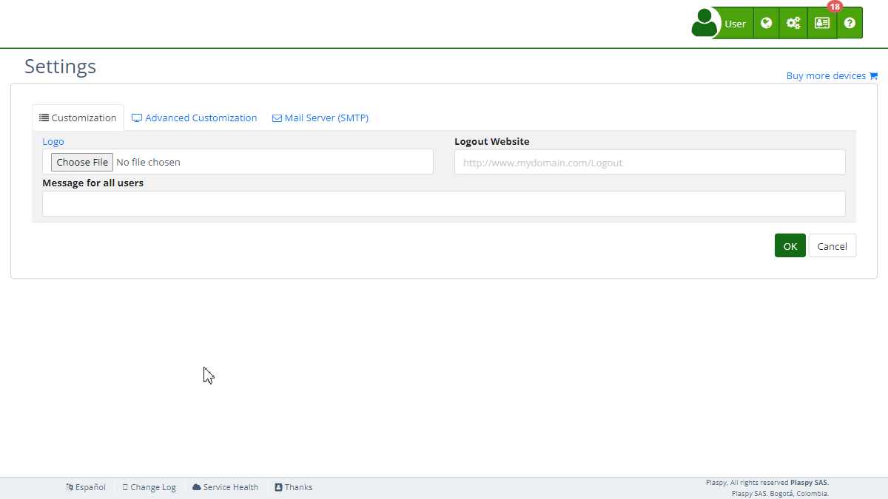

# Contact
The "Contact" section 's [settings](https://app.plaspy.com/Settings) allows administrators to provide contact information and configure chat services for user assistance. This section is crucial to ensure users can easily communicate with technical support or customer service. This guide details all available fields and the steps to configure them properly.

### Field Descriptions

- **Smartsupp Chat Key**: API key to integrate the Smartsupp chat service.
- **tawk.to Chat Key**: API key to integrate the tawk.to chat service.
- **Contact Us Email**: Email address where requests sent by users through the contact form will be received. By default, this address is that of the account administrator.
- **Contact Information**: Rich text field to add additional contact information.

### Step-by-Step Instructions

1. **Access the Section**:
    - Log in to and go to the main menu in the top right corner in \(*fa-cogs*\).
    - Select "[*fa-list* Settings](https://app.plaspy.com/Settings)", click "*fa-television* Advanced Customization" and then "*fa-envelope* Contact".
2. **Configure Smartsupp Chat Key**:
    - Obtain the API key from your Smartsupp account.
    - Enter the key in the "Smartsupp Chat Key" field.
    - Help link: [Smartsupp Chat Code](https://smartsupp.helpjuice.com/es_ES/preguntas-frecuentes)
3. **Configure tawk.to Chat Key**:
    - Obtain the API key from your tawk.to account.
    - Enter the key in the "tawk.to Chat Key" field.
    - Help link: [tawk.to](https://www.tawk.to/) Chat Code
4. **Configure the Contact Email**:
    - Enter the email address that users can use to contact support through the contact form.
    - Ensure the address is valid and regularly monitored. By default, this address is that of the account administrator.
5. **Add Additional Contact Information**:
    - Use the rich text editor in the "Contact Information" field to provide additional details such as phone numbers, business hours, and other contact methods.
    - You can format the text, add links, and more using the tools available in the editor.
6. **Save Changes**:
    - Review all fields to ensure the information is correct.
    - Click "Accept" to save all changes made.

### Validations and Restrictions

- **Smartsupp Chat Key and tawk.to Chat Key**: Must be valid API keys obtained from the respective platforms.
- **Contact Us Email**: Must be a valid email address where requests sent through the contact form will be received.
- **Contact Information**: No specific restrictions, but it is recommended to keep the information clear and organized to facilitate contact.

### Frequently Asked Questions

- **How do I obtain my Smartsupp Chat key?**
    - You can obtain your API key from the administration panel of your Smartsupp account. Follow the instructions in [Smartsupp Chat Code](https://smartsupp.helpjuice.com/es_ES/preguntas-frecuentes).
- **What do I do if I don't have a tawk.to key?**
    - If you do not yet have a tawk.to API key, you must create an account on tawk.to and follow the steps to obtain your key. More information in [tawk.to](https://www.tawk.to/) Chat Code.
- **What type of information should I include in the "Contact Information" field?**
    - Include any information that helps users contact support, such as phone numbers, additional email addresses, business hours, and links to contact pages or forms.
- **How do I know if my email address is valid?**
    - Ensure the email address follows the standard format \(e.g., name@domain.com\) and test by sending an email to that address to verify it is receiving emails correctly.
- **Can I customize the text design in the "Contact Information"?**
    - Yes, you can use the rich text editor to format the text, add links, lists, and more, ensuring the information is clear and easy to read.
- **What happens if I don't configure an email in "Contact Us Email"?**
    - If you do not configure a specific email address, requests sent through the contact form will be sent by default to the email address of the account administrator.

With these instructions, you can effectively configure the "Contact" section and ensure users have multiple ways to communicate 's technical support or customer service.
