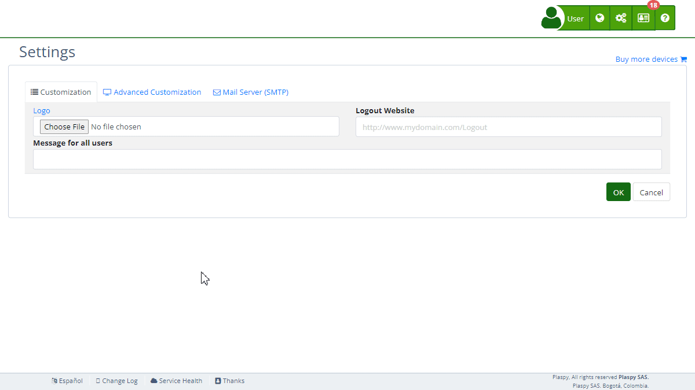

# Email Templates
The "Email Templates" section in Plaspy's [settings](https://app.plaspy.com/Settings) allows administrators to customize the content and format of various email notifications sent by the platform. This feature is essential for ensuring that communications with users are consistent with your organization's branding and messaging. This guide details the available fields and the steps to configure them properly.

### Field Descriptions

- **Type:** Dropdown menu to select the type of email template to customize \(e.g., Device Alerts, User Information Change, Device Certificate, Password Change Verification Code, Email Change Verification Code, Temporary Access Creation, Username Reminder\).
- **Language:** Dropdown menu to select the language of the email template \(e.g., English, Spanish\).
- **Title:** The subject line of the email.
- **Content:** The body of the email, which can be customized using a rich text editor.

### Step-by-Step Instructions

1. **Access the Section:**

    - Log in to Plaspy and go to the main menu in the top right corner in \(\).
    - Select "[Settings](https://app.plaspy.com/Settings)", click " Advanced Customization" and then " Email Templates."
2. **Select the Email Template Type:**

    - Use the "Type" dropdown menu to select the type of email template you want to customize \(e.g., Device Alerts\).
    - Depending on the selected type, different placeholders and variables will be available for use in the email content.
3. **Choose the Language:**

    - Use the "Language" dropdown menu to select the language of the email template. This ensures that the email content is appropriate for your audience's preferred language.
4. **Set the Email Title:**

    - Enter the subject line of the email in the "Title" field. This is the first thing recipients will see, so make sure it is clear and relevant.
5. **Customize the Email Content:**

    - Use the rich text editor in the "Content" field to customize the body of the email. You can format the text, insert images, add links, and use variables to personalize the email content.
    - The available variables depend on the selected template type. You can find and select these variables in the menu called "Variables."
6. **Save or Test the Template:**

    - Click "Save" to apply the changes to the email template.
    - Optionally, you can click "Test" to send a test email and verify that the content appears as expected.
7. **Restore or Delete a Template:**

    - If necessary, you can restore a previous version of the template by clicking "Restore."
    - To delete the current template, click "Delete."

### Validations and Restrictions

- **Title:** Must be a valid string and should be relevant to the type of email being sent.
- **Content:** Should be properly formatted and include any necessary variables to personalize the email. Ensure that the content is clear and free of errors.

### Frequently Asked Questions

- **What types of email templates can I customize?**
    - You can customize various types of email templates, including Device Alerts, User Information Change, Device Certificate, Password Change Verification Code, Email Change Verification Code, Temporary Access Creation, and Username Reminder.
- **How do I insert variables into the email content?**
    - Use the "Variables" menu in the rich text editor to insert dynamic placeholders such as \{\{DeviceName\}\}, \{\{AlertText\}\}, and \{\{AlertDate\}\}. These variables will be replaced with actual data when the email is sent. The available variables depend on the selected template type.
- **Can I customize email templates in multiple languages?**
    - Yes, you can select the desired language from the "Language" dropdown menu and customize the template accordingly.
- **How can I test the email template to ensure it looks correct?**
    - After customizing the template, click the "Test" button to send a test email. This allows you to verify that the content appears as expected before saving the changes.
- **What should I do if I accidentally delete a template?**
    - If you delete a template, you may need to recreate it from scratch. It's recommended to regularly save your changes and make use of the "Restore" option if available.

With these instructions, you will be able to customize the "Email Templates" section effectively and ensure that your email communications are consistent with your organization's branding and messaging on the Plaspy platform.
