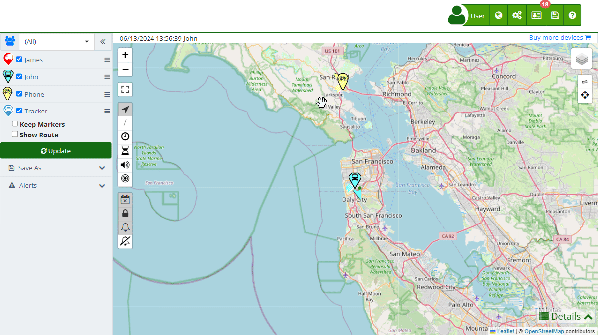

# Settings
The Configuration section in Plaspy allows you to customize the appearance and functionality of your account, adapting it to the specific needs of your organization. From customizing logos and colors to configuring email servers and notifications, this section gives you complete control over how Plaspy is presented and operates for your team and clients.

To access the configuration, click the gear icon \(\) located in the upper right corner of the main panel and select "[Configuration](https://app.plaspy.com/Settings)." A new tab will open where you can manage all available options.

## Field Descriptions

###  Customization

- **Logo:** Allows you to upload an image that will be displayed when logging into your account. You can select a file from your device and upload it to personalize your platform.
- **Web page on logout:** Configure the URL you want users to see when they log out of the platform.
- **Message for all users:** Field where you can enter a global message that will be visible to all users.

###  Advanced Customization

Advanced Customization offers additional options to tailor Plaspy's appearance to your company's corporate identity. This functionality is available exclusively for accounts with more than 100 active devices. The options include several sections, each focused on a specific aspect of customization:

- **[Organization](organization):** In this tab, you can change the organization's name and platform icon. This allows Plaspy's interface to better reflect your company's identity.  

    - [**Create Mobile App**:](https://app.plaspy.com/Settings/MobileApp) In this tab, you can generate a customized Plaspy mobile app for Android and iOS. You only need to fill out a short form; once you save it, Plaspy will prepare the application code with your personal branding so you can use it as your own app.
- **[Login](log_in):** Here you can customize the appearance of Plaspy's login page. You can modify the page's HTML, add custom CSS styles, and configure the background image and login page logo.
- **[Contact](contact):** This section allows you to configure the contact information that will be displayed to users. You can add email addresses, phone numbers, and other contact methods to improve communication with users.
- **[Styles](styles):** This tab allows you to customize the platform's color scheme, including background, text, buttons, and link colors. This way, you can adapt the interface to your organization's corporate colors.
- **[Maps](maps):** Configure Plaspy's map display options. You can choose from different map providers and set display preferences such as the default map type and information layers to display.
- **[Email templates](email_templates):** Allows you to customize the email templates used by Plaspy. You can modify the content and design of the emails sent from the platform, ensuring they align with your company's corporate image.
- **[Push mobile notifications](push_notifications):** Configure push notifications that will be sent to users' mobile devices. This option allows you to customize the content and appearance of notifications to ensure effective communication.
- **[Telegram notifications](telegram_notifications):** In this section, you can configure and customize the notifications sent via Telegram. This includes integration with Plaspy's Telegram bot and configuring automatic messages.
- **[WhatsApp notifications](whatsapp_notifications):** Allows configuring the notifications that will be sent to users via WhatsApp. You can customize the message content and ensure they are effectively sent through this platform.

####  Email Server \(SMTP\)

The SMTP \(Simple Mail Transfer Protocol\) Server is an essential tool in Plaspy that allows the configuration of your own email server for sending notifications and alerts. By configuring an SMTP server, you can ensure that all emails sent from Plaspy appear as coming from your domain, enhancing the reliability and professionalism of communications.

- **SMTP Server:** The address of the SMTP server you will use to send emails.
- **Port:** The port number that the SMTP server will use. Common ports include 25, 465, and 587, with support for security protocols like TLS/STARTTLS.
- **From:** The email address that will appear as the sender in the emails sent from Plaspy.
- **Authentication:** Many SMTP servers require authentication. You will need to enter the username and password of the email account you are using.

**Why use an SMTP server?:** An SMTP server is used to send emails from an application through your own domain. This is especially useful for maintaining consistency in communication with users and avoiding email delivery issues that can arise when using shared email servers.

**How does an SMTP server work?** The SMTP server acts as an intermediary between your application and the recipient's email server. When you send an email from Plaspy, the SMTP server receives the request, verifies the authentication credentials, and then delivers the email to the recipient's server. This process ensures that emails are delivered securely and efficiently.

###  History

The History option in the configuration allows users to review and restore previous platform configurations. This functionality is crucial for maintaining a record of changes and reverting any configuration that may have caused issues or did not turn out as expected.

- **Consult history:** Allows viewing previous configurations and changes made on the platform.
- **Restore configuration:** Option to restore the configuration to a previous state by selecting a specific date when the configuration was in the desired conditions.

## Step-by-Step Instructions

1. **Access the Configuration:**

    - In the main panel, click the gear icon \(\) in the upper right corner.
    - Select "[Configuration](https://app.plaspy.com/Settings)" from the dropdown menu.
2. **Costumization:**

    - Go to the " Customization" tab.
    - To change the logo, click "Choose file" and select an image from your device.
    - Enter the redirect URL in the "Web page on logout" field.
    - Add a global message in the "Message for all users" field.
3. **Advanced Customization:**

    - Go to the " Advanced Customization" tab.
    - In "[Organization](organization)," change the organization name and platform icon as needed.
    - In "[Login](log_in)," customize the appearance of the login page.
    - In "[Contact](contact)," add relevant contact information for users.
    - In "[Styles](styles)," select colors that best represent your brand.
    - In "[Maps](maps)," configure the map display options.
    - In "[Email templates](email_templates)," modify the content and design of emails.
    - In "[Push mobile notifications](push_notifications)," customize push notifications.
    - In "[Telegram notifications](telegram_notifications)," configure Telegram notifications.
    - In "[WhatsApp notifications](whatsapp_notifications)," configure WhatsApp notifications.
4. **Email Server \(SMTP\):**

    - Navigate to the " Email Server \(SMTP\)" tab.
    - Enter your SMTP server details, including the server address, port, and sender's email address.
    - If necessary, enter the authentication credentials.
5. **History:**

    - Go to the " History" section.
    - Consult previous configurations using the date selector.
    - To restore a configuration, select the desired date and confirm the restoration action. This will revert any changes made since that date.

## Validations and Restrictions

- The Advanced Customization option is only available for accounts with more than 100 active devices.
- Ensure valid URLs are entered in the fields corresponding to the logout page and CSS style sheets.
- Verify that the API keys for map providers and SMS services are correct to avoid integration errors.
- The SMTP server configuration requires precise and valid information to ensure proper email delivery.

## Frequently Asked Questions

- **Why can't I access Advanced Customization?**
    - Advanced Customization is available only for accounts with more than 100 active devices in Plaspy.
- **How can I change my account logo?**
    - You can change the logo by accessing the Personalization section, selecting a file from your device, and uploading it.
- **What should I do if I have issues with SMTP server configuration?**
    - Ensure that the SMTP server details, including the port and server address, are correct. You can contact your email service provider for the necessary information.
- **How can I restore a previous configuration?**
    - Access the History section, select the date of the configuration you want to restore, and confirm the restoration. This will revert any changes made since that date.

For more information and video tutorials, visit the links provided in the configuration section on Plaspy.
