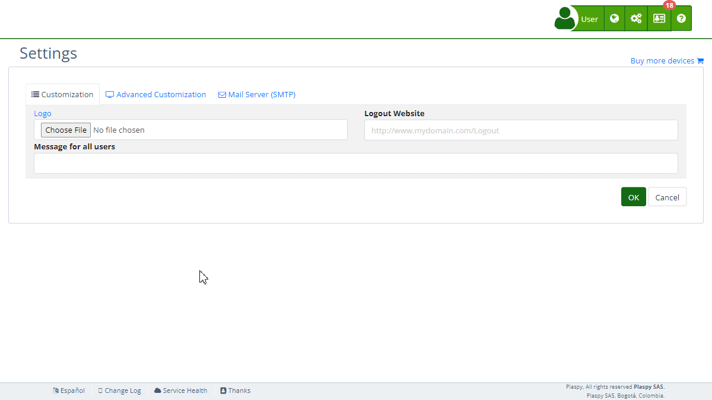

# Log In
The "Log In" section within Plaspy's [settings](https://app.plaspy.com/Settings) allows customization of the login page to enhance the user experience when accessing the platform. Here you can define the visual appearance and functionality of the login page, ensuring users have a consistent and user-friendly interface. This guide will help you configure each available field.

### Field Descriptions

- **Title**: The title that will be displayed on the login page.
- **Alert Text**: The message that will be displayed as an alert on the login page.
- **Upper Text**: The message that will be displayed at the top of the login page.
- **Lower Text**: The message that will be displayed at the bottom of the login page.
- **Link to Play Store**: URL to redirect users to download the app on Google Play Store.
- **Link to App Store**: URL to redirect users to download the app on Apple App Store.
- **Background Colour**: Colours that will be displayed as the background on the login page.
- **Login HTML**: Custom HTML code that defines the content and design of the login page.

### Step-by-Step Instructions

1. **Access the Section**:

    - Log in to Plaspy and go to the main menu in the top right corner in \(\).
    - Select "[Settings](https://app.plaspy.com/Settings)", click " Advanced Customization" and then " Log In".
2. **Configure the Title**:

    - Enter the desired title in the "Title" field. This will be visible on the login page.
3. **Add Alert Text**:

    - Enter the message you want to display as an alert in the "Alert Text" field.
4. **Configure Upper and Lower Texts**:

    - Complete the "Upper Text" and "Lower Text" fields with the messages you want to appear in the respective positions on the login page.
5. **Add Links to App Stores**:

    - Enter the URL of the app in the Google Play Store in the "Link to Play Store" field.
    - Enter the URL of the app in the Apple App Store in the "Link to App Store" field.
6. **Upload Background Colour**:

    - Click on and select the color you want to use as the background on the login page.
7. **Customize Login HTML**:

    - Use the HTML editor to add or modify the HTML code of the login page. This allows for complete customization of the content and design.
8. **Save Changes**:

    - Review all fields to ensure the information is correct.
    - Click "Accept" to save all changes made.

### Validations and Restrictions

- **Title**: Must be a valid text string.
- **Link to Play Store and App Store**: Must be valid URLs that direct to the respective app stores.
- **Background Images**: Must be image files in an accepted format \(e.g., JPG, PNG\).
- **Login HTML**: The HTML code must be correct and well-formed to avoid errors on the login page.

### Frequently Asked Questions

- **How can I change the background of the login page?**
    - Access the "Login" section, select the images you want to use as the background in the "Background Images" field, and save the changes.
- **Is it mandatory to add a link to the app stores?**
    - It is not mandatory, but it is recommended to provide users with direct access to the mobile applications.
- **What kind of messages can I put in the text fields?**
    - You can put any informational or welcome message you consider useful for users in the "Top Text" and "Bottom Text" fields.
- **How can I completely customize the login page?**
    - Use the "Login HTML" field to add or modify the HTML code of the login page. This allows you to fully customize the content and design according to your needs.
- **What dimensions should the background images have?**
    - There are no specific dimension restrictions, but it is recommended to use high-quality images that fit well on different screen sizes for better visual appearance.

With these instructions, you can effectively configure the "Login" section and ensure that the login page is attractive and functional for Plaspy users.
