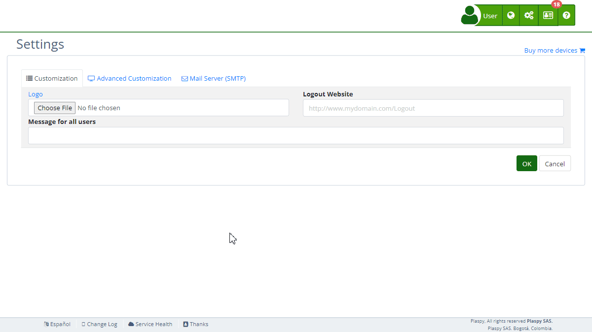

# Maps
The "Maps" section 's [settings](https://app.plaspy.com/Settings) allows administrators to integrate various map APIs to provide geolocation services and map visualization on the platform. This functionality is essential for applications that require precise device location and real-time route and location visualization. This guide details the available fields and the steps to configure them properly.

### Field Descriptions

- **Google Maps API key:** API key to integrate Google Maps services.
- **Bing Maps API key:** API key to integrate Bing Maps services.
- **MapBox API key:** API key to integrate MapBox services.
- **Apple Maps Token:** Authentication token to integrate Apple Maps services.
- **Here Maps Id:** Application ID to integrate Here Maps services.
- **Here Maps API key:** API key to integrate Here Maps services.
- **Yandex Maps:** Checkbox to enable or disable integration with Yandex Maps.

### Step-by-Step Instructions

1. **Access the Section:**

 - Log in to and go to the main menu in the top right corner in \(*fa-cogs*\).
 - Select "[*fa-list* Settings](https://app.plaspy.com/Settings)", click "*fa-television* Advanced Customization" and then "*fa-globe* Maps".
2. **Configure Google Maps API:**

 - Obtain the Google Maps API key from your Google Developers account.
 - Enter the key in the "Google Maps API key" field.
 - Help link: [Google Maps API](https://developers.google.com/maps/documentation/javascript/get-api-key)
 - Terms of service: [Terms of Service](https://developers.google.com/maps/terms)
3. **Configure Bing Maps API:**

 - Obtain the Bing Maps API key from your Microsoft account.
 - Enter the key in the "Bing Maps API key" field.
 - Help link: [Bing Maps API](https://www.microsoft.com/en-us/maps/create-a-bing-maps-key)
 - Terms of use: [Terms of Use](https://go.microsoft.com/fwlink/?LinkID=206977)
4. **Configure MapBox API:**

 - Obtain the MapBox API key from your MapBox account.
 - Enter the key in the "MapBox API key" field.
 - Help link: [MapBox Maps API](https://www.mapbox.com/maps/)
 - Terms of service: [Terms of service](https://www.mapbox.com/tos/)
5. **Configure Apple Maps:**

 - Obtain the Apple Maps authentication token from your Apple Developer account.
 - Enter the token in the "Apple Maps Token" field.
 - Help link: [Apple MapKit JS](https://developer.apple.com/documentation/mapkitjs)
 - Terms and conditions: [Terms and Conditions](https://developer.apple.com/terms/)
6. **Configure Here Maps:**

 - Obtain the Here Maps application ID and API key from your Here Developer account.
 - Enter the ID in the "Here Maps Id" field.
 - Enter the API key in the "Here Maps API key" field.
 - Help link: [HERE Maps API](https://developer.here.com/)
 - Service terms: [Service terms](https://legal.here.com/en-gb/terms)
7. **Enable Yandex Maps:**

 - Check the "Yandex Maps" checkbox to enable integration with Yandex Maps.
 - Help link: [Yandex Maps API](https://tech.yandex.com/maps/)
 - Terms of use: [Terms of Use](https://yandex.com/legal/maps_api/)
8. **Save Changes:**

 - Review all fields to ensure the information is correct.
 - Click "Accept" to save all changes made.

### Validations and Restrictions

- **Google Maps API key, Bing Maps API key, MapBox API key, Apple Maps Token, Here Maps Id, and Here Maps API key:** Must be valid keys and tokens obtained from their respective platforms.
- **Yandex Maps:** The checkbox must be checked to enable integration.

### Frequently Asked Questions

- **How do I get my Google Maps API key?**
 - You can obtain your Google Maps API key from the Google Developers Console. Follow the instructions on [Google Maps API](https://developers.google.com/maps/documentation/javascript/get-api-key).
- **What if I don't have a Bing Maps API key?**
 - If you do not have a Bing Maps API key, you need to create an account with Microsoft and follow the steps to obtain your key. More information can be found at [Bing Maps API](https://www.microsoft.com/en-us/maps/create-a-bing-maps-key).
- **What happens if my API key is not valid?**
 - The API key must be valid and active. If the key is not valid, you will not be able to save the changes or use the map services. Ensure to follow the instructions from each provider to generate and activate your API key.
- **Can I use multiple map services at the same time?**
 - Yes, you can configure and use multiple map services at the same time, depending on your needs and preferences.
- **How can I verify that my API keys are correctly applied?**
 - After saving the changes, verify the functionality of the maps on the platform to ensure that the API keys are configured correctly and the maps are displayed as expected.
- **What are the benefits of enabling Yandex Maps integration?**
 - Yandex Maps offers additional map services that can be useful depending on your region and specific needs. Enabling Yandex Maps provides additional geolocation and visualization options.

With these instructions, you will be able to configure the "Maps" section effectively and ensure that the map services are integrated and functioning correctly on the platform.
