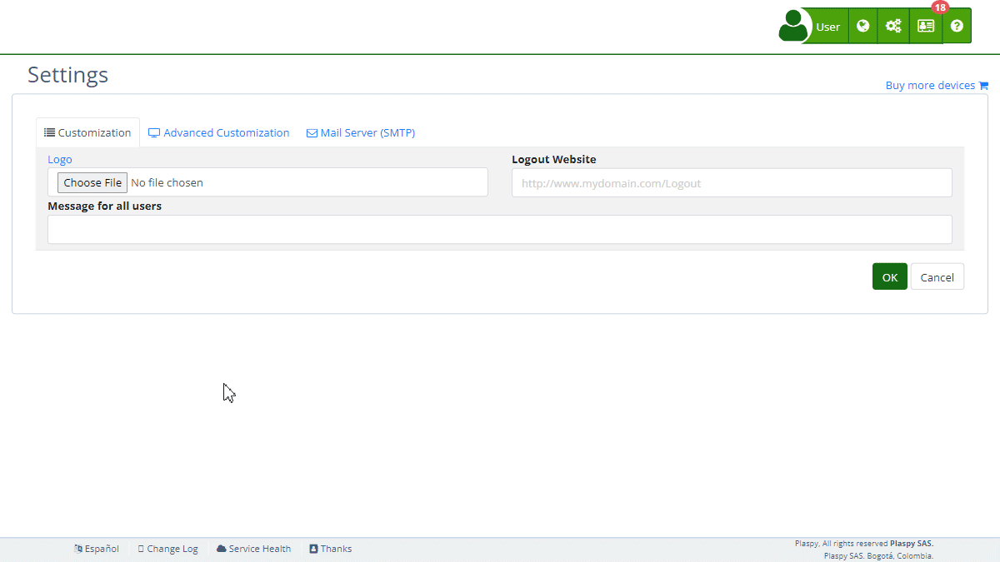

# Mobile App
This section allows users to generate the source code for their [personalized mobile applications](https://app.plaspy.com/Settings/MobileApp) for Android and iOS quickly and easily. Once the form is completed with the required information, the system will generate the corresponding code so that users can create their own application.

## Field Descriptions

- **Mobile application type:** Select the type of application you want to generate. Options include Basic, Google Maps, Push Notifications, and Phone Tracking.
- **Application name:** Enter the name of your application. This name will appear in the app store and within the application itself.
- **App Id:** Specify the unique identifier for the application. It should be a unique package name, such as `com.yourcompany.yourapp`.
- **Icon background color:** Select the background color for your application icons. Choose a color that matches your corporate branding.

#### Google Maps API Keys

- **GoogleMaps Key SDK Android:** Enter your [Google Maps API key for the Android version](https://developers.google.com/maps/documentation/android-sdk/get-api-key) of the application.
- **GoogleMaps Key SDK iOS:** Enter your [Google Maps API key for the iOS version](https://developers.google.com/maps/documentation/ios-sdk/get-api-key) of the application.

#### Firebase Keys

- **Firebase Key Android \(google-services.json\):** Upload the JSON file with [Firebase](https://console.firebase.google.com/) credentials for the Android version.
- **Firebase Key iOS \(GoogleService-Info.plist\):** Upload the PLIST file with [Firebase](https://console.firebase.google.com/) credentials for the iOS version.

## Application Types

### Basic

The basic application is a hybrid app written in Cordova that allows you to customize it with your logo and corporate colors. With this application, you can log in with your credentials and view the location of your tracking devices in real-time on a map. You can also access additional features such as report generation, device management, and statistics viewing. It is ideal for users who need a simple and effective tracking solution.

**Key Features:**

- Customization with logo and corporate colors.
- Login credentials.
- Real-time viewing of tracking device locations.
- Report and statistics generation.

#### Google Maps

This application includes all the functionalities of the basic application but with support for Google Maps. Using the Google Maps SDK for Android and iOS, you will have access to more detailed maps and higher location accuracy. This application is ideal for users who require a high level of detail in map viewing and prefer to use Google Maps technology instead of OpenStreetMap.

**Key Features:**

- All features of the basic application.
- Support for Google Maps SDK for Android and iOS.
- Access to detailed and accurate maps.
- No additional costs for using Google Maps.

#### Push Notifications

In addition to the features of the basic application, this application includes support for push notifications through Firebase. You can receive instant notifications on your mobile device about the location of your tracking devices without needing to open the application. This allows for more effective and timely monitoring of your devices.

**Key Features:**

- All features of the basic application.
- Support for push notifications via Firebase.
- Instant notification reception about device locations.
- More efficient device monitoring.

#### Phone Tracking

This application includes all the features of the basic application, but with additional phone tracking capabilities. In addition to tracking your tracking devices, you can choose to track the phone on which the application is installed. This provides an extra layer of security and control, ideal for companies that want detailed tracking of their mobile devices.

**Key Features:**

- All features of the basic application.
- Phone tracking capabilities.
- Ability to send SMS commands when the application is offline.
- Additional security and control through phone tracking.

## Step-by-Step Instructions

1. **Log into :** Log in to and go to the main menu in the top right corner in \(*fa-cogs*\).
2. **Find "*fa-mobile* Create Mobile App":** Select "[*fa-list* Settings](https://app.plaspy.com/Settings)", click "*fa-television* Advanced Customization", then "*fa-building* Organization" and select "*fa-mobile* Create Mobile App".
3. **Select the mobile application type:** In the dropdown menu, choose the type of application you want to create. Options include features like maps, push notifications, and phone tracking.
4. **Enter the application name:** Write the name you want for your application. This will be visible in the app store and within the application itself.
5. **Specify the App Id:** Enter a unique identifier for your application. This is necessary for publication in app stores.
6. **Select the icon background color:** Click on the color selector to choose the background color for the application icons.
7. **Configure Google Maps API Keys \(if applicable\):** If you have selected an application with Google Maps, provide the API keys for the Android and iOS versions.
8. **Upload Firebase keys \(if applicable\):** If you have selected an application with push notifications, upload the Firebase configuration files for Android and iOS.
9. **Generate the application:** Once all fields are completed, click "Generate" to create the source code for your application.

## Validations and Restrictions

- **Mobile application type:** This field is mandatory. You must select an application type.
- **Application name:** This field is mandatory. You must provide a name for the application.
- **App Id:** This field is mandatory. You must provide a unique identifier.
- **Icon background color:** You must select a valid color in RGB Hex format.
- **Google Maps API Keys:** If you selected an application with Google Maps, the API keys are mandatory.
- **Firebase Keys:** If you selected an application with push notifications, the Firebase configuration files are mandatory.

## Frequently Asked Questions

- **What type of application is generated?**
 - The generated application is a hybrid app written in Cordova. It can include additional functionalities like support for Google Maps and push notifications, depending on the selected application type.
- **How do I upload my application to app stores?**
 - You will need knowledge in mobile application development and an account in the corresponding app stores \(Google Play Store and Apple App Store\) to upload your application.
- **Can I customize the application with my logo and corporate colors?**
 - Yes, you can customize the application with your logo and corporate colors by selecting the icon background color and uploading your logo.
- **What happens if I don't have a Google Maps or Firebase API key?**
 - If the selected application requires Google Maps or Firebase API keys and you don't provide them, you will not be able to generate a functional application with those features. You must obtain the necessary API keys to complete the process.
