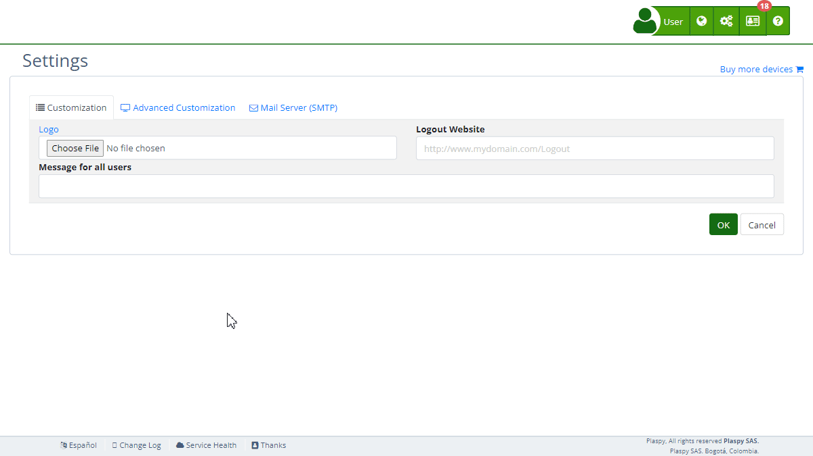

# Organization
The "*fa-building* Organization" section with's [settings](https://app.plaspy.com/Settings) allows administrators to customize and manage key organizational details, such as the name, interface colors, icon, sub-domain, and integration with tracking and security tools. This guide provides a detailed description of each field and the steps needed to effectively configure this section.

### Field Descriptions

- **Organization Name**: Field to specify the official name of the organization.
- **Primary Color**: Selector to define the primary color of the interface using an RGB Hex code.
- **Icon**: Option to upload or restore the organization's icon. This icon will be used for website notifications and as the small icon \(favicon\) of the website. The icon must be square and the recommended dimensions are 32x32 pixels.
- **Tracking Tag for Site**: Field to enter the Google Analytics tracking tag, which will be used to collect traffic and user behavior data on the web.
- **Sub-domain**: Field to specify and test the platform's sub-domain, with an option to activate HTTPS via Let's Encrypt.

### Step-by-Step Instructions

1. **Access the Section**:

 - Log in to and go to the main menu in the top right corner in \(*fa-cogs*\).
 - Select "[*fa-list* Settings](https://app.plaspy.com/Settings)", click "*fa-television* Advanced Customization" and then "*fa-building* Organization".
2. **Update the Organization Name**:

 - Enter the official name of your organization in the "Organization Name" field.
3. **Configure the Primary Color**:

 - Select a color using the color picker and ensure the Hex code is valid.
4. **Upload or Restore the Icon**:

 - Click "Choose File" to upload a new icon.
 - To restore the original icon, click "Restore".
 - Remember, the icon is used for website notifications and as the favicon. It should be square, and the recommended dimensions are 32x32 pixels.
5. **Add Google Analytics Tracking Tag**:

 - Enter the tracking tag in the corresponding field.
 - You can verify the setup on the Google Analytics site.
 - This tag is used to collect data on user traffic and behavior on your website, allowing you to analyze and improve user experience.
6. **Configure the Sub-domain**:

 - Enter the desired sub-domain in the "Sub-domain" field.
 - Activate HTTPS by checking the box and accepting Let's Encrypt's terms.
 - Click "Test" to verify the sub-domain configuration.
 - The sub-domain is a web address that functions as an extension of your main domain. For example, in "platform.mydomain.com", "platform" is the sub-domain.
 - You need to set up a CNAME record that points to "h.trackservers.net". A CNAME record is a type of DNS record that aliases one domain name to another. To configure it, access your domain's DNS settings and create a CNAME record with your sub-domain pointing to "h.trackservers.net".
7. **Save Changes**:

 - Review all fields to ensure the information is correct.
 - Click "OK" to save all changes made.

### Validations and Restrictions

- **Organization Name**: Must be an alphanumeric text string.
- **Primary Color**: Must be a valid RGB Hex code.
- **Icon**: Allowed file format \(e.g., PNG, JPG\).
- **Tracking Tag**: Must follow the "UA-XXXXXXXX-X" format of Google Analytics.
- **Sub-domain**: Must comply with the sub-domain format and pass the connection test.

### Frequently Asked Questions

- **How can I change the organization name?**
 - Go to the "Organization" section and modify the "Organization Name" field. Save the changes to apply them.
- **Is it mandatory to activate HTTPS?**
 - It is not mandatory, but it is highly recommended to secure communications on your sub-domain. HTTPS is a security protocol that encrypts data transferred between the user's browser and the server, protecting the information from potential interceptions.
- **What if the icon does not load correctly?**
 - Ensure the file meets the allowed formats and that the dimensions are square. If the problem persists, you can restore the original icon by clicking "Restore".
- **How can I know if my sub-domain is configured correctly?**
 - After entering the sub-domain, click "Test". The system will verify and inform you if the configuration is correct. Also, ensure to set up the CNAME record in your DNS provider to point to "h.trackservers.net".
- **What is the Google Analytics tag used for?**
 - The Google Analytics tag is used to collect and send data about traffic and user behavior on your website to the Google Analytics platform. This allows you to gain detailed insights into how users interact with your site, helping you improve user experience and optimize site performance.
- **How do I configure a sub-domain with a CNAME record?**
 - A sub-domain is an additional address you can create for your main domain, like "platform.mydomain.com".
 - To configure it, access your domain's DNS settings and create a CNAME record. This record should point your sub-domain to "h.trackservers.net". This tells browsers and internet services that the sub-domain should resolve to the server specified by the CNAME record, facilitating the management and access to your platform on.
 - With these instructions, you can effectively configure the "Organization" section and ensure that all your organization's details are correctly registered.
