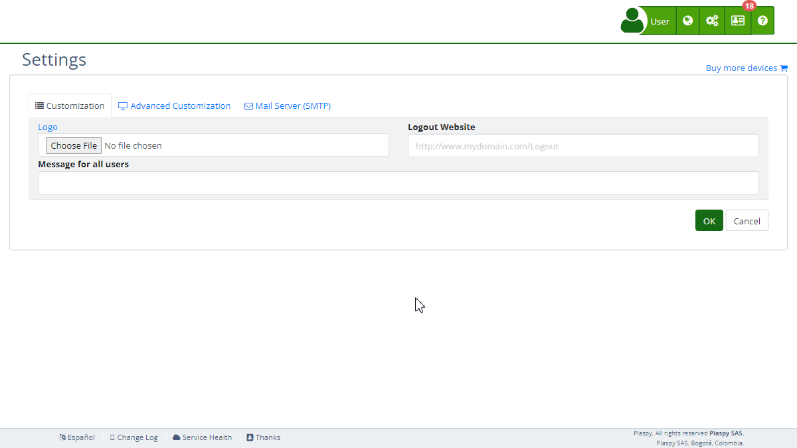

# Push Notifications
The "Push Notifications" section in Plaspy's [settings](https://app.plaspy.com/Settings) allows administrators to configure push notifications for customized mobile applications created through [Plaspy Mobile App Settings](https://app.plaspy.com/Settings/MobileApp). This functionality is crucial for sending real-time alerts and messages to mobile app users. This guide details the available fields and the steps to configure them properly.

### Field Descriptions

- **Firebase Account Key:** JSON file containing the private credentials necessary to use Firebase Cloud Messaging \(FCM\).
- **Test Token:** Field to input the test device token and test push notifications.

### Step-by-Step Instructions

1. **Access the Section:**

    - Log in to Plaspy and go to the main menu in the top right corner in \(\).
    - Select "[Settings](https://app.plaspy.com/Settings)", click " Advanced Customization" and then " Push Mobile Notifications".
2. **Upload Firebase Account Key:**

    - Obtain the JSON file with private credentials from your Firebase account. This file contains crucial information such as `project_id`, `private_key_id`, and `client_email`.
    - Click "Choose File" and select the JSON file.
    - The content of the file will be loaded into the system, allowing Plaspy to use Firebase Cloud Messaging to send push notifications.
    - Help link: [Provide credentials manually](https://firebase.google.com/docs/cloud-messaging/auth-server#provide_credentials_manually)
3. **Configure the Test Token:**

    - Enter the test device token in the "Test Token" field.
    - You can obtain the test device token by following the guides for [Android](https://firebase.google.com/docs/cloud-messaging/android/client#recupera-el-token-de-registro-actual) and [iOS](https://firebase.google.com/docs/cloud-messaging/ios/client#c%C3%B3mo-recuperar-el-token-de-registro-actual).
    - Click "Test" to send a test notification and ensure the configuration is correct.
4. **Save Changes:**

    - Review all fields to ensure the information is correct.
    - Click "Accept" to save all changes made.

### Validations and Restrictions

- **Firebase Account Key:** Must be a valid JSON file with the necessary credentials for Firebase Cloud Messaging authentication.
- **Test Token:** Must be a valid test device token to ensure that push notifications are sent correctly.

### Frequently Asked Questions

- **What is Firebase Cloud Messaging \(FCM\)?**
    - Firebase Cloud Messaging \(FCM\) is a service that allows you to send notifications and messages to your users' devices through mobile apps, browsers, and web applications.
- **How do I obtain the JSON file with Firebase private credentials?**
    - You can obtain the JSON file from the Firebase console, under the project settings section, in "Service accounts."
- **What should I do if the JSON file does not load correctly?**
    - Ensure the JSON file is valid and contains all the necessary information. If the issue persists, consult the Firebase documentation or contact Plaspy support.
- **How can I test push notifications on my device?**
    - Enter the test device token in the "Test Token" field and click "Test" to send a test notification. Follow the Firebase guides to obtain the device token for [Android](https://firebase.google.com/docs/cloud-messaging/android/client#recupera-el-token-de-registro-actual) and [iOS](https://firebase.google.com/docs/cloud-messaging/ios/client#c%C3%B3mo-recuperar-el-token-de-registro-actual).
- **Can I use push notifications for apps not created through Plaspy Mobile App Settings?**
    - No, this functionality is enabled only for customized mobile applications created through [Plaspy Mobile App Settings](https://app.plaspy.com/Settings/MobileApp).

With these instructions, you will be able to configure the "Push Notifications" section effectively and ensure that push notifications are correctly sent to users of your customized mobile applications on the Plaspy platform.
