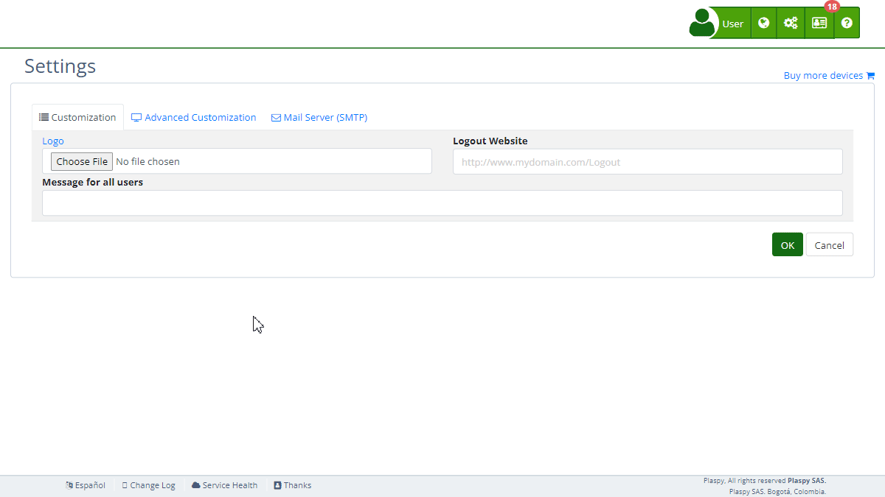

# Styles
The "Styles" section 's [settings](https://app.plaspy.com/Settings) allows administrators to customize the platform's appearance by uploading CSS \(Cascading Style Sheets\). This functionality is useful for adapting the interface for both desktop and mobile devices, ensuring a consistent and professional user experience. This guide details the available fields and the steps to configure them properly.

### Field Descriptions

- **Load Default CSS Styles**: Option to enable or disable the use 's default CSS styles. Enabling this option will automatically adapt 's current theme to the primary color of the website without needing to include any additional CSS scheme.
- **Desktop Stylesheet**: URL of the CSS stylesheet that will be applied to the desktop version of the platform.
- **Mobile Stylesheet**: URL of the CSS stylesheet that will be applied to the mobile version of the platform.

### Step-by-Step Instructions

1. **Access the Section**:
    - Log in to and go to the main menu in the top right corner in \(*fa-cogs*\).
    - Select "[*fa-list* Settings](https://app.plaspy.com/Settings)", click "*fa-television* Advanced Customization" and then "*fa-desktop* Styles".
2. **Enable or Disable Default CSS Styles**:
    - Check or uncheck the "Load Default CSS Styles" box according to your needs. If checked, will use its default CSS styles, automatically adapting the theme to the primary color of your website without additional CSS schemes.
3. **Configure Desktop Stylesheet**:
    - Enter the URL of the CSS stylesheet in the "Desktop Stylesheet" field. Ensure the URL is valid and accessible.
    - The URL must start with "http://" or "https://", and must follow the correct format to be accepted.
4. **Configure Mobile Stylesheet**:
    - Enter the URL of the CSS stylesheet in the "Mobile Stylesheet" field. Ensure the URL is valid and accessible.
    - As with the desktop stylesheet, the URL must be valid and accessible for the changes to apply correctly.
5. **Save Changes**:
    - Review all fields to ensure the information is correct.
    - Click "Accept" to save all changes made.

### Validations and Restrictions

- **Load Default CSS Styles**: If this option is enabled, will apply its default CSS styles, adjusting the theme to the primary color configured on the platform.
- **Desktop and Mobile Stylesheets**: The URLs must be valid and accessible. They must follow the correct format: "http\(s\)://\(domain\)/\(path\)/\(file.css\)". They will be automatically validated to ensure they meet the URL format requirements.

### Frequently Asked Questions

- **What is a CSS stylesheet and what is it used for?**
    - A CSS stylesheet is a file that defines how HTML elements are presented on a web page. It allows you to customize the design, colors, fonts, and layout of the user interface, providing a consistent and professional visual experience.
- **Can I use a custom CSS stylesheet instead of the default one?**
    - Yes, you can uncheck the "Load Default CSS Styles" option and provide the URLs of your own CSS stylesheets for desktop and mobile.
- **What happens if my CSS stylesheet URL is not valid?**
    - The URL must follow the correct format to be accepted. If the URL is not valid, you will not be able to save the changes. Ensure the URL starts with "http://" or "https://" and is accessible.
- **How can I verify that my CSS stylesheets are being applied correctly?**
    - After saving the changes, visit the platform with your subdomain URL in a browser and verify that the styles have been correctly applied to both the desktop and mobile versions.
- **Can I change the CSS stylesheet at any time?**
    - Yes, you can update the URLs of the CSS stylesheets at any time from the "Styles" section 's settings. Just make sure to save the changes after making any modifications.
- **What are the benefits of enabling default CSS styles?**
    - Enabling default CSS styles will automatically adapt 's theme to the primary color configured on the platform, simplifying the customization process without the need for additional CSS schemes.

With these instructions, you can effectively configure the "Styles" section and customize the appearance of the platform according to your organization's needs.
