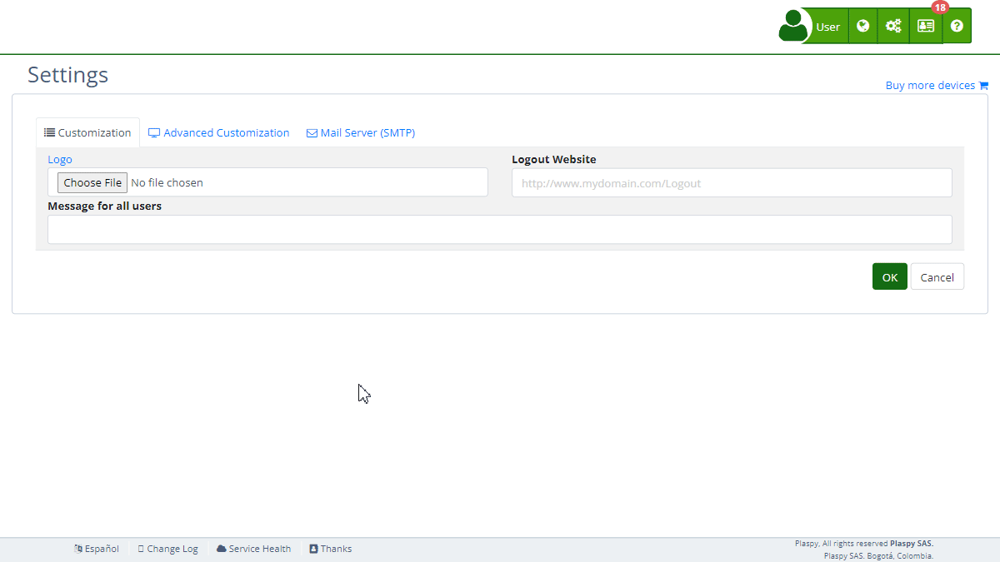

# Telegram Notifications
The "Telegram Notifications" section in Plaspy's [settings](https://app.plaspy.com/Settings) allows administrators to configure notifications via Telegram using a personal bot, different from Plaspy's bot \(@plaspybot\). This functionality is useful for sending alerts and messages directly to users via Telegram. It is important that the user has already created their own bot on Telegram following the provided instructions. This guide details the available fields and the steps to configure them properly.



### Field Descriptions

- **Bot Name:** Name of the Telegram bot you have created.
- **Bot Token:** Token of the Telegram bot provided by @botfather.

### Step-by-Step Instructions

1. **Access the Section:**

    - Log in to Plaspy and go to the main menu in the top right corner in \(\).
    - Select "[Settings](https://app.plaspy.com/Settings)", click " Advanced Customization" and then " Telegram Notifications".
2. **Create a Bot on Telegram:**

    - Connect to [@botfather](https://t.me/botfather) on Telegram and send the command ```/newbot``` to create a new bot.
    - Follow @botfather's instructions to assign a name and obtain the bot token.
    - For more information on creating bots, see [How to create a bot](https://core.telegram.org/bots#how-do-i-create-a-bot).
3. **Configure the Bot Name:**

    - Enter the name of your Telegram bot in the "Bot Name" field.
4. **Configure the Bot Token:**

    - Enter the bot token provided by @botfather in the "Bot Token" field.
5. **Register the Bot in Plaspy:**

    - Click "Register" to register the bot in Plaspy.
    - This will allow Plaspy to use your bot to send notifications via Telegram.
6. **Test the Configuration:**

    - After registering the bot, click "Test" to verify that notifications are sent correctly via your Telegram bot.
7. **Save Changes:**

    - Review all fields to ensure the information is correct.
    - Click "Accept" to save all changes made.

### Validations and Restrictions

- **Bot Name:** Must be a valid and representative name for your Telegram bot.
- **Bot Token:** Must be a valid token provided by @botfather. Ensure the token is correct and active.

### Frequently Asked Questions

- **How do I create a bot on Telegram?**
    - Connect to [@botfather](https://t.me/botfather) on Telegram and follow the instructions by sending the command ```/newbot```. For more details, see [How to create a bot](https://core.telegram.org/bots#how-do-i-create-a-bot).
- **What is a bot token and how do I get it?**
    - A bot token is a unique string that identifies and authenticates your Telegram bot. You get it from @botfather when you create your bot.
- **Can I use any Telegram bot for notifications in Plaspy?**
    - Yes, you can use any Telegram bot that you have created by following the provided instructions and registering it in Plaspy.
- **What should I do if the bot token doesn't work?**
    - Ensure the token is correct and has not expired. If the problem persists, you can generate a new token from @botfather by sending the command ```/token```.
- **How can I test that Telegram notifications are working correctly?**
    - After registering the bot, click "Test" to send a test notification. Check Telegram to ensure the notification is received correctly.

With these instructions, you will be able to configure the "Telegram Notifications" section effectively and ensure that notifications are correctly sent via your Telegram bot on the Plaspy platform.
