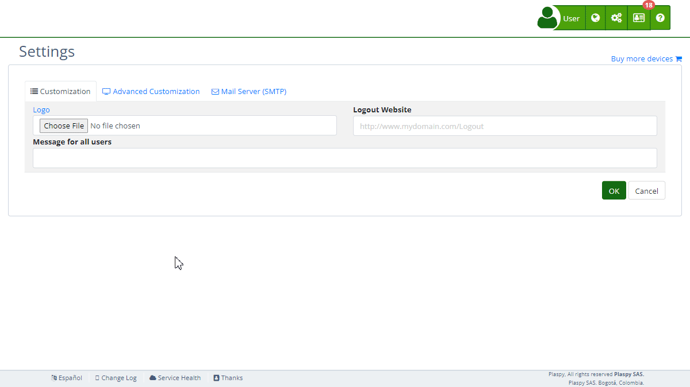

# WhatsApp Notifications
The "WhatsApp Notifications" section in Plaspy's [settings](https://app.plaspy.com/Settings) allows administrators to configure notifications via WhatsApp. This functionality is useful for sending alerts and messages directly to users through WhatsApp. It is essential that the user has already created their own WhatsApp Business account and bot, following the provided instructions. This guide details the available fields and the steps to configure them properly.

### Field Descriptions

- **App ID:** ID of your WhatsApp application.
- **WhatsApp Business Account ID:** ID of your WhatsApp Business account.
- **Phone Number ID:** ID of the phone number associated with your WhatsApp Business account.
- **Access Token:** Token for accessing the WhatsApp Business API.
- **Template Name:** Name of the message template to use.
- **Webhook:**
    - **Callback URL:** URL for receiving webhook events.
    - **Verify Token:** Token used to verify the webhook configuration.
- **Test Phone Number:** Phone number used for testing notifications.

### Step-by-Step Instructions

1. **Access the Section:**

    - Log in to Plaspy and go to the main menu in the top right corner in \(\).
    - Select "[Settings](https://app.plaspy.com/Settings)", click " Advanced Customization" and then " WhatsApp Notifications".
2. **Create a WhatsApp Business Account and Get API Credentials:**

    - Go to the [Facebook Developers Console](https://developers.facebook.com/) and create a WhatsApp Business account.
    - Follow the instructions in the [WhatsApp API Help](https://developers.facebook.com/documentation/business-messaging/whatsapp/get-started) to obtain your App ID, WhatsApp Business Account ID, Phone Number ID, and Access Token.
    - You can create a permanent access token through [System Users](https://business.facebook.com/settings/system-users/).
3. **Configure WhatsApp Business API Credentials:**

    - Enter the App ID in the "App ID" field.
    - Enter the WhatsApp Business Account ID in the "WhatsApp Business Account ID" field.
    - Enter the Phone Number ID in the "Phone Number ID" field.
    - Enter the Access Token in the "Access Token" field.
4. **Configure the Message Template:**

    - Enter the name of the message template in the "Template Name" field.
    - You can create templates in 'es' and 'en' at the [Facebook Business Console](https://business.facebook.com/wa/manage/message-templates/).
5. **Set Up the Webhook:**

    - The "Callback URL" is pre-configured and read-only. It is used to receive webhook events from WhatsApp.
    - The "Verify Token" is also pre-configured and read-only. It is used to verify the webhook configuration. Follow the guide on [Configuring Webhooks](https://developers.facebook.com/docs/whatsapp/cloud-api/get-started#configure-webhooks) for more details.
6. **Test the Configuration:**

    - Enter a test phone number in the "Test Phone Number" field.
    - Click "Test" to send a test notification and verify that the configuration is correct.
7. **Save Changes:**

    - Review all fields to ensure the information is correct.
    - Click "Accept" to save all changes made.

### Validations and Restrictions

- **App ID, WhatsApp Business Account ID, Phone Number ID, Access Token:** Must be valid credentials obtained from the Facebook Developers Console.
- **Template Name:** Must be the name of an existing message template created in the Facebook Business Console.
- **Test Phone Number:** Must be a valid phone number for testing notifications.

### Frequently Asked Questions

- **How do I create a WhatsApp Business account and get API credentials?**
    - Go to the [Facebook Developers Console](https://developers.facebook.com/) and follow the instructions in the [WhatsApp API Help](https://developers.facebook.com/documentation/business-messaging/whatsapp/get-started) to create an account and obtain your credentials.
- **What is a Webhook and how do I configure it?**
    - A Webhook is a URL that receives real-time data from WhatsApp. Follow the guide on [Configuring Webhooks](https://developers.facebook.com/docs/whatsapp/cloud-api/get-started#configure-webhooks) for detailed steps.
- **What should I do if the access token doesn't work?**
    - Ensure the token is correct and has not expired. If the issue persists, you can generate a new token through [System Users](https://business.facebook.com/settings/system-users/).
- **How can I test that WhatsApp notifications are working correctly?**
    - Enter a test phone number in the "Test Phone Number" field and click "Test" to send a test notification. Verify that the notification is received correctly on the specified phone number.
- **Can I use any message template for WhatsApp notifications?**
    - You must use a message template that has been created and approved in the Facebook Business Console. Enter the exact name of the template in the "Template Name" field.

With these instructions, you will be able to configure the "WhatsApp Notifications" section effectively and ensure that notifications are correctly sent via WhatsApp on the Plaspy platform.
