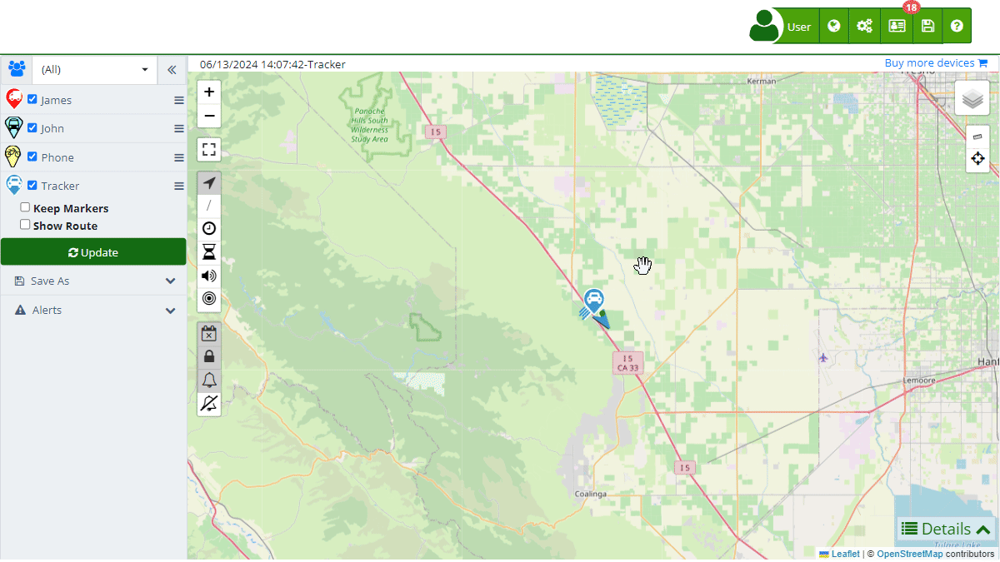

# Share Access
The "[*fa-share-alt* Temporary Access](https://app.plaspy.com/Users/Share)" feature allows users to create temporary access for third parties via a URL without the need for a password. This tool is ideal for providing limited access to tracking information and statistics of specific devices for a determined period. Invited users can view routes and statistics only during the enabled date range and for the devices belonging to the selected group.

To access the temporary access section, go to the top menu and select "*fa-cogs*", then choose "[*fa-share-alt* Temporary Access](https://app.plaspy.com/Users/Share)." Here you can create new temporary accesses, edit existing ones, and assign devices and groups to each access.

### Field Descriptions

- **Name:** Field to enter the name of the person who will have temporary access.
- **Email:** Optional field to enter the email address of the user who will receive temporary access.
- **Time Zone:** Selection of the time zone corresponding to the temporary access.
- **Group:** Selection of the [group](groups) of devices to which access will be granted.
- **Device:** Search field to add a specific device to the temporary access.
- **Description:** Field to add a detailed description of the temporary access, providing additional information about its purpose.
- **Access:** Automatically generated URL to access the shared information.
- **Expires:** Selection of the date range during which the temporary access will be active.

### Functionalities of Temporary Access

Temporary accesses allow you to perform the following actions:

- **Provide Temporary Access:** Allow third parties to access tracking information and statistics of specific devices for a limited period.
- **Access Control:** Limit access to read-only and restrict it to a specific date range.
- **Email Notification:** Send an access link to the invited user's email, facilitating the access process.

### Step-by-Step Instructions

**Creating a New Temporary Access**

1. **Access the Temporary Access Section:**
    - Click on the "Settings" icon in the top menu and select "[*fa-share-alt* Temporary Access](https://app.plaspy.com/Users/Share)."
2. **Start Creating a Temporary Access:**
    - Click on the "*fa-plus*" icon in the bottom right corner to open the temporary access creation form.
3. **Complete the Temporary Access Details:**
    - **Name:** Enter the name of the person who will have access.
    - **Email:** Enter the user's email \(optional\).
    - **Time Zone:** Select the corresponding time zone.
    - **Group:** Select the [group](groups) of devices you wish to share.
    - **Device:** Use the search field to add a specific device.
    - **Description:** Add a detailed description of the temporary access.
    - **Expires:** Select the date range during which the access will be active.
4. **Generate and Copy the Access URL:**
    - The access URL will be generated automatically. Click on the copy icon to copy the URL to the clipboard.
5. **Save the Temporary Access:**
    - Click "OK" to save the new temporary access.
    - If you wish to cancel, click "Cancel."

**Editing an Existing Temporary Access**

1. **Select the Access to Edit:**
    - In the list of [temporary accesses](https://app.plaspy.com/Users/Share), click on the edit icon \(represented by a pencil\) next to the access you want to modify.
2. **Modify the Access Details:**
    - Make the necessary changes to the name, email, time zone, group, device, description, or date range of the access.
3. **Save the Changes:**
    - Click "OK" to save the changes made.

### Validations and Restrictions

- **Access Name:** Make sure to enter a descriptive and easily identifiable name.
- **Expiration Date:** Select a valid date range during which the access will be active.
- **Device or Group:** You must select at least one device or group for the access to be valid.

### Frequently Asked Questions

- **How can I share temporary access with a user?**
    - Create a new temporary access in the corresponding section, enter the necessary details, and provide the generated URL to the user.
- **Can I edit a temporary access after creating it?**
    - Yes, you can edit the details of an existing temporary access by selecting it from the list and making the necessary changes.
- **How can I limit access to certain devices?**
    - Select the specific group or device you wish to share during the creation or editing of the temporary access.
- **What happens when the temporary access expires?**
    - The temporary access will automatically deactivate, and the invited user will no longer be able to access the shared information.
