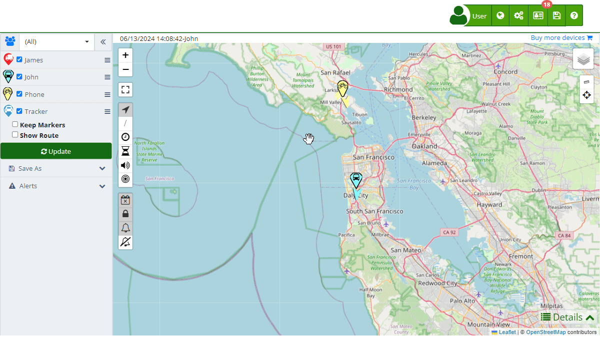

# SMS
The "[SMS](https://app.plaspy.com/SMS)" section in Plaspy allows users to manage and monitor text messages sent by their devices. This functionality is essential for sending alerts and commands efficiently and cost-effectively. Users can view message history, add balance to their account, and set daily sending limits.

To access the SMS section, go to the top menu and select the envelope icon that represents text messages. From there, you can review the history of sent messages and make additional configurations according to your needs.

### Field Descriptions

- **Date:** Indicates the date and time when the text message was sent.
- **Number:** Shows the phone number to which the message was sent.
- **Message:** Contains the content of the sent text message.
- **Status:** Indicates the status of the message, such as "Successful" or "Failed."
- **Price USD:** Shows the cost of the message in US dollars.
- **User:** Indicates the user who sent the message.
- **Device:** Shows the device from which the message was sent.

### Sending Text Messages

To send a text message from Plaspy, follow these steps:

1. **Open the Send Form:**
    - Click on the "" icon in the bottom right corner of the [SMS](https://app.plaspy.com/SMS) screen.
2. **Complete the Message Details:**
    - **Phone Number:** Enter the recipient's phone number.
    - **Message:** Write the content of the text message.
3. **Send the Message:**
    - Click "Send" to send the message.
    - If you wish to cancel the send, click "Cancel."

### Saving SMS History

Plaspy allows saving the history of sent messages in Excel format for further analysis and storage. This option facilitates the review and management of messages sent from the platform.

1. **Access the History:**
    - In the [SMS](https://app.plaspy.com/SMS) section, use the search filters and pagination options to review the history of sent messages.
2. **Save to Excel:**
    - Click on the save icon \(\) located at the top of the message list.
    - The message history will be downloaded in an Excel file that you can open and review with any compatible software.

### Setting Daily Message Limits

You can set the maximum number of text messages that can be sent daily per device and per user. This is useful for controlling costs and ensuring that budget limits are not exceeded.

1. **Access the Settings:**
    - Click on the gear icon \(\) in the bottom left of the SMS screen.
2. **Define Limits:**
    - In the settings window, you will see two fields:  

        - **Device:** Specify the maximum number of messages a device can send daily.
        - **User:** Define the maximum number of messages a user can send daily.
    - Enter the desired values in each field.
3. **Save Changes:**
    - Click the "Accept" button to save the changes.
    - If you wish to cancel the changes, click "Cancel."

### Checking Text Message Prices

Plaspy offers a dedicated page to check the prices of text messages. These prices vary by country and operator. To check the prices, visit [Plaspy SMS Pricing](https://app.plaspy.com/SMSPricing). Here you will find a detailed table with costs by country and operator, allowing you to better manage your messaging expenses.

### Step-by-Step Instructions

1. **Open the SMS Menu:**
    - In the top menu, click on the [envelope icon](https://app.plaspy.com/SMS) \(\).
2. **Review the Message History:**
    - Use the search filters and pagination options to review the history of sent messages.
3. **Send a New Message:**
    - Click on the "" icon to open the message sending form.
    - Complete the message details and click "Send."
4. **Set Daily Message Limits:**
    - Click on the gear icon \(\) to open the daily limits settings.
    - Define the limits and save the changes.
5. **Save Message History:**
    - Click on the save icon \(\) and select "Save to Excel" to download the history of sent messages.
6. **Check Text Message Prices:**
    - Visit [Plaspy SMS Pricing](https://app.plaspy.com/AdditionalServicesPricing) to review prices by country and operator.

### Validations and Restrictions

- **Phone Number:** Make sure to enter a valid phone number, including the country code.
- **Message Content:** The message must have valid content and must not be empty.
- **Daily Limits:** No more messages can be sent than those allowed by the configured limits.

### Frequently Asked Questions

- **How can I add balance to send text messages?**
    - You can add balance by clicking on the green "Balance" box at the top of the SMS screen.
- **Can I send text messages to multiple recipients at once?**
    - Currently, messages are sent to one recipient at a time. You can send multiple messages to different recipients individually.
- **What do I do if a message does not send?**
    - Check the message status in the history. If it is "Failed," verify the phone number and the available balance. If the problem persists, contact technical support.
- **Is it possible to schedule the sending of text messages?**
    - Currently, messages are sent manually. There is no option to schedule the automatic sending of messages.
- **What types of messages can be sent?**
    - You can send any type of text message that complies with standard SMS content and length restrictions.
- **Where can I check the prices of text messages?**
    - You can check the prices of text messages by country and operator on the [Plaspy SMS Pricing](https://app.plaspy.com/SMSPricing) page.
