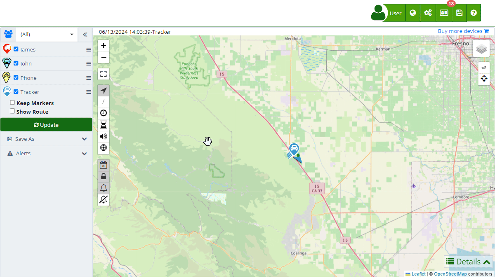

# Statistics
The "[Statistics](https://app.plaspy.com/Statistics)" section allows users to obtain detailed reports on the performance and usage of their devices over time. This tool is crucial for monitoring key aspects such as fuel consumption, mileage, generated alerts, and much more, providing valuable data for efficient fleet and asset management.

To access the statistics section, go to the top menu and select the statistics icon represented by a graph. This will take you to the page where you can configure and view various types of reports according to your needs.

### Field Descriptions

- **Date:** Allows you to select the date range for the statistics you want to view. You can choose from predefined options such as "Last 2 days," "Last week," "Last month," among others, or define a custom range.
- **Group:** Select the group of devices for which you want to see statistics. This option is useful for filtering and obtaining specific reports for certain groups of devices.
- **Devices:** Allows you to select one or several specific devices to generate the statistics. You can use the search field to easily find and select devices.
- **Type:** Defines the type of statistic you want to generate. Options include generated alerts, fuel consumption, daily mileage, fuel level, time in motion, speed, among others.
- **Update:** Button to apply the selected filters and generate the corresponding statistic.
- **AI Statistics Chat:** This feature allows you to consult and analyze statistics through an integrated chat. You can ask questions in natural language and request specific reports.
- **Save:** Allows you to save the generated statistics in Excel format for further analysis and storage.

### Types of Statistics

- **Specific Function Activity \(Sensor 2\):** Provides information on the activation of specific vehicle functions monitored by sensor 2, configured according to the client's needs. This report is crucial for monitoring the operation of additional vehicle components such as lights and security systems.
- **Ignition Sensor Activity \(Sensor 1\):** Details the time the vehicle has been on and off throughout the day, thanks to the connection of digital sensor 1 to the vehicle's ignition system. It is essential for monitoring the effective use of the vehicle.
- **Monitoring Alerts:** Summary of all alerts generated within a specific period, including those not notified by email. This includes everything from movement alerts to security notifications.
- **Speed Analysis:** Provides a detailed report on speed patterns, identifying possible excesses and contributing to road safety and traffic regulation compliance.
- **Aggressive Driving:** Detailed analysis of aggressive driving events, including sudden braking and acceleration. This report identifies risky driving patterns to promote safer driving practices and prevent accidents.
- **Daily Fuel Consumption \(Gallons\):** Presents the daily fuel consumption of each vehicle, measured in gallons. This statistic allows efficient tracking of fuel expenses, facilitating energy consumption planning and management.
- **Daily Fuel Consumption \(Tanks\):** Presents the daily fuel consumption of each vehicle relative to the total tank capacity, offering a perspective on the vehicle's autonomy and efficiency.
- **Vehicle Inactivity:** Shows the total time the vehicle has remained stationary, providing insights into operational efficiency and vehicle safety.
- **Daily Mileage \(Kms\):** Shows the kilometers traveled by each vehicle daily, providing key data for vehicle maintenance and logistical planning.
- **Fuel Level Monitoring:** Detailed report on the fuel level over time, allowing the identification of consumption patterns and possible leaks or anomalies in the fuel system.
- **Stop Log:** Documents the number of stops made by the vehicle, offering insights into vehicle usage and potential route efficiency improvements.
- **Temperature Report:** Compiles temperature variations within the selected date range, crucial for vehicles transporting temperature-sensitive products or for monitoring the engine and associated systems' condition.
- **Activity Time:** Details the total time the vehicle is in motion, providing a clear view of its utilization and helping optimize routes and delivery times.
- **Idling Time:** Exposes the time the vehicle remains on without moving, an important factor for understanding unnecessary fuel consumption and engine wear.

### Interaction through Integrated AI Chat

At Plaspy, we have integrated an innovative feature that allows users to interact with statistics through an online chat powered by artificial intelligence \(AI\). This tool provides an intuitive and efficient way to obtain information and make inquiries about the data of your tracked devices. Below are the capabilities and advantages of this functionality:

#### Features of the Integrated AI Chat

1. **Real-Time Queries:**

    - You can ask direct questions about the current statistics of your devices, such as "How many kilometers did the vehicles travel last week?" or "What was the fuel consumption for the last 30 days?"
    - The AI will respond immediately with the latest information available in the system.
2. **Request New Information:**

    - If you need to generate a specific report or analyze a new set of data, simply ask the AI to do it for you. For example, "Generate a report of alerts for the last 7 days" or "Show the speed analysis for vehicle A."
    - The AI will process your request and provide the desired result.
3. **Detailed Data Exploration:**

    - The AI can break down the information contained in the statistics and present specific data according to your needs. You can ask, "How many speed alerts were there yesterday?" or "What was the maximum speed recorded today?"
    - This facilitates a deep and detailed understanding of the data without needing to manually navigate through multiple sections.

#### Benefits of Using the AI Chat

- Direct interaction with the data through the chat reduces the time it would normally take to search for and analyze information.
- No advanced technical knowledge is required to use this tool. The AI is designed to understand and respond in natural language, making it easy for all users to use.
- Being integrated with the system, the AI provides real-time updated data, ensuring you always have the most accurate information at your disposal.

#### Saving Options

There are several options for saving generated statistics in Excel format, allowing greater flexibility in data analysis and management. The available options are detailed below:

- **Current Statistics:**

    - **Selected Devices:** Allows you to save the statistics of the current device you are viewing or the devices selected in the filter.
    - **Each Device on a Different Sheet:** Saves the current statistics of the selected devices, each on a separate sheet within the same Excel file.
- **All Statistics:**

    - **<i class="fa fa-floppy-o"></i> Each Statistic on Different Sheets:** Saves all statistics for the selected devices, with each statistic on a different sheet within the same Excel file.
    - **<i class="fa fa-file-excel-o"></i> Each Device in a Different File:** Saves all statistics for the selected devices in separate Excel files, creating a different file for each device.

### Step-by-Step Instructions

**Accessing the Statistics Section**

1. **Open the Statistics Menu:**
    - Go to the main menu in the top right corner in \(\) and then select " Stadistics".
2. **Select Desired Filters:**
    - **Date:** Select the date range you want to analyze.
    - **Group:** Choose the group of devices \(optional\).
    - **Devices:** Select one or several specific devices.
    - **Type:** Select the type of statistic you want to generate.
3. **Generate the Statistic:**
    - Click on the " Update" button to view the statistic on the platform.
4. **Save the Statistic:**
    - Click on the "Save" button to export the information to an Excel file.
    - Select the preferred saving option from the dropdown menu.

### Validations and Restrictions

- **Date Range:** Make sure to select a valid date range. Dates must be in the correct format and cannot be empty.
- **Device Selection:** You must select at least one device to generate a statistic.
- **Type of Statistic:** It is mandatory to select a type of statistic to proceed with the report generation.

### Frequently Asked Questions

- **How can I save the generated statistics?**
    - You can save the generated statistics in Excel format by clicking the "Save" button after applying the desired filters. Then, choose the appropriate saving option for your needs.
- **Can I generate statistics for multiple devices at once?**
    - Yes, you can select multiple devices when configuring the statistics filters.
- **What types of alerts can be included in the statistics?**
    - You can include any type of alert configured on your devices, such as speed alerts, unauthorized movements, fuel levels, among others.
