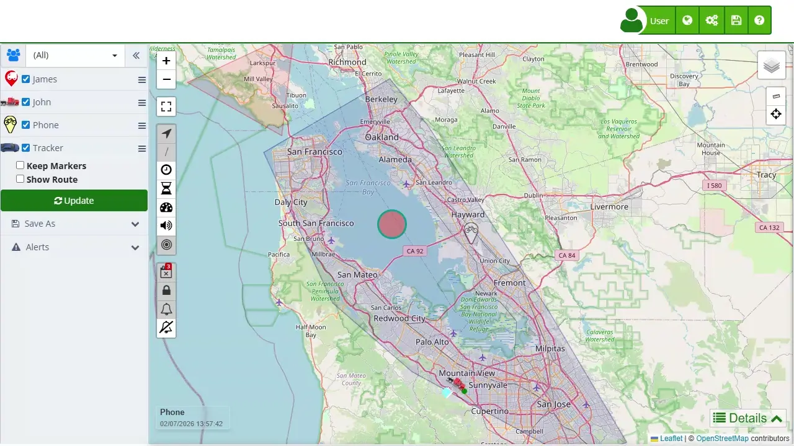

# Activation Code
To activate an [activation code](https://app.plaspy.com/Subscription?tp=1) in Plaspy, follow the detailed steps below. It is important that you have a valid code provided by a Plaspy supplier, either through a prepaid card or an email.

The activation code is essential to enable your services on Plaspy. This code ensures that your subscription is credited and allows the activation of associated devices. Below are the necessary steps to complete the activation using this code.

## Access

To activate the serial in Plaspy, you need to have a user account on [www.plaspy.com](https://app.plaspy.com/).

1. **Plaspy User**: If you do not have a Plaspy account, go to the main page and select "[Sign Up](https://app.plaspy.com/Join)" in the top menu, fill in your details, and create the account. If you already have a Plaspy account, click on your username in the top right corner and select the " Buy more devices" option located right below your name.

## Field Description

- **Activation Code**: This is the field where you must enter the code provided by your Plaspy supplier. This code can be found on a prepaid card or in an email you have received.

## Step-by-Step Instructions

1. **Log into your Plaspy account**:

    - If you do not have an account, [sign up](https://app.plaspy.com/Join) on the main page of Plaspy by filling in your personal details.
    - If you already have an account, [log in](https://app.plaspy.com/Subscription?tp=1) with your credentials.
2. **Access the activation section**:

    - Once logged in, go to the "[Buy more devices](https://app.plaspy.com/Subscription?tp=1)" option located at the top right, just below your username.
3. **Select the Activation card option**:

    - In the menu options, choose " I have an activation card," which is located at the end of the discounts section.
4. **Enter the activation code**:

    - In the activation code section, enter the serial number or activation code in the corresponding field and click "Validate."
5. **Review the serial data**:

    - Verify the serial data, including the number of devices and product type. Then, click "Activate."
6. **Confirm the activation**:

    - Once validated, you will be redirected to a page where the serial is activated. This page will show information such as the number of devices associated with your account and the expiration date.
7. **Add a new device**:

    - To add a new device, go to the top menu next to your username, in the menu with the gears, and select "[Devices](https://app.plaspy.com/Devices)."
    - Enter the device name and the IMEI or Identifier \(usually the IMEI of the tracker\).
    - Click "New" to create the new device.

## Validations and Restrictions

- **Required Field**: The "Activation Code" field is mandatory. If you do not enter a code, you will not be able to proceed with the activation.
- **Code Format**: Make sure to enter the code exactly as it was provided, without additional spaces or incorrect characters.

## Frequently Asked Questions

- **Where can I find my activation code?**
    - The activation code can be on a prepaid card provided by your supplier or in an email you received when purchasing a subscription.
- **What should I do if my activation code does not work?**
    - If your code does not work, verify that you entered it correctly. If the problem persists, contact Plaspy technical support for assistance.
- **Can I activate more than one device with a single code?**
    - It depends on the type of subscription and the number of devices associated with the activation code. Verify the details provided during the activation process.
