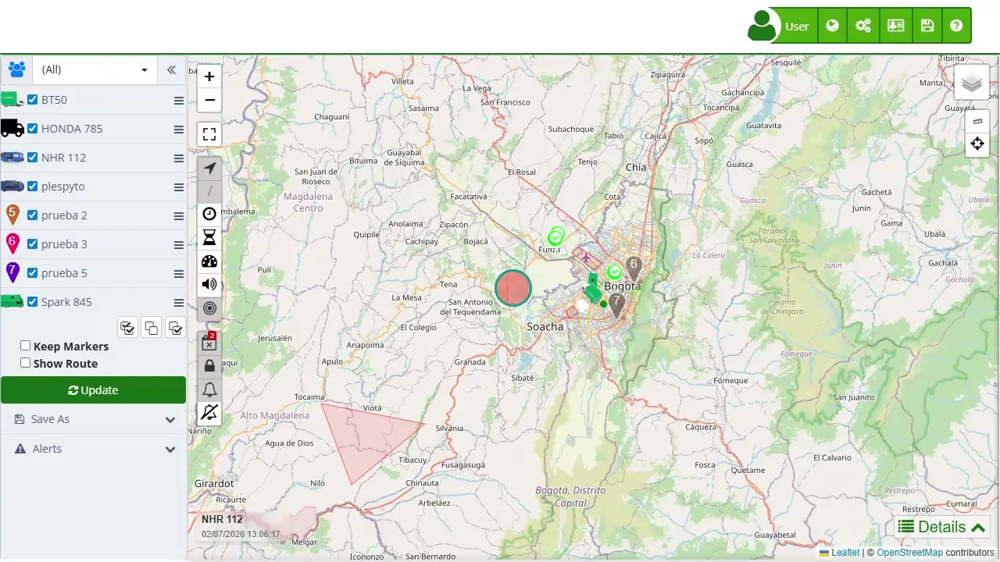

# Line Renewal
The "[*fa-mobile* Lines](https://app.plaspy.com/SDG/Lines)" section allows users to manage the mobile lines associated with their tracking devices. A key functionality of this section is the renewal of data plans, which ensures the continuity of satellite tracking service without interruptions. Renewal can be easily done from the user interface and allows extending the validity of a specific line's data plan.

To access the lines section, go to the top menu and select "*fa-address-card-o*", then choose "[*fa-mobile* Lines](https://app.plaspy.com/SDG/Lines)". Here you can view the status of your lines, renew them, and update their descriptions.

### Field Descriptions

- **Number:** Phone number of the mobile line associated with the tracking device.
- **Description:** Field to add a detailed description of the line, facilitating its identification.
- **Device:** Device associated with the mobile line.
- **Status:** Current status of the line \(e.g., Active\).
- **Days Left:** Number of days remaining before the current data plan expires.
- **Date:** Date the line was registered.
- **Expires:** Date when the current data plan expires.

### Line Renewal Functionalities

Line renewal allows you to perform the following actions:

- **Service Extension:** Extend the validity of the mobile line's data plan, ensuring the continuity of satellite tracking service.
- **Day Accumulation:** The remaining days of the current plan are added to the new subscription period, ensuring no days of service are lost.
- **Description Management:** Update the line's description to facilitate its identification and management.

### Step-by-Step Instructions

**Renewing a Data Plan**

1. **Access the Lines Section:**Click on "*fa-address-card*" in the top menu and select "[*fa-mobile* Lines](https://app.plaspy.com/SDG/Lines)".
2. **Select the Line to Renew:**In the list of lines, identify the line you wish to renew and click on the renewal icon \(*fa-refresh*\).
3. **Review Renewal Details:**A modal window will open with the renewal details, including the number of remaining days and the cost of the new plan.
4. **Confirm and Make Payment:**

 - Click "Renew" to confirm the renewal on the plan of your preference.
 - Follow the instructions to make the payment and complete the renewal process.
5. **Verify the Renewal:**Once the payment is completed, verify that the new expiration date has been correctly updated in the list of lines.

**Editing a Line Description**

1. **Select the Line to Edit:**In the list of lines, click on the edit icon \(*fa-pencil-square-o*\) next to the line you wish to modify.
2. **Update the Description:**In the modal window, update the line's description in the corresponding field.
3. **Save the Changes:**Click "OK" to save the new description.

### Validations and Restrictions

- **Expiration Date:** Make sure to renew the line before the expiration date to avoid service interruptions.
- **Payment Information:** Payments must be successfully completed for the renewal to be effective.

### Frequently Asked Questions

- **How can I renew my data plan?**
 - Access the lines section, select the line you wish to renew, review the details, and make the payment following the provided instructions.
- **What happens if I don't renew my data plan on time?**
 - If you do not renew your data plan before the expiration date, the satellite tracking service may be interrupted. It is advisable to renew before the current plan expires.
- **Can I edit the description of a line after it has been registered?**
 - Yes, you can edit the description of a line at any time by accessing the lines section and selecting the edit option.
- **How is the new expiration date calculated when renewing a line?**
 - The new expiration date is calculated by adding the period of the new data plan to the remaining days of the current plan, ensuring no days of service are lost.
