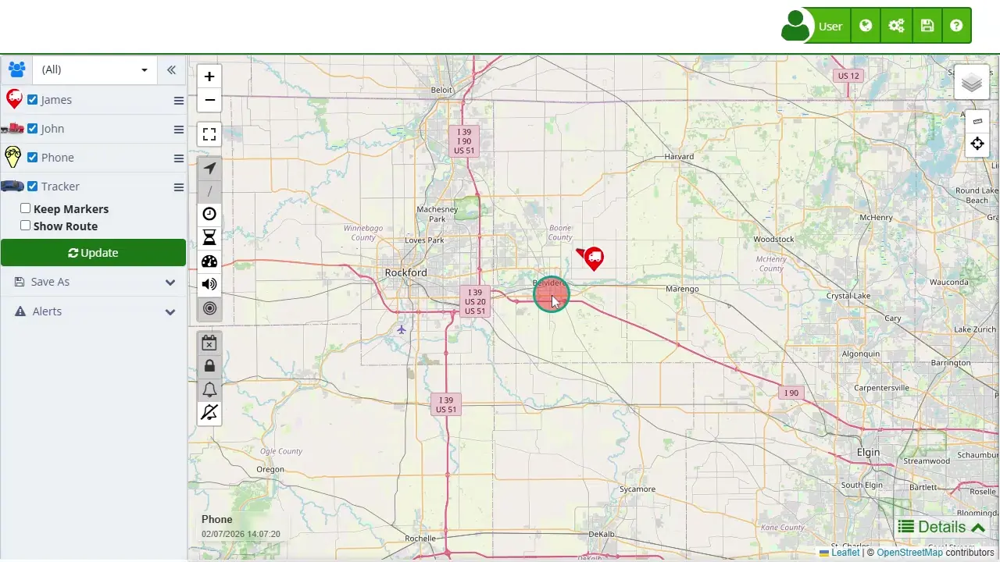

# Payment Methods
Plaspy offers various [subscription](https://app.plaspy.com/Subscription) options and payment methods to cater to the needs of all its users. Understanding these options will help you choose the best fit for your requirements, optimizing your costs and ensuring continuous and efficient service.

### Payment Periods

Plaspy provides multiple payment periods to offer flexibility and savings based on the chosen option:

1. **Monthly Subscription**: Pay for the service month by month with automatic renewal every month. No long-term contracts, no sign-up fees, and no commitments. You can cancel at any time. The monthly cost remains constant and does not include discounts for advance payment.
2. **Annual Subscription**: Pay for a full year of service in one payment with automatic renewal every year. By paying annually, you get a significant discount compared to the monthly payment. Requires a larger initial payment but saves money in the long term.

### Discounts

Plaspy automatically applies discounts when certain conditions are met, allowing you to maximize savings:

1. **Annual Payment Discounts**: Selecting an annual payment automatically applies a 20% discount on the regular monthly cost.
2. **Device Quantity Discounts**: Plaspy offers additional discounts based on the number of devices purchased. These discounts are automatically applied when the minimum required quantity is reached.

### Available Discount Table

| Number of Devices | Additional Discount \(%\) |
| --- | --- |
| Annual Prepayment | 20% |
| More than 51 devices | 5% |
| More than 101 devices | 10% |
| More than 201 devices | 25% |
| More than 501 devices | 30% |

####   
Notes:

- **Accumulation of Discounts**: The annual prepayment discount can be combined with the discounts for the number of devices. For example, if you select an annual payment and purchase more than 101 devices, you will receive a total discount of 30% \(20% for annual payment + 10% for device quantity\).
- **Calculation in Dollars**: All payments are calculated in US dollars \(USD\). The exchange rate used will depend on the issuing bank of the credit or debit card used for the payment. This means that the amount in local currency may vary depending on the current exchange rate of your bank.

### Step-by-Step Instructions

1. **Select Your Country**: Use the dropdown menu to select the country where you are purchasing the devices. This will set the currency for your transaction.
2. **Toggle USD Pricing**: If you prefer to see prices in US dollars \(USD\), check the "Show prices in USD" box.
3. **Enter the Number of Devices**: Input the number of devices you want to purchase in the "Number of Devices" field. The cost per month will be displayed accordingly.
4. **Choose Subscription Period**: Select your desired subscription period:

    - **Monthly Subscription**: Recurring monthly payment.
    - **Annual Subscription**: One-time annual payment with a discount.
5. **Review Order Summary**: The order summary will update to reflect your selections, showing the total cost and any discounts applied.
6. **Apply Discounts**: Check the " Savings" section to see if you qualify for additional discounts based on the number of devices or the selected payment period.
7. **Proceed to Payment**: Click "Continue" to proceed to the payment page. Here, you can select your preferred payment method \(e.g., credit card, PayPal, ePayco\) and complete the transaction.

### Validations and Restrictions

- **Mandatory Field**: Ensure you enter a number of devices greater than zero.
- **Code Format**: The subscription selection will affect the total cost and available discounts.
- **Calculation in Dollars**: Payments are made in US dollars \(USD\), and the exchange rate used will depend on your issuing bank.

### Frequently Asked Questions

- **Can I change my subscription period after making a purchase?**
    - Yes, you can change your subscription period at any time through your account settings. The changes will take effect from the next billing cycle.
- **Are there any additional fees for international transactions?**
    - Depending on your bank, there might be additional fees for international transactions. Check with your bank for more details.
- **How do I apply a discount code?** 
    - During the checkout process, there will be an option to enter a discount code. Enter your code and click "Apply" to see the updated total.
