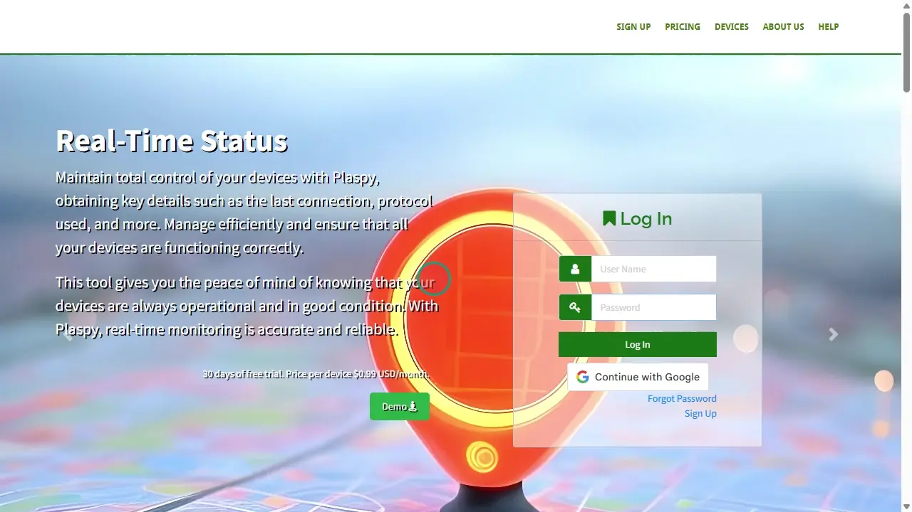

# Sign Up
The [sign-up](https://app.plaspy.com/SignUp) process for The platform is straightforward and allows you to start using satellite tracking services immediately. This guide will walk you through the steps to register and begin your free month.

### Introduction

To access the sign-up page, follow these steps:

1. Open your web browser and go to the homepage.
2. Click on the "[Sign Up](https://app.plaspy.com/SignUp)" link at the top of the homepage.
3. You will be redirected to the sign-up page.

### Field Descriptions

- **Names**: Enter your full name.
- **Country**: Select your country from the dropdown list.
- **Email**: Provide a valid email address.
- **Confirm email**: Re-enter the same email address to confirm.
- **Password**: Create a secure password.
- **Confirm Password**: Re-enter the password to confirm it.
- **I have read and accept the Terms of Service**: Check this box to accept the terms and conditions.
- **I have read and accept the Data Processing Policies**: Check this box to accept the data processing policies.
- **I'm not a robot**: Check the box to complete the reCAPTCHA, confirming you are not a robot.

### Step-by-Step Instructions

1. **Enter Names**: In the "Names" field, enter your full name.
2. **Select Country**: In the "Country" field, select your country from the dropdown list.
3. **Enter Email**: In the "Email" field, provide a valid email address. Then, in the "Confirm email" field, re-enter the same email address to confirm it.
4. **Create Password**: In the "Password" field, create a secure password that you can remember. Then, in the "Confirm Password" field, re-enter the password to confirm it.
5. **Accept Terms and Policies**: Check the boxes for "I have read and accept the Terms of Service" and "I have read and accept the Data Processing Policies" to proceed.
6. **Complete reCAPTCHA**: Check the "I'm not a robot" box and complete the reCAPTCHA to verify that you are human.
7. **Click on Sign Up**: Once all fields are completed and the appropriate boxes are checked, click the "Sign Up" button.
8. **Email Verification**: will send a verification email to the provided address. Check your inbox \(and spam folder, if necessary\) and follow the instructions to verify your account.

### Validations and Restrictions

- **Email Address**: Ensure you enter a valid email address that matches in both fields.
- **Secure Password**: The password must meet 's security requirements, such as minimum length and combination of letters, numbers, and special characters.
- **Acceptance of Terms and Policies**: You must check the acceptance boxes to complete the registration.
- **Email Verification**: The verification email must be confirmed to activate your account.

### Frequently Asked Questions

- **What should I do if I don't receive the verification email?**
    - Check your spam or junk mail folder.
    - Ensure the provided email address is correctly entered.
    - If you still do not receive the email, try repeating the sign-up process or contact support.
- **How can I ensure my password is secure?**
    - Use a combination of uppercase and lowercase letters, numbers, and special characters.
    - Avoid using common passwords or easily guessable personal information.
    - Consider using a long, unique passphrase that only you know.

By following these steps, you can sign up for securely and quickly, ensuring your account is ready to start using satellite tracking services.
