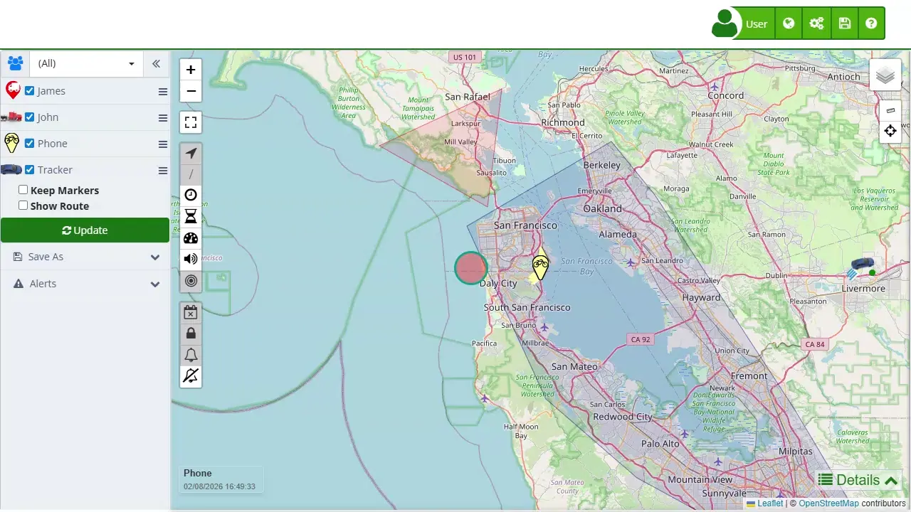

# Users
In the "[Users](https://app.plaspy.com/Users)" section of the Plaspy application, you can manage user accounts that have access to the platform. This functionality is essential for granting and managing permissions, roles, and access for different users according to their needs and responsibilities within the system.

### Accessing the Users Section

To access the users section, go to the top right menu and select the gear icon \(\). In the dropdown menu, choose "[Users](https://app.plaspy.com/Users)." This will take you to the page where you can see the list of current users and perform various actions such as creating, editing, or deleting users.

### Field Descriptions

- **Name:** Allows you to enter the user's full name. It is important for identifying the user within the platform.
- **Username:** Defines the username that will be used to log into the platform. This field is unique and cannot be changed once created.
- **Password:** Sets the user's password. The password must be confirmed to avoid entry errors.
- **Confirm:** Field to re-enter the password to confirm it was typed correctly.
- **Country:** Select the user's country of residence. This can influence regional and language settings.
- **Time Zone:** Defines the user's time zone. It is crucial for the correct synchronization of events and alerts in the system.
- **Description:** Adds relevant information about the user, such as their role, responsibilities, or any other important notes.
- **Type:** Select the type of user. Options may include standard user, own account administrator, or main account administrator. Each type has different levels of permissions and access.
- **Privileges:** Defines the specific permissions the user will have, such as the ability to edit, send commands, call devices, etc.
- **Group:** Assigns the user to a specific [group](groups) of devices. This helps manage which devices they can view and administer.
- **Device:** Allows assigning a specific device to the user. They will only have access and control over the assigned devices.
- **Account Disabled:** Check this option if you want to temporarily disable the user's account.
- **Expires:** Sets an expiration date for the user's account. After this date, the account will automatically deactivate.

### User Types

The types of users in Plaspy determine the permissions and scope of actions they can perform within the platform. The different types of users available are detailed below:

1. **Standard User:**

    - This is the basic user who can only view the devices assigned to them through a group or specific device.
    - They may have additional privileges as configured, such as editing devices, sending SMS alerts, sending commands, among others.
    - They cannot add or remove devices, only interact with assigned devices.
2. **Administrator \(Manages their own account\):**

    - This user has full control over their own account, including adding devices, users, and temporary access.
    - They do not have access to the main account, only to the devices and users they create.
    - Devices created by this user are deducted from the main account's device limit.
3. **Administrator \(Manages this account\):**

    - Has the same privileges as the main account user.
    - Has access to all devices and users but cannot access billing.
    - This user can fully manage the account on behalf of the main user.

### User Privileges

User privileges in Plaspy define what actions a user can perform on the assigned devices. The privileges that can be configured include:

- **Edit:** Allows the user to modify names, icons, alerts, and other details of the assigned devices.
- **Phone Call Commands:** Here you can change the authorized number to call the tracker. When you call the device, it can respond with an SMS or activate the cabin monitoring \(listen-in\) feature.
- **Send commands:** Allows the user to send commands to the devices via GPRS.
- **Send SMS alerts:** Allows the user to configure and send alerts via SMS for assigned devices.
- **Send SMS commands:** Allows the user to send commands to the devices via SMS.
- **Send WhatsApp alerts:** Allows the user to configure and send alerts via WhatsApp for assigned devices.
- **Track 1 phone:** Allows the user to see the location and route of one assigned phone within the platform.
- **Track Phones:** Allows the user to see the location and route of all assigned phones within the platform.

These privileges enable granular management of what each user can do within the platform, ensuring they only have access to the functions necessary for their specific roles.

### Access to the Users Section

1. **Access the administration menu:**

    - Go to the top right menu of the platform.
    - Click on the gear icon \(\) to display the administration menu.
2. **Select the "Users" option:**

    - In the dropdown menu, select the "[Users](https://app.plaspy.com/Users)" option.
    - You will be redirected to the user management page where you can see a list of existing users.

### Creating a New User

1. **Open the creation form:**

    - Click on the add icon \(\) located at the bottom left of the users page.
    - A new window with a form will open to enter the new user's information.
2. **Complete the form fields:**

    - **Name:** Enter the full name of the new user.
    - **Username:** Define a unique username for login.
    - **Password:** Set a secure password for the user and confirm it in the "Confirm" field.
    - **Country:** Select the user's country of residence.
    - **Time Zone:** Define the time zone corresponding to the selected country.
    - **Description:** Add any relevant information about the user, such as their role or responsibilities.
    - **Type:** Select the type of user \(Standard User, Own Account Administrator, Main Account Administrator\).
    - **Privileges:** Configure the specific permissions the user will have, such as the ability to edit devices or send commands.
    - **Group:** Assign the user to a device [group](groups).
    - **Device:** If necessary, assign a specific device to the user.
    - **Account Disabled:** Check this option if you want the user's account to be temporarily disabled.
    - **Expires:** Set an expiration date for the user's account if necessary.
3. **Save the changes:**

    - Review all the information entered in the form.
    - Click "OK" to save the new user.

#### Editing an Existing User

1. **Select the user to edit:**

    - In the [user](https://app.plaspy.com/Users) list, locate the user you want to edit.
    - Click on the edit icon \(\) next to the user's name.
2. **Modify the user information:**

    - Update the necessary fields in the edit form.
    - Make sure to review and confirm the changes made.
3. **Save the changes:**

    - Click "OK" to save the modifications made to the user.

#### Deleting a User

1. **Select the user to delete:**

    - In the [user](https://app.plaspy.com/Users) list, locate the user you want to delete.
    - Click on the delete icon \(represented by a trash can\) next to the user's name.
2. **Confirm the deletion:**

    - A confirmation window will appear.
    - Click "OK" to confirm the deletion of the user.

### Validations and Restrictions

- **Unique Username:** The username must be unique and cannot be modified once created.
- **Password:** The password must meet the security requirements set by the platform, such as minimum length and character combination.
- **Mandatory Fields:** All fields marked with an asterisk \(\*\) are mandatory and must be completed to save changes.
- **Country and Time Zone:** These fields must be selected from the provided dropdown lists to ensure correct regional settings.

### Frequently Asked Questions

- **How can I recover a user's password?**
    - To recover a user's password, the account administrator can reset it through the user edit section. This will allow a new password to be set for the affected user.
- **Can I change the username once created?**
    - No, the username is unique and cannot be modified after creation. If a change is needed, a new user account must be created.
- **What happens when an account expires?**
    - When an account expires, the user's access is automatically deactivated. The user will not be able to log in until an administrator reactivates their account or extends the expiration date.
- **Can I assign multiple devices to a user?**
    - Yes, you can assign multiple devices to a user by selecting a device group instead of a single specific device. This allows the user to manage multiple devices according to the configured permissions.
- **What permissions does a standard user have?**
    - A standard user has limited access only to the devices and functions assigned to them. Permissions may include viewing locations, editing devices, sending commands, and alerts, among others, as configured by the administrator.
