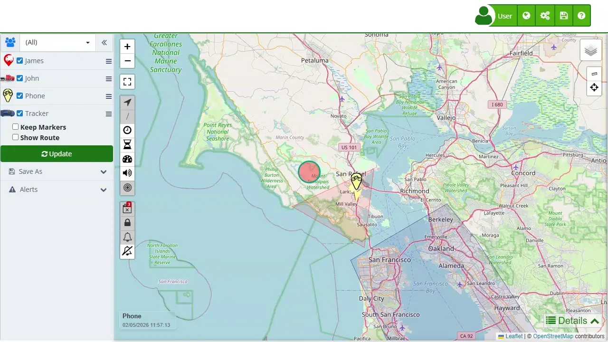

# Welcome to Plaspy help
Welcome to the Plaspy Help Manual, the satellite GPS tracking service designed to provide efficient and secure management of vehicles, motorcycles, cargo, mobile phones, and other trackable devices. This manual aims to provide a comprehensive guide on the operation and benefits of the Plaspy system, helping users maximize the use of this powerful tool.

Plaspy is compatible with a wide range of trackers and offers mobile applications available for Android and iPhone. With Plaspy, users can access a comprehensive web platform that includes essential tools such as statistics management, alerts, reports, sensors, and accessories, allowing the system to stay updated and manage devices efficiently and consistently.

### Purpose of the Manual

The main objective of this manual is to provide a detailed and accessible resource that facilitates the understanding and optimal use of Plaspy. Here, you will find step-by-step instructions, usage guides, and multimedia files designed to enhance the user experience when interacting with the platform. This document is essential for those who wish to make the most of Plaspy's tracking and management capabilities.

### Key Features

Among the key features of Plaspy are:

1. **[Real-Time Monitoring Map](map)**: The Plaspy map is an advanced tool that allows interactive and real-time visualization of the location of various tracking devices. It offers satellite and street views, real-time updates, and the ability to analyze historical routes.
2. **[Device Control Panel](map/device_control_panel)**: This panel facilitates the management and visualization of all tracked devices. Users can easily search, filter, and select devices, as well as access advanced settings and personalized viewing options.
3. **[Trip Statistics](statistics)**: Plaspy provides a detailed summary of device performance during specific trips, including metrics such as maximum speed, average speed, distance traveled, and times in motion and stationary.
4. [**Activity Summary:**](activity_summary) This feature allows users to clearly and organizedly review device behavior over a selected period of time. Through the Activity Summary, users can analyze completed trips, fuel consumption, and other relevant indicators, making it easier to monitor and track managed vehicles or assets.
5. **[Geofences](map/geofences)**: Users can create and manage virtual zones on the map that generate alerts when a device enters or leaves these areas. These geofences can be configured in various ways to suit different monitoring needs.
6. **[Bulk Alert Editing](map/bulk_alert_editing)**: This feature allows configuring and managing alerts for multiple devices simultaneously, saving time and ensuring consistency in alert settings across several devices.

### Benefits of Plaspy

Plaspy stands out for its ability to provide reliable, secure, efficient, and cost-effective service tailored to the specific needs of its users. Among the benefits it offers are:

- **Fleet Management Optimization**: Facilitates the supervision and control of vehicles, ensuring efficient management and reducing operational costs.
- **Enhanced Security**: Allows setting up alerts and geofences that contribute to the security of tracked assets.
- **Access to Real-Time Data**: Provides accurate and up-to-date information crucial for making informed decisions.
- **Flexibility and Adaptability**: Compatible with a wide variety of devices and adaptable to different sectors and operational needs.

### How to Use This Manual

This manual is structured to offer intuitive navigation and quick access to the necessary information. Throughout the chapters, you will find sections dedicated to each of Plaspy's functionalities and tools, with detailed descriptions and clear steps for their use. Additionally, FAQs and practical tips are included to help resolve common issues and optimize system use.

We hope this manual is of great assistance and enables you to make the most of all the capabilities and benefits Plaspy has to offer. If you have any questions or need additional assistance, please do not hesitate to contact our support team, always ready to provide the best attention and service.
