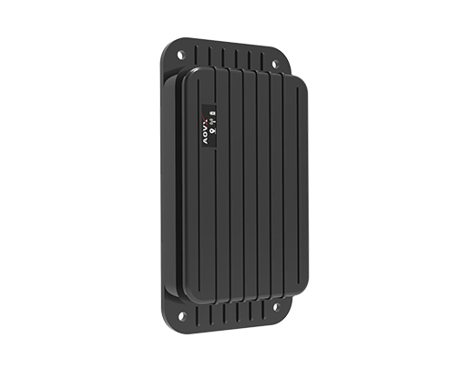

# AOVX - AG300

El AOVX AG300 es un rastreador industrial de activos diseñado para ofrecer una visibilidad de ubicación confiable en entornos exigentes. Combina posicionamiento multimodo con una construcción robusta, lo que lo hace adecuado para organizaciones que necesitan rastrear equipos valiosos, contenedores u otros activos tanto en interiores como en exteriores.

Como dispositivo compatible con Plaspy, el AG300 se integra en flujos de trabajo que dependen del monitoreo continuo de ubicación, las alertas y la supervisión operativa. Es una opción relevante para equipos que buscan un rastreador GPS AOVX AG300 que apoye el rastreo de flotas, la recuperación de activos y la visibilidad a largo plazo a través del software de rastreo de Plaspy.

## Aspectos clave

- El posicionamiento multimodo ayuda a brindar visibilidad de ubicación en distintos entornos, incluso en zonas donde el posicionamiento satelital por sí solo puede ser limitado.
- Su diseño de grado industrial respalda escenarios exigentes de rastreo de activos y un uso prolongado.
- La protección robusta IP68 aporta confianza para implementaciones en exteriores y en condiciones adversas.
- Las alertas por movimiento, vibración y manipulación ayudan al monitoreo por eventos de activos valiosos.
- La compatibilidad con BLE 5.0 permite que el rastreador funcione con sensores Bluetooth externos en casos de uso compatibles.
- Su diseño de consumo ultrabajo favorece un rastreo de bajo mantenimiento durante periodos extendidos.
- El montaje magnético fuerte opcional puede ser útil para activos metálicos y equipos portátiles.

## Cómo funciona con Plaspy

Cuando se utiliza con Plaspy, el AG300 aporta datos de ubicación y eventos a una plataforma diseñada para el monitoreo, la visibilidad y la generación de reportes. Esto lo hace útil para organizaciones que desean seguir activos casi en tiempo real, revisar el historial de movimientos y responder con rapidez ante actividades anómalas.

- Plaspy puede mostrar el AG300 en vistas de rastreo en vivo para respaldar la conciencia continua de ubicación.
- El historial de ubicación en Plaspy ayuda a los equipos a revisar rutas, patrones de movimiento y actividad pasada.
- Los eventos de movimiento, vibración y manipulación pueden respaldar alertas para monitoreo enfocado en seguridad.
- Las herramientas de reportes de Plaspy pueden ayudar a convertir los datos del rastreador en información operativa para el control y la supervisión de activos.
- El soporte para posicionamiento en interiores y exteriores puede mejorar la visibilidad en entornos mixtos donde los activos se desplazan entre áreas abiertas y ubicaciones cubiertas.
- La compatibilidad con sensores BLE puede ampliar la utilidad del rastreador en implementaciones que dependen de datos de sensores externos junto con el rastreo de ubicación.

## Usos más comunes

- Rastreo de equipos de alto valor que se desplazan entre obras, áreas de almacenamiento y rutas de transporte
- Monitoreo de contenedores y otros activos resistentes en logística u operaciones de patio
- Apoyo a flujos de trabajo de recuperación de activos cuando se necesita atender movimientos o indicios de manipulación
- Mejora de la visibilidad para implementaciones de activos con operación mixta en interiores y exteriores
- Ayuda a las organizaciones a gestionar rastreo de bajo mantenimiento para casos de uso de larga duración
- Incorporación de contexto de ubicación a programas de monitoreo de activos basados en sensores

## Por qué elegir este rastreador con Plaspy

El AG300 es una opción práctica para organizaciones que necesitan un rastreador GPS resistente con amplio soporte de posicionamiento y potencial de rastreo a largo plazo. Su conjunto de funciones encaja bien en despliegues enfocados en activos, donde la visibilidad, las alertas y la durabilidad importan más que una instalación compleja o un mantenimiento intensivo.

Al usarse con Plaspy, el AOVX AG300 puede formar parte de una estrategia más amplia de rastreo y gestión de flotas que integra datos de ubicación, alertas y reportes en una sola vista operativa. Si desea explorar cómo Plaspy puede dar soporte a dispositivos como el AG300, conozca más sobre Plaspy en el sitio principal https://www.plaspy.com. Los detalles del producto, la disponibilidad y las especificaciones del fabricante pueden cambiar con el tiempo, por lo que es recomendable verificar la información vigente en la documentación oficial de AOVX en https://www.aovx.com/.
