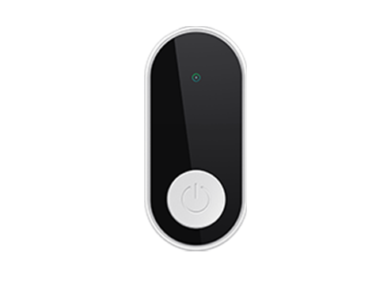

# AOVX - EB110

La AOVX EB110 es una etiqueta ambiental diseñada para monitorear envíos, almacenes e inventario sensible. Funciona con bajo consumo de energía y ofrece telemetría basada en sensores que ayuda a supervisar condiciones como temperatura, humedad, luz y movimiento en entornos donde la integridad del producto es fundamental.

Como la EB110 es compatible con Plaspy, puede utilizarse como parte de una estrategia de visibilidad más amplia que va más allá de la ubicación. En flujos de trabajo gestionados en Plaspy, el dispositivo puede aportar datos de condición que respaldan el control de cadena de frío, la detección de manipulación y una mejor toma de decisiones operativas en casos de uso de logística y monitoreo de activos.

## Aspectos destacados

- Etiqueta ambiental compatible con Plaspy para monitoreo según condiciones
- Compatible con sensores de temperatura, humedad, luz y movimiento
- Diseñada para envíos, almacenes e inventario sensible
- Operación de bajo consumo ideal para despliegues de larga duración
- Formato compacto para colocación discreta en mercancía o activos de almacenamiento
- Funciona muy bien como complemento de despliegues de rastreadores GPS en Plaspy
- Útil para visibilidad en flujos de trabajo de logística, almacenamiento e inventario

## Cómo funciona con Plaspy

La EB110 puede agregar contexto ambiental a las operaciones de seguimiento gestionadas en Plaspy mediante el envío de datos de sensores a través de puntos de recolección basados en Bluetooth e infraestructura conectada. Esto ayuda a los equipos a combinar visibilidad de ubicación con monitoreo de condiciones, para que puedan ver no solo dónde está un activo, sino también si estuvo expuesto a movimiento o cambios ambientales que importan para el negocio.

- Ofrece visibilidad sobre cambios de condición que pueden afectar envíos o mercancía almacenada
- Ayuda a los usuarios de Plaspy a monitorear flujos sensibles a temperatura y humedad
- Agrega información sobre luz y movimiento para eventos de exposición y manipulación
- Complementa el rastreo GPS al aportar contexto basado en sensores junto con los datos de ubicación
- Permite alertas y revisión histórica cuando se integra en operaciones basadas en Plaspy
- Es útil para equipos de flota y logística que necesitan más que solo seguimiento de posición

## Casos de uso comunes

- Monitoreo de cadena de frío para productos farmacéuticos, alimentos y otros bienes sensibles a la temperatura
- Seguimiento de condiciones en almacenes para inventario sensible y áreas de almacenamiento controlado
- Monitoreo de envíos donde se deben revisar eventos de exposición a la luz o movimiento
- Supervisión de activos para mercancías que requieren visibilidad ambiental continua
- Flujos de trabajo logísticos que se benefician de combinar datos de sensores con registros de seguimiento de Plaspy

## Por qué elegir este rastreador con Plaspy

La AOVX EB110 es una opción práctica para organizaciones que necesitan monitoreo ambiental además del rastreo de ubicación estándar. Su mayor valor se nota en implementaciones de Plaspy donde los datos de condición ayudan a explicar qué ocurrió con un activo durante el almacenamiento o el tránsito, haciendo que las revisiones operativas sean más completas y útiles.

Para equipos que evalúan un rastreador GPS AOVX EB110 o buscan software de rastreo AOVX EB110 y compatibilidad con rastreo de flotas, Plaspy ofrece una forma estructurada de centralizar este tipo de información de sensores. Si desea conocer más sobre cómo Plaspy apoya el seguimiento y la visibilidad en diferentes tipos de dispositivos, visite el sitio principal en https://www.plaspy.com. Los detalles del producto, la disponibilidad y las especificaciones del fabricante pueden cambiar con el tiempo, por lo que conviene verificar la información actual en la documentación oficial de AOVX en https://www.aovx.com/.
