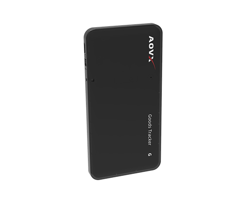

# AOVX - GG100

El AOVX GG100 es un rastreador GPS ultradelgado para mercancías, diseñado para entornos logísticos y de cadena de suministro donde es importante rastrear activos sin necesidad de instalación. Está pensado para envíos, pallets, cajas y contenedores, con enfoque en visibilidad práctica más que en telemática vehicular compleja.

Para las organizaciones que usan Plaspy, el GG100 es relevante porque es compatible de forma explícita con la plataforma y se adapta a escenarios de rastreo a gran escala. Esto lo convierte en una opción útil para equipos que buscan software de rastreo AOVX GG100 capaz de centralizar datos de ubicación, monitoreo ambiental y control operativo en un solo lugar.

## Principales ventajas

- Rastreador GPS compatible con Plaspy para monitoreo y reportes centralizados
- Diseño ultradelgado y sin instalación para colocarlo fácilmente sobre mercancías y activos
- Posicionamiento multimodo con soporte para GPS, Beidou, estación base y Wi-Fi
- Sensor integrado de temperatura y humedad para mayor visibilidad de carga sensible
- Larga autonomía en espera para monitoreo extendido durante tránsito y almacenamiento
- Alarma de manipulación y apertura para reforzar el control de cadena de custodia
- Construcción reciclable, ideal para operaciones logísticas de alto volumen

## Cómo funciona con Plaspy

Cuando se usa con Plaspy, el GG100 puede enviar datos de posición y condiciones a un entorno único de rastreo, ayudando a los equipos a seguir las mercancías durante el traslado, el almacenamiento y los puntos de entrega. Su combinación de métodos de localización brinda una visibilidad más amplia en entornos donde una sola fuente de posicionamiento no siempre es suficiente.

- Consulte ubicaciones de envíos y activos en Plaspy para el monitoreo diario
- Revise registros históricos de movimiento para entender mejor el comportamiento del tránsito
- Reciba alertas relacionadas con eventos de manipulación o condiciones de apertura
- Haga seguimiento de tendencias de temperatura y humedad para mercancías que requieren control ambiental
- Apoye flujos logísticos que necesitan visibilidad escalable sobre muchos activos
- Combine los datos del rastreador con los reportes de Plaspy para mejorar el control operativo

## Usos más comunes

- Logística de cadena de frío donde la visibilidad de temperatura y humedad es fundamental
- Seguimiento de pallets en almacenes, centros de distribución y rutas de transporte
- Monitoreo de contenedores para mercancías valiosas o sensibles
- Supervisión de envíos en operaciones logísticas y de cadena de suministro de gran escala
- Visibilidad de activos para empaques de transporte temporales o reutilizables
- Monitoreo de cadena de custodia donde resulta útil detectar manipulaciones

## Por qué elegir este rastreador con Plaspy

El GG100 puede ser una buena opción para equipos que necesitan rastreo sencillo y escalable de mercancías, en lugar de un dispositivo orientado a vehículos. Su formato delgado, el monitoreo ambiental y el posicionamiento multimodo lo hacen práctico para dar visibilidad a los activos a lo largo de los flujos logísticos, mientras que Plaspy aporta la capa de software para monitoreo, alertas y reportes.

Para las empresas que comparan un rastreador GPS AOVX GG100 con otros dispositivos compatibles con Plaspy, su principal valor está en el equilibrio entre simplicidad y telemetría útil en un formato compacto. Si desea conocer más sobre Plaspy y cómo apoya las operaciones de rastreo, visite el sitio principal en https://www.plaspy.com. Los detalles del producto, la disponibilidad y las especificaciones pueden cambiar con el tiempo, por lo que siempre es recomendable verificar la información más reciente en el sitio oficial del fabricante en https://www.aovx.com/.
