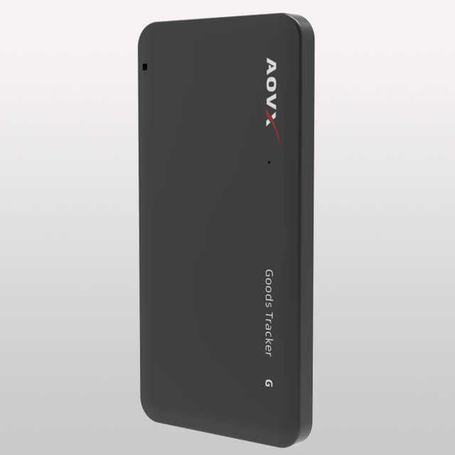

# AOVX - GL100

El AOVX GL100 es un rastreador GPS compacto para activos, diseñado para el monitoreo de largo plazo de mercancías, paquetes y carga vehicular. Está pensado para despliegues en los que el rastreo sin instalación es importante y donde los datos de ubicación pueden necesitar complementarse con información ambiental como temperatura y humedad. Con posicionamiento GNSS, asistencia de ubicación basada en Wi‑Fi y sensores integrados, está orientado a escenarios prácticos de rastreo más que a una telemática vehicular intensiva.

Como dispositivo compatible con Plaspy, el GL100 puede enviar datos de ubicación y de condiciones a Plaspy para monitoreo, alertas e informes. Esto lo hace útil para organizaciones que buscan software de rastreo AOVX GL100 compatible con visibilidad de flotas, flujos antirobo y supervisión de entregas con condiciones en una sola plataforma.

## Aspectos destacados

- Compatible con Plaspy para rastreo de ubicación, alertas e informes en un solo espacio de trabajo
- Diseñado para el monitoreo de activos a largo plazo con un formato que no requiere instalación
- Admite posicionamiento GNSS con asistencia de Wi‑Fi para un uso de rastreo más amplio
- Incluye sensores integrados de temperatura y humedad para monitoreo de condiciones
- Adecuado para mercancías, paquetes y carga vehicular
- Preparado para uso desatendido con comportamiento de reporte eficiente en consumo de energía
- Ofrece carga diferida de datos mediante almacenamiento interno durante periodos sin conexión

## Cómo funciona con Plaspy

Cuando se usa con Plaspy, el GL100 puede aportar tanto información de posición como telemetría ambiental a una vista centralizada de rastreo. Esto ayuda a los equipos a seguir los activos a lo largo del tiempo, revisar el historial de movimientos y responder a alertas según los patrones de reporte o las condiciones detectadas. En la práctica, Plaspy convierte los datos del rastreador en visibilidad operativa para apoyar tareas de logística, protección de activos y gestión de flotas.

- Muestre los activos rastreados en los mapas de Plaspy para visibilidad en tiempo real o periódica
- Revise el historial de movimientos y la actividad de reporte en los informes de Plaspy
- Use flujos de alertas para cambios de ubicación o eventos de condición
- Monitoree lecturas de temperatura y humedad en envíos sensibles
- Apoye procesos antirrobo y de prevención de pérdidas con actualizaciones oportunas
- Utilice los registros almacenados durante periodos sin conexión cuando la conectividad no esté disponible temporalmente

## Casos de uso habituales

- Rastreo de mercancías durante el transporte o el almacenamiento
- Monitoreo de paquetes y encomiendas en operaciones logísticas
- Visibilidad de carga en vehículos que transportan bienes de valor
- Seguimiento de entregas con condiciones para artículos sensibles
- Monitoreo de activos a largo plazo para despliegues no permanentes
- Verificación de movimientos de inventario y bodega para control operativo

## Por qué elegir este rastreador con Plaspy

El GL100 es una opción práctica para organizaciones que necesitan un rastreador GPS compacto con capacidades de monitoreo de ubicación y condiciones. Su combinación de GNSS, asistencia por Wi‑Fi y sensores ambientales le entrega a Plaspy datos útiles para flujos de rastreo que van más allá de una simple visualización en mapa. Para equipos que necesitan un dispositivo de bajo mantenimiento para activos, en lugar de un terminal vehicular completo, se integra de forma natural en una estrategia de monitoreo más amplia.

Con Plaspy, el AOVX GL100 pasa a formar parte de una configuración de rastreo escalable que admite supervisión de flotas, reportes y operaciones basadas en alertas. Si desea conocer más sobre cómo Plaspy ayuda a las empresas a monitorear activos y vehículos, visite el sitio principal en https://www.plaspy.com. Los detalles del producto, la disponibilidad y las especificaciones del fabricante pueden cambiar con el tiempo, por lo que siempre es mejor verificar la información vigente en la documentación oficial de AOVX en https://www.aovx.com/.
