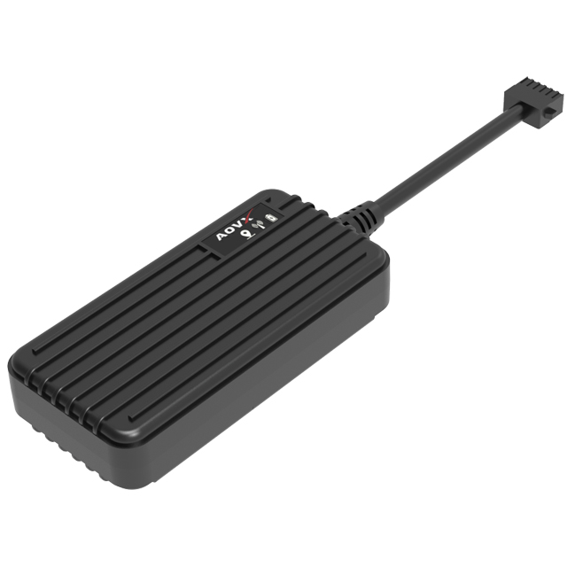

# AOVX - VL300R - (4G)

El AOVX VL300R - (4G) es un rastreador GPS vehicular cableado, robusto y pensado para operadores de flotas e integradores que necesitan visibilidad confiable de la ubicación y mayor soporte de telemetría. Está diseñado para instalaciones exigentes en vehículos y combina GNSS multiconstelación, antenas internas, conectividad LTE FDD y GSM, además de memoria interna para grandes volúmenes de registros de posición. Esto lo convierte en una opción práctica para organizaciones que buscan un dispositivo de rastreo duradero para gestión de flotas, prevención de robo y telemática vehicular.

Este modelo también es relevante para quienes buscan un rastreador GPS AOVX VL300R - (4G) que funcione con Plaspy. Como Plaspy puede aprovechar datos de rastreo, alertas y telemetría basada en eventos de dispositivos compatibles, el VL300R - (4G) encaja muy bien en entornos donde importan la supervisión en tiempo real, la identificación del conductor y el control operativo. Para equipos que estandarizan su software de rastreo con Plaspy, ofrece un equilibrio útil entre conectividad, memoria y flexibilidad de interfaz.

## Aspectos destacados

- Rastreador GPS compatible con Plaspy, ideal para seguimiento en tiempo real y monitoreo de flotas.
- Conectividad 4G LTE FDD y GSM para una amplia cobertura celular.
- GNSS multiconstelación con antenas internas para una ubicación confiable.
- Memoria interna para miles de registros de posición, útil para conservar datos de rastreo.
- Soporte para identificación de conductor, sensores ambientales y entradas de emergencia.
- Modos de suspensión de bajo consumo y opciones de actualización remota de firmware para facilitar el mantenimiento.
- Formato vehicular cableado diseñado para despliegues profesionales de flotas.

## Cómo funciona con Plaspy

Cuando se usa con Plaspy, el VL300R - (4G) puede enviar datos de ubicación y eventos a una plataforma centralizada de flotas para monitoreo, alertas y revisión de historial. Esto ayuda a las organizaciones a dar seguimiento a los vehículos, entender patrones de movimiento y responder más rápido ante incidentes operativos. Plaspy reúne los datos de rastreo en una sola vista para que los equipos sigan la actividad vehicular con mayor claridad.

- La ubicación del vehículo en tiempo real puede supervisarse en Plaspy para tener visibilidad diaria de la flota.
- Los registros de rastreo almacenados respaldan la revisión de historial y el análisis de rutas cuando se interrumpe la cobertura de datos.
- Las entradas de identificación del conductor pueden ayudar a asociar viajes y eventos con operadores específicos.
- Las entradas de emergencia, como un botón de pánico, pueden respaldar flujos de trabajo basados en alertas en Plaspy.
- Los datos de sensores pueden utilizarse para un monitoreo operativo más amplio cuando se requiere telemetría ambiental.
- Los administradores de flota pueden combinar alertas, registros de eventos e informes para mejorar la supervisión.

## Usos habituales

- Gestión de flotas para vehículos que requieren seguimiento continuo de ubicación y visibilidad de trayectos.
- Monitoreo antirrobo donde las alertas de eventos y los flujos de respuesta remota son importantes.
- Escenarios de identificación de conductor que requieren vincular viajes con operadores específicos.
- Monitoreo de carga o equipos cuando los sensores ambientales forman parte del flujo de trabajo.
- Casos de uso de respuesta a emergencias donde las entradas de pánico deben activar notificaciones rápidas.
- Proyectos generales de telemática vehicular que se benefician de una supervisión centralizada basada en Plaspy.

## Por qué elegir este rastreador con Plaspy

El AOVX VL300R - (4G) es una opción sólida para organizaciones que buscan un rastreador vehicular cableado con opciones prácticas de telemetría y compatibilidad con Plaspy. Su conjunto de funciones cubre las necesidades diarias de monitoreo de flotas y, al mismo tiempo, deja espacio para casos de uso más avanzados como identificación del conductor, alertas activadas por entradas y control operativo remoto. Para muchos equipos, esa combinación facilita estandarizar el seguimiento vehicular dentro de Plaspy sin agregar complejidad innecesaria.

Si su proyecto requiere una solución confiable de software de rastreo AOVX VL300R - (4G) que pueda respaldar el seguimiento de flotas, la visibilidad de eventos y la generación de reportes operativos, vale la pena evaluar este modelo. Para conocer más sobre Plaspy y cómo admite dispositivos GPS compatibles, visite el sitio principal en https://www.plaspy.com. Los detalles del producto, la disponibilidad y las especificaciones del fabricante pueden cambiar con el tiempo, por lo que conviene verificar la información más reciente en el sitio oficial de AOVX en https://www.aovx.com/.
