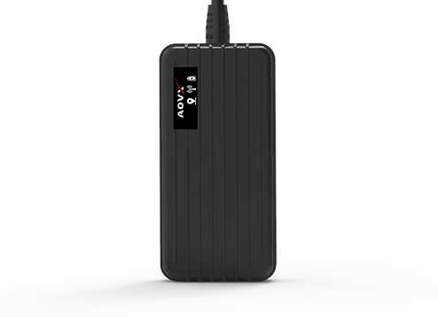

# AOVX - VX300

El AOVX VX300 es un rastreador GPS compacto diseñado para ofrecer un seguimiento confiable de vehículos y una gestión eficiente de flotas. Está pensado para despliegues comerciales donde la visibilidad constante de la ubicación, el reporte de estado y una amplia cobertura de red son aspectos clave. Gracias a su posicionamiento multisistema y a su diseño discreto, el VX300 se adapta a casos de uso donde la instalación oculta y el rastreo confiable son importantes.

Para las organizaciones que evalúan un rastreador GPS AOVX VX300 con Plaspy, este modelo destaca porque se describe como totalmente compatible con la plataforma. Esto lo convierte en una opción relevante para equipos que desean centralizar el monitoreo vehicular, las alertas y los reportes en Plaspy, utilizando al mismo tiempo un dispositivo diseñado para operaciones de flotas comerciales.

## Puntos clave

- Compatible con Plaspy para centralizar el rastreo, las alertas y la supervisión de flotas
- Diseñado para uso en vehículos comerciales y gestión de flotas
- Compatible con opciones de conectividad Cat.M1, 4G Cat.1 y 2G GPRS
- Utiliza posicionamiento multisistema para reportes de ubicación más consistentes
- Incluye detección de ignición para registrar mejor los viajes y el estado del vehículo
- Admite inmovilización remota para flujos de respuesta ante robo
- Ofrece integración ampliada con sensores GPIO y Bluetooth para mayor telemetría

## Cómo funciona con Plaspy

El VX300 funciona con Plaspy al enviar información de ubicación y estado del vehículo, la cual puede visualizarse, analizarse y administrarse desde una sola plataforma. En la práctica, esto permite a los operadores de flotas monitorear movimientos, revisar historiales y reaccionar ante eventos con mayor visibilidad en las operaciones diarias.

- Vea la ubicación del vehículo en tiempo real en Plaspy para el monitoreo activo de la flota
- Revise el historial de rutas y la actividad de los viajes para análisis operativos
- Use los datos de estado de ignición para registrar eventos de arranque y detención
- Configure alertas por movimiento, cambios de estado u otros eventos rastreados
- Organice reportes de flota en Plaspy para supervisión y planeación
- Incorpore telemetría adicional de sensores compatibles cuando esté disponible

## Usos comunes

- Gestión de flotas para autos, vans y vehículos comerciales
- Rastreo vehicular para visibilidad de rutas y coordinación de despachos
- Monitoreo antirobo con soporte de inmovilización remota
- Supervisión operativa de eventos de ignición y cambios de estado del vehículo
- Escenarios de rastreo basados en sensores donde la telemetría adicional es útil
- Visibilidad de activos en despliegues que se benefician de hardware de rastreo compacto

## Por qué elegir este rastreador con Plaspy

El AOVX VX300 puede ser una opción práctica para equipos que buscan un rastreador enfocado en el seguimiento vehicular, la gestión de flotas y la cobertura multired. Su combinación de opciones de posicionamiento, detección de ignición y soporte para inmovilización remota lo hace مناسب para organizaciones que necesitan más que un reporte básico de ubicación, especialmente cuando se integra con Plaspy para una supervisión centralizada.

Si está comparando la experiencia de software de rastreo del AOVX VX300 con Plaspy, este modelo ofrece un equilibrio adecuado para empresas que valoran la visibilidad de ubicación, las alertas y los reportes de flota en un solo lugar. Conozca más sobre Plaspy en el sitio web principal https://www.plaspy.com. Las especificaciones del producto, la disponibilidad y los detalles del fabricante pueden cambiar con el tiempo, así que verifique la información actual en el sitio oficial de AOVX https://www.aovx.com/.
